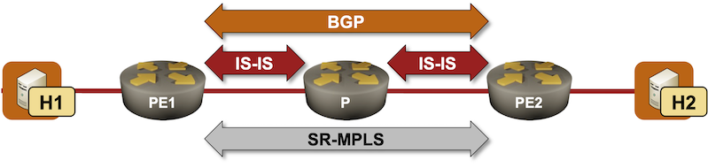

# Build an SR-MPLS Network with IS-IS

Segment Routing with the MPLS dataplane is the best (control-plane) thing that has happened to MPLS in decades. Instead of building a forwarding table and then assigning local MPLS labels to the entries in the forwarding table, SR-MPLS advertises MPLS labels (called *Segment Identifiers*) directly in IGP. This approach completely eliminates the need for an additional control-plane protocol (LDP) and the [synchronization headaches](https://blog.ipspace.net/2011/11/ldp-igp-synchronization-in-mpls/) LDP introduces.

In this lab exercise, you'll build a [BGP-free network core](https://blog.ipspace.net/2012/01/bgp-free-service-provider-core-in/) with segment routing (see the [BGP-Free Core in a Transit Network](https://bgplabs.net/challenge/40-mpls-core/) lab exercise for a more traditional approach).



!!! Expert
    This is an expert-level challenge lab -- you are on your own. Good luck and Godspeed!

## Device Requirements

* Use any device supported by the _netlab_ [IS-IS](https://netlab.tools/module/isis/#platform-support) and [BGP](https://netlab.tools/module/bgp/#platform-support) configuration modules for the routers in your lab. The device should also support SR-MPLS with IS-IS
* I recommend using a traditional networking device like Arista EOS. Configuring the MPLS data plane on a Linux container running FRRouting control plane can become an interesting exercise in tweaking underdocumented Linux kernel knobs.
* The hosts (H1, H2) attached to the PE-routers are Linux VMs or containers (depending on the virtualization provider you're using). You don't have to worry about them; _netlab_ will take care of that detail.

## Starting the Lab

You can start the lab [on your own lab infrastructure](../1-setup.md) or in [GitHub Codespaces](https://github.com/codespaces/new/bgplab/isis) ([more details](https://bgplabs.net/4-codespaces/)):

* Change directory to `advanced/10-sr`
* Execute **netlab up**.
* Log into lab routers with **netlab connect** and verify their configuration.

!!! tip
    Use Arista EOS containers with GitHub Codespaces. You won't be able to load the kernel drivers needed by FRRouting or VyOS containers, and SR Linux containers need a license to run MPLS.

## Existing Routing Protocol Configuration

When starting the lab, _netlab_ configures IPv4 addresses, IS-IS, and BGP on the lab routers. 

The PE-routers use the following BGP AS number. Both of them advertise the external (host-facing) subnets into BGP.

| Node/ASN | Router ID | Advertised prefixes |
|----------|----------:|--------------------:|
| **AS65000** ||
| pe1 | 10.0.0.1 | 172.16.0.0/24 |
| pe2 | 10.0.0.3 | 172.16.1.0/24 |

Each PE-router has a single IBGP neighbor (the other PE-router):

| Node | Router ID/<br />Neighbor | Router AS/<br />Neighbor AS | Neighbor IPv4 |
|------|------------------|---------------------:|--------------:|
| **pe1** | 10.0.0.1 | 65000 |
| | pe2 | 65000 | 10.0.0.3 |
| **pe2** | 10.0.0.3 | 65000 |
| | pe1 | 65000 | 10.0.0.1 |

All routers are running IS-IS on intra-AS links. They are configured as level-2 routers using point-to-point links.

## The Problem

After the IS-IS and BGP adjacencies are established, PE1 receives the BGP prefix for the external subnet advertised by PE2 (and vice versa):

BGP table on PE1 running Arista EOS
{ .code-caption }
```
pe1#show ip bgp
BGP routing table information for VRF default
Router identifier 10.0.0.1, local AS number 65000
Route status codes: s - suppressed contributor, * - valid, > - active, E - ECMP head, e - ECMP
                    S - Stale, c - Contributing to ECMP, b - backup, L - labeled-unicast
                    % - Pending best path selection
Origin codes: i - IGP, e - EGP, ? - incomplete
RPKI Origin Validation codes: V - valid, I - invalid, U - unknown
AS Path Attributes: Or-ID - Originator ID, C-LST - Cluster List, LL Nexthop - Link Local Nexthop

          Network                Next Hop              Metric  AIGP       LocPref Weight  Path
 * >      172.16.0.0/24          -                     -       -          -       0       i
 * >      172.16.1.0/24          10.0.0.3              0       -          100     0       i
```

However, you can't ping H2 from H1:

```
$ netlab connect h1 ping h2
Connecting to container clab-sr-h1, executing ping h2
PING h2 (172.16.1.5): 56 data bytes
^C
--- h2 ping statistics ---
6 packets transmitted, 0 packets received, 100% packet loss
```

A traceroute executed on H1 indicates that the probe packets arrive at PE1 and then get dropped by the P router. You [shouldn't be surprised](https://bgplabs.net/ibgp/2-transit/) by that behavior; the P router is not running BGP and does not know how to reach the external subnets to which H1 and H2 are connected.

```
$ netlab connect h1 traceroute -n h2
Connecting to container clab-sr-h1, executing traceroute -n h2
traceroute to h2 (172.16.1.5), 30 hops max, 46 byte packets
 1  172.16.0.1  0.004 ms  0.003 ms  0.001 ms
 2^Cpipi@brick2:~/ISIS/advanced/10-sr$ netlab connect h1 traceroute h2
Connecting to container clab-sr-h1, executing traceroute h2
traceroute to h2 (172.16.1.5), 30 hops max, 46 byte packets
 1  Ethernet1.pe1 (172.16.0.1)  0.004 ms  0.001 ms  0.001 ms
 2  *  *  *
 3  *  *  *
```

## Configuration Hints

You must configure Segment Routing-based MPLS (SR-MPLS) transport across AS 65000 to hide transit traffic into an MPLS LSP. You would usually have to[^CHEAT]:

* Enable MPLS dataplane and IS-IS segment routing on all routers 
* Assign a Segment Identifier to the loopback prefixes of the PE-routers

[^CHEAT]: You could also cheat, add the **sr** module to all routers in the lab topology, and start the lab with SR-MPLS already configured.

!!! Warning
    * If you're using FRRouting containers, execute `sudo modprobe mpls-router mpls-iptunnel` before starting the lab.
    * You must use `sysctl` commands to enable MPLS on FRRouting interfaces (see [FRRouting OSPF Segment Routing ](https://docs.frrouting.org/projects/dev-guide/en/latest/ospf-sr.html#linux-kernel) and [FRRouting IS-IS Segment Routing](https://docs.frrouting.org/en/latest/isisd.html#segment-routing) documentation for more details).

## Validation

Use a command similar[^CSHT] to **show isis segment-routing** to verify that you successfully enabled SR-MPLS for IS-IS (Arista EOS refuses to enable it unless you also enable the MPLS dataplane).

[^CSHT]: Use the [Segment Routing Segment IDs and MPLS Labels](https://blog.ipspace.net/2021/05/segment-routing-ids-mpls-labels/) and [BGP-Free MPLS Core with Segment Routing](https://blog.ipspace.net/2021/05/segment-routing-mpls-bgp-free-core/) blog posts for further inspiration

IS-IS SR-MPLS status on PE1 running Arista EOS
{: .code-caption}
```
pe1#show isis segment-routing

System ID: pe1                  Instance: Gandalf
SR supported Data-plane: MPLS                   SR Router ID: 10.0.0.1
SR Global Block( SRGB ): Base: 900000           Size: 65536
Adj-SID allocation mode: SR-adjacencies
Adj-SID allocation pool: Base: 100000     Size: 16384

All Prefix Segments have    : P:0 E:0 V:0 L:0
IS-IS Reachability Algorithm : SPF (0)
Proxy-node segment attached flag: ignored

Number of IS-IS segment routing capable nodes excluding self: 2

Self-Originated Segment Statistics:
Node-Segments       : 1
Prefix-Segments     : 0
Proxy-Node-Segments : 0
Adjacency Segments  : 1
```

Check that the PE-routers advertise SR-MPLS TLVs in their LSPs:

Contents of PE2.00-00 LSP on PE1 running Arista EOS
{: .code-caption}
```
pe1#show isis database pe2.00-00 detail
Legend:
H - hostname conflict
U - node unreachable

IS-IS Instance: Gandalf VRF: default
  IS-IS Level 2 Link State Database
    LSPID                   Seq Num  Cksum  Life Length IS  Received LSPID        Flags
    pe2.00-00                     5  45011  1024    149 L2  0000.0000.0003.00-00  <>
      Remaining lifetime received: 1199 s Modified to: 1200 s
      NLPID: 0xCC(IPv4)
      Hostname: pe2
      Area addresses: 49.0001
      Interface address: 10.1.0.6
      Interface address: 10.0.0.3
      IS Neighbor          : p.00                Metric: 10
        IPv4 Neighbor Address: 10.1.0.5
        IPv4 Interface Address: 10.1.0.6
        Adj-sid: 100000 flags: [L V] weight: 0x0
      Reachability         : 10.0.0.3/32 Metric: 10 Type: 1 Up
        SR Prefix-SID: 3 Flags: [N] Algorithm: 0
      Reachability         : 10.1.0.4/30 Metric: 10 Type: 1 Up
      Router Capabilities: Router Id: 10.0.0.3 Flags: []
        SR Local Block:
          SRLB Base: 965536 Range: 65536
        Area leader priority: 250 algorithm: 0
        Maximum SID depth:
          Base MPLS imposition (MSD type 1):  6
        SR Capability: Flags: [I]
          SRGB Base: 900000 Range: 65536
```

You can also check the PE1 MPLS forwarding table.

Contents of MPLS forwarding table on PE1 running Arista EOS
{: .code-caption}
```
pe1#show mpls route
MPLS forwarding table (Label [metric] Vias) - 2 routes
MPLS next-hop resolution allow default route: False
Metric Codes:
          A - Active metric
Via Type Codes:
          M - MPLS via, LP - LDP pseudowire via,
          I - IP lookup via, V - VLAN via,
          VA - EVPN VLAN aware via, ES - EVPN ethernet segment via,
          VF - EVPN VLAN flood via, AF - EVPN VLAN aware flood via,
          NG - Nexthop group via, BP - BGP pseudowire via,
          VP - VPWS pseudowire via, MSP - Static pseudowire via

 100000  A[1]
                via M, 10.1.0.1, pop
                    EgressACL: apply
                    directly connected, Ethernet2
                    52:dc:ca:fe:02:01, vlan 1007
 900003  A[1]
                via M, 10.1.0.1, swap 900003
                    EgressACL: apply
                    directly connected, Ethernet2
                    52:dc:ca:fe:02:01, vlan 1007
```

Notice the label 900003[^DLDD]; it's the label for the loopback address of PE2:

* PE-2 advertises an SR Prefix-SID 3 for IP prefix 10.0.0.3/32 (see above)
* Similar to PE-2[^NCGB], the P-router advertises SR Global Block starting at 900000
* PE-1 thus has to use label 900003 when sending packets towards 10.0.0.3/32 to the P-router.

[^DLDD]: The label depends on the SR Global Block advertised by the P-router ([more details](https://blog.ipspace.net/2021/05/segment-routing-ids-mpls-labels/))

[^NCGB]: Because I was running Arista EOS on both of them and did not change the SRGB configuration

Finally, check the IP forwarding table on PE-1. The BGP prefix 172.16.1.0/24 should have the MPLS label for the BGP next hop (PE-2 loopback interface):

BGP prefixes in the IP routing table on PE1 running Arista EOS
{: .code-caption}
```
pe1#show ip route bgp
...
 B I      172.16.1.0/24 [200/0]
           via 10.0.0.3/32, IS-IS SR tunnel index 1
              via 10.1.0.1, Ethernet2, label 900003
```

Last but definitely not least, let's retry that failed **ping**:

```
$ netlab connect h1 ping h2
Connecting to container clab-sr-h1, executing ping h2
PING h2 (172.16.1.5): 56 data bytes
64 bytes from 172.16.1.5: seq=0 ttl=61 time=2.843 ms
64 bytes from 172.16.1.5: seq=1 ttl=61 time=2.450 ms
^C
--- h2 ping statistics ---
2 packets transmitted, 2 packets received, 0% packet loss
round-trip min/avg/max = 2.450/2.646/2.843 ms
```

Mission Accomplished 😎

## Reference Information

### Lab Wiring

| Origin Device | Origin Port | Destination Device | Destination Port |
|---------------|-------------|--------------------|------------------|
| pe1 | Ethernet1 | h1 | eth1 |
| pe2 | Ethernet1 | h2 | eth1 |
| pe1 | Ethernet2 | p | Ethernet1 |
| pe2 | Ethernet2 | p | Ethernet2 |

**Note:** The interface names depend on the devices you use in the lab. The printout was generated with lab devices running Arista EOS.

### Lab Addressing

| Node/Interface | IPv4 Address | IPv6 Address | Description |
|----------------|-------------:|-------------:|-------------|
| **pe1** |  10.0.0.1/32 |  | Loopback |
| Ethernet1 | 172.16.0.1/24 |  | pe1 -> h1 |
| Ethernet2 | 10.1.0.2/30 |  | pe1 -> p |
| **p** |  10.0.0.2/32 |  | Loopback |
| Ethernet1 | 10.1.0.1/30 |  | p -> pe1 |
| Ethernet2 | 10.1.0.5/30 |  | p -> pe2 |
| **pe2** |  10.0.0.3/32 |  | Loopback |
| Ethernet1 | 172.16.1.3/24 |  | pe2 -> h2 |
| Ethernet2 | 10.1.0.6/30 |  | pe2 -> p |
| **h1** |
| eth1 | 172.16.0.4/24 |  | h1 -> pe1 |
| **h2** |
| eth1 | 172.16.1.5/24 |  | h2 -> pe2 |
