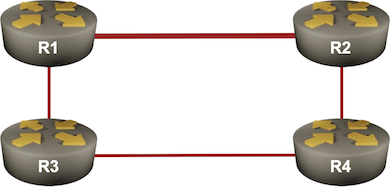

# Configure IS-IS Fast Reroute Using TI-LFA

*[Fast Reroute](https://blog.ipspace.net/2020/12/fast-failover-techniques/)* redirects traffic around a link or node failure before a routing protocol recalculates the best paths ([more details](https://blog.ipspace.net/series/fast-failover/)). It was traditionally implemented with traffic engineering tunnels and later with a much simpler *[Loop Free Alternate](https://blog.ipspace.net/2012/01/loop-free-alternate-ospf-meets-eigrp/)*  (LFA) that immediately uses the next best path *when that path is guaranteed to be loop-free*.

Unfortunately, LFA works only in a subset of well-designed network topologies. For example, in our lab topology, the R1-R2 link is a high-bandwidth link (with IS-IS cost 10), while the other links have lower bandwidth (and IS-IS cost 20). We thus cannot shift the R1→R2 traffic toward R3 after the R1-R2 link fails; we'd create an immediate routing loop as R3 uses R1 to get to R2.



The only way to make LFA work in our lab topology is to have a mechanism that could attach an explicit path[^TEH] to the R1→R2 traffic, allowing R3 to forward that traffic after the R1-R2 link failure *based on the explicit path and without inspecting the original IP headers*. An MPLS LSP is commonly used to achieve that, and the global MPLS labels created by Segment Routing (SR-MPLS) are just what we need to implement Topology-independent LFA (TI-LFA).

[^TEH]: Or a tunnel encapsulation header

In this lab exercise, you'll explore how TI-LFA calculates the backup paths. Unfortunately, it's hard to trigger the *fast-failover* behavior on virtual devices; interface shutdowns or IS-IS adjacency failures always trigger an immediate IS-IS response[^LSPG]. We'll have to rely on **show** commands to figure out the details.

[^LSPG]: You might try to delay the propagation of that change by tweaking the initial delay in the *LSP Generation Interval*  nerd knob (assuming your platform implements it).

!!! Expert
    This is an expert-level challenge lab -- you are mostly on your own. Have fun!

## Device Requirements

Use any device supported by the _netlab_ [IS-IS](https://netlab.tools/module/isis/#platform-support) configuration modules for the routers in your lab. The device should also support SR-MPLS with IS-IS and TI-LFA.

!!! tip
    You can use Arista cEOS containers in almost any environment. Arista EOS also has an excellent TI-LFA implementation with exquisite **show** commands.

## Starting the Lab

You can start the lab [on your own lab infrastructure](../1-setup.md) or in [GitHub Codespaces](https://github.com/codespaces/new/bgplab/isis) ([more details](https://bgplabs.net/4-codespaces/)):

* Change directory to `advanced/11-ti-lfa`
* Execute **netlab up** to start the lab if you want to configure Segment Routing yourself, or **netlab up -s sr=yes** if you'd like *netlab* to configure Segment Routing[^SRMBS]
* Log into lab routers with **netlab connect** and verify their configuration.

[^SRMBS]: In which case, your device has to be [supported by the _netlab_ Segment Routing configuration module](https://netlab.tools/module/sr-mpls/#supported-platforms).

!!! tip
    Use Arista EOS containers with GitHub Codespaces. You won't be able to load the kernel drivers needed by FRRouting or VyOS containers, and SR Linux containers need a license to run MPLS.

## Existing Routing Protocol Configuration

When starting the lab, _netlab_ configures IPv4 addresses and IS-IS routing. All routers will be level-2 routers using IS-IS point-to-point links for faster convergence.

If you start the lab with the `-s sr=yes` parameter, you'll also get the prerequisite SR-MPLS configuration.

## Configuration Sequence

* Configure SR-MPLS on all routers ([more details](10-sr.md))
* Reduce the IS-IS timers on all interfaces to the minimum your device supports to get faster failure detection[^NBFD].
* Configure TI-LFA *link protection* (the network is not big enough for a meaningful *node protection*) using an IS-IS router configuration command similar to **fast-reroute ti-lfa**.
* Some platforms allow you to configure TI-LFA within the routing protocol configuration, while others require TI-LFA configuration on every interface. Cisco IOS requires both, plus LFA (**isis fast-reroute protection**) configured on all interfaces.

[^NBFD]: You could also use BFD, but it looks like Arista EOS interprets BFD session failure as a node failure.

## Validation

It's tough to see what TI-LFA is doing. Most modern IS-IS implementations flood changes immediately and start SPF within milliseconds[^FLC]. It's therefore best to inspect what TI-LFA would do with the **show** commands.

[^FLC]: Unless the routers are overloaded with too many consecutive failures

For example, the **show isis ti-lfa path** command on Arista EOS displays the nodes the router would use to get to a specific destination in case of a link failure:

TI-LFA paths displayed by Arista EOS
{ .code-caption }
```
r1#show isis ti-lfa path
TI-LFA paths for IPv4 address family
   Topology ID: Level-2
   Destination       Algorithm       Constraint           Path
----------------- --------------- ----------------------- ----
   r4                SPF             exclude Ethernet2    r3

   r2                SPF             exclude Ethernet2    r4

   r3                SPF             exclude Ethernet1    r4
```

In our case, if the Ethernet2 (R1-R2) link fails, R1 would use R3 to reach R4 and R4 to reach R2. Use the **show isis ti-lfa path detail** command for even more details. Here's how R1 would get to R2:

The details of the TI-LFA path R1 would use to get to R2 (displayed by Arista EOS)
{ .code-caption }
```
r1#show isis ti-lfa path detail r2
TI-LFA paths for IPv4 address family
   Topology ID: Level-2
   Destination: r2
      Path constraint: exclude Ethernet2
                       algorithm SPF (0)
         Request sequence number: 1
         Response sequence number: 1
         Number of times path updated: 1
         Last updated: 1:29:57 ago
         ID: 0x1
         Path:
            r4 [PQ-node]
```

The crucial parts of the above printout are:

* The PQ-node (the first node that no longer uses R1 to get to R2)
* The TI-LFA tunnel index (ID)

Once we know the TI-LFA tunnel index, we can use the **show isis ti-lfa tunnel** command to inspect what labels R1 would use to redirect the traffic sent to R2:

TI-LFA tunnel (MPLS LSP) information displayed by Arista EOS
{ .code-caption }
```
r1#show isis ti-lfa tunnel 1
Tunnel Index 1
   via 172.16.0.2, 'Ethernet2'
      label stack 3
   backup via 10.1.0.2, 'Ethernet1'
      label stack 900004 900002
```

The label stack effectively says "_get this packet to R4, and then R4 should get it to R2_".

The only information Cisco IOS/XE gives you is the pretty cryptic tunnel information:

TI-LFA tunnel information displayed by Cisco IOS/XE
{ .code-caption }
```
r1#show isis fast-reroute ti-lfa tunnel

Tag Gandalf:
Fast-Reroute TI-LFA Tunnels:

Tunnel  Interface  Next Hop         End Point        Label     End Point Host
MP1     Et0/1      10.1.0.2         10.0.0.4         16004     r4
MP2     Et0/2      10.1.0.14        10.0.0.4         16004     r4
```

Fortunately, we can get a bit more from the **show ip cef** command:

Forwarding information for the R2 loopback displayed by R1 running Cisco IOS/XE
{ .code-caption }
```
r1#show ip cef 10.0.0.2
10.0.0.2/32
  nexthop 10.1.0.14 Ethernet0/2 label [explicit-null|16002](ptr:0x7F092623E850)-(local:16002)
    repair: attached-nexthop 10.0.0.4 MPLS-SR-Tunnel1
```

The forwarding table contains the repair information, which shows that:

* R1 would use R4 as the next hop to get to R2
* R1 would use MPLS-SR-Tunnel1 to get to R4
* Using the previous printout, we can find the MPLS label attached to packets sent through that tunnel (16004)

!!! tip
    Cisco IOS/XE has extensive TI-LFA debugging. Enable **isis fast-reroute trigger** and **isis fast-reroute ti-lfa** debugging on R1, shut down the R1-R2 link on R2, and enjoy the show 🍿
    
And now we're ready to move to the next exercise: [Configure IS-IS Flexible Algorithms](12-delay.md).

## Reference Information

### Lab Wiring

| Origin Device | Origin Port | Destination Device | Destination Port |
|---------------|-------------|--------------------|------------------|
| r1 | Ethernet1 | r3 | Ethernet1 |
| r3 | Ethernet2 | r4 | Ethernet1 |
| r4 | Ethernet2 | r2 | Ethernet1 |
| r1 | Ethernet2 | r2 | Ethernet2 |

**Note:** The interface names depend on the devices you use in the lab. The printout was generated with lab devices running Arista EOS.

### Lab Addressing

| Node/Interface | IPv4 Address | IPv6 Address | Description |
|----------------|-------------:|-------------:|-------------|
| **r1** |  10.0.0.1/32 |  | Loopback |
| Ethernet1 | 10.1.0.1/30 |  | r1 -> r3 |
| Ethernet2 | 10.1.0.13/30 |  | r1 -> r2 |
| **r2** |  10.0.0.2/32 |  | Loopback |
| Ethernet1 | 10.1.0.9/30 |  | r2 -> r4 |
| Ethernet2 | 10.1.0.14/30 |  | r2 -> r1 |
| **r3** |  10.0.0.3/32 |  | Loopback |
| Ethernet1 | 10.1.0.2/30 |  | r3 -> r1 |
| Ethernet2 | 10.1.0.5/30 |  | r3 -> r4 |
| **r4** |  10.0.0.4/32 |  | Loopback |
| Ethernet1 | 10.1.0.6/30 |  | r4 -> r3 |
| Ethernet2 | 10.1.0.10/30 |  | r4 -> r2 |
