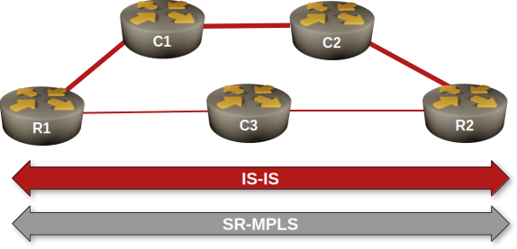

# Configure IS-IS Flexible Algorithms

By [Dan Partelly](https://github.com/DanPartelly)
{.author-byline }

Traditional routing protocols like IS-IS and OSPF make forwarding decisions based on a single metric, typically configured or derived from interface bandwidth. While this approach works well for many networks, it doesn't account for the diverse requirements of applications that need low-latency paths, require high bandwidth without latency considerations, or have specific compliance or security constraints.

IS-IS Flexible Algorithm (Flex-Algo) addresses this limitation. It allows multiple routing topologies to coexist in the same network, each optimized for different metrics or constraints. Instead of running separate routing protocol instances, Flex-Algo enables a single IS-IS deployment to compute multiple shortest-path trees using different optimization criteria.

!!! tip
    ISIS is not the only IGP to support flexible algorithms. OSPF does support them as well. Flexible algorithms were initially introduced in [RFC 9350: IGP Flexible Algorithm](https://datatracker.ietf.org/doc/html/rfc9350)

In this exercise, you'll use the IS-IS Flexible Algorithm to implement delay-based routing. You'll configure routers to compute paths based on link delay instead of the default IGP metric, enabling latency-sensitive traffic to follow optimal low-delay paths while regular traffic continues to use bandwidth-optimized routes.



!!! Expert
    This is an expert-level challenge lab. We'll give you guidelines, but you're mostly on your own.

## Device Requirements

Use any device supported by the _netlab_ [IS-IS](https://netlab.tools/module/isis/#platform-support) and [Segment Routing](https://netlab.tools/module/sr-mpls/#platform-support) configuration modules for the routers in your lab. The device should support IS-IS flexible algorithms and delay metric.

## Starting the Lab

You can start the lab [on your own lab infrastructure](../1-setup.md) or in [GitHub Codespaces](https://github.com/codespaces/new/bgplab/isis) ([more details](https://bgplabs.net/4-codespaces/)):

* Change directory to `advanced/12-delay`
* Execute **netlab up**.
* Log into lab routers with **netlab connect** and verify their configuration.

!!! tip
    Use Arista EOS containers with GitHub Codespaces. You won't be able to load the kernel drivers needed by FRRouting or VyOS containers, and SR Linux containers need a license to run MPLS.

## Existing Routing Protocol Configuration

* When starting the lab, _netlab_ configures IPv4 addresses ([details](#addr)), IS-IS, and SR-MPLS on the lab routers.
* All routers are IS-IS level-2 routers in area 49.0001 ([details](#isis))
* The R1-C1, C1-C2, and C2-R2 are high-bandwidth links with IS-IS metric 5 ([details](#isis-cost)).
* The R1-C3 and C3-R2 are low-bandwidth, low-latency links with IS-IS metric 10 ([details](#isis-cost)).

## The Problem

After the IS-IS adjacencies are established, router R1 will reach R2 over the path with the lowest cost (the high-bandwidth path R1-C1-C2-R2):

Traceroute to R2 starting on R1, Arista cEOS
{ .code-caption }
```
r1#traceroute ip r2

traceroute to r2 (10.0.0.2), 30 hops max, 60 byte packets

1. c1 (10.1.0.1)0.043 ms0.009 ms0.008 ms
2. c2 (10.1.0.6)1.011 ms1.020 ms1.150 ms
3. r2 (10.0.0.2)1.537 ms1.832 ms2.119 ms

```

We want to enable a second path in our network. The path should enable R1 to reach R2 over the low-latency path (R1-C3-R2). You will use a flexible-algorithm-based solution to create that path.

## Configuration Hints

Configure a delay metric-based flexible algorithm in your network:

* At least one router must define the flexible algorithms[^MTO]; the algorithm definition is propagated to all other routers via IS-IS TLVs/OSPF LSAs. Configure your algorithm on R1.
* Algorithm IDs 0 to 127 are reserved. Define algorithm 128, with a priority of 100[^AP] and the label of LOW_LATENCY.

[^MTO]: Usually, you should define the same algorithm on multiple routers for redundancy.

[^AP]: If multiple routers define the same algorithm, the lower-priority definition wins. You can use the algorithm *priority* to implement changes.

!!! tip
    On Arista EOS, you'll find the **flex-algo** section in the **router traffic-engineering** configuration block.
    
* The router that defines the algorithm should advertise it into the IGP. We are using a pure level-2 IS-IS network; advertise your algorithm only into the level-2 backbone.

!!! tip
		On Arista EOS, you'll have to configure that in the **segment-routing mpls** part of the **router isis** configuration.

* Even if only one router defines the algorithm, all other routers that want to participate in that algorithm must declare it. We defined the algorithm on R1, so we have to declare it on R2 and C2.
* All other routers that want to participate in the constrained graph represented by this flex-algo must announce their intent.

!!! tip
    On Arista EOS, you use the same command you used to advertise the algorithm into the IGP, but without the **advertised** option.

Finally:

* Assign a delay based metric on all interfaces in the path R1-C3-R2. Use a value of 500 microseconds.

!!! tip
    Use the **traffic-engineering** interface configuration command on Arista EOS

* For verification purposes, assign a second node Segment ID (SID) specifically referencing algorithm 128 on R2's loopback. Use a unique label; the SID labels advertised in SR-MPLS TLVs are global and must be *recognized by every node in the network*.

## Validation

For validation, use a flex algo aware mpls traceroute from R1 to R2. If the configuration is correct, R1 must reach R2 through C2.


Algorithm-aware MPLS traceroute from R1 to R2.
{: .code-caption}
```

r1#traceroute mpls segment-routing ip 10.0.0.2/32 algorithm LOW_LATENCY


LSP traceroute IS-IS segment-routing to 10.0.0.2/32 , algorithm LOW_LATENCY

via 10.1.0.13, label stack: [901000]

1. 10.1.0.13MTU 1500RTT:0.857ms1-Way:0.648mssuccess: label switched

downstream information (DSMAP) 1:

interface address: 10.1.0.18

IP address: 10.1.0.18

label stack: [implicit-null]

1. 10.1.0.18RTT:1.294ms1-Way:1.11mssuccess: egress ok


```


Examine the lfib on R1:
{: .code-caption}
```

r1#show mpls lfib route 10.0.0.2/32 | beg IP

.....

IP900002[1], 10.0.0.2/32

via M, 10.1.0.1, swap 900002

payload autoDecide, ttlMode uniform, apply egress-acl

interface Ethernet1

IP901000[1], 10.0.0.2/32, algorithm LOW_LATENCY

via M, 10.1.0.13, swap 901000

payload autoDecide, ttlMode uniform, apply egress-acl

interface Ethernet2


```


The Label Forwarding Information Base should contain two entries for 10.0.0.2/32, with two different labels, one of them explicitly referencing algorithm 128.

If you have a different outcome, it's time for troubleshooting.

As soon as you successfully configure and advertise a flex algo on R1, you can check for its presence is sub-tlv's of R1 LSPs. Notice that now it reports it knows about two algorithms, 0 and 128. 0 is the IGP default algorithm.

Contents of R1.00-00 LSP on PE1 running Arista EOS
{: .code-caption}
```

r1#show isis database r1.00-00 detail

Legend:

H - hostname conflict

U - node unreachable


IS-IS Instance: Gandalf VRF: default

IS-IS Level 2 Link State Database

LSPIDSeq NumCksumLife Length ISReceived LSPIDFlags

r1.00-006616091061216 L20000.0000.0001.00-00<>

LSP generation remaining wait time: 0 ms

Time remaining until refresh: 761 s

NLPID: 0xCC(IPv4)

Hostname: r1

Area addresses: 49.0001

Interface address: 10.1.0.14

Interface address: 10.1.0.2

Interface address: 10.0.0.1

IS Neighbor: c3.00Metric: 10

IPv4 Neighbor Address: 10.1.0.13

IPv4 Interface Address: 10.1.0.14

Adj-sid: 100001 flags: [L V] weight: 0x0

IS Neighbor: c1.00Metric: 5

IPv4 Neighbor Address: 10.1.0.1

IPv4 Interface Address: 10.1.0.2

Adj-sid: 100000 flags: [L V] weight: 0x0

Reachability: 10.1.0.12/30 Metric: 10 Type: 1 Up

Reachability: 10.1.0.0/30 Metric: 5 Type: 1 Up

Reachability: 10.0.0.1/32 Metric: 10 Type: 1 Up

SR Prefix-SID: 1 Flags: [N] Algorithm: 0

Router Capabilities: Router Id: 10.0.0.1 Flags: []

SR Local Block:

SRLB Base: 965536 Range: 65536

Area leader priority: 250 algorithm: 0

Maximum SID depth:

Base MPLS imposition (MSD type 1):6

SR Capability: Flags: [I]

SRGB Base: 900000 Range: 65536

Algorithms:0, 128

Flex Algo: Algorithm: 128 Metric: Min Unidirectional Delay Metric (1) Calc: SPF (0) Prio: 100

```


At this stage, you can also use "show isis flex-algo" to verify you are correctly advertising the flex algo:


Correctly advertised flex algo on R1, Arista cEOS.
{: .code-caption}
```

r1#show isis flex-algo


IS-IS Instance: Gandalf VRF: default


AlgorithmAdvertised Level MetricSelected

----------- ---------- ----- --------- --------

LOW_LATENCY yesL2min-delay r1


```


Once you configured the participation of all other required routers in our flex algorithm, you can seeall the routers participating in the constrained topology:


All routers participating in flex-algo 128, as viewed on R1, Arista cEOS
{: .code-caption}
```
r1#show isis flex-algo routers algorithm 128


IS-IS Instance: Gandalf VRF: default


Algorithm: LOW_LATENCY


Router Level Advertising Priority

------ ----- ----------- --------

c3L2no

r1L2yes100

r2L2no


```


Once you configured a second SID on R2's loopback, you should see it immediately as a known prefix in the segment-routing database. If it was correctly bound to algorithm 128, you will see it will use algorithm 128 (LOW_LATENCY in our case).

Segment routing prefixes on R1, Arista cEOS
{: .code-caption}
```

show isis segment-routing prefix-segments


System ID: r1Instance: 'Gandalf'

SR supported Data-plane: MPLSSR Router ID: 10.0.0.1


Node: 6Proxy-Node: 0Prefix: 0Total Segments: 6


Flag Descriptions: R: Re-advertised, N: Node Segment, P: no-PHP

E: Explicit-NULL, V: Value, L: Local, A: Proxy-Node attached

Segment status codes: * - Self originated Prefix, L1 - level 1, L2 - level 2, ! - SR-unreachable,

# - Some IS-IS next-hops are SR-unreachable

PrefixSIDLabel TypeFlagsSystem IDLevel ProtectionAlgorithm

------------------------- ----- ------- ---------- ---------------------------- --------------- ----- ----------- -------------

* 10.0.0.1/321900001 NodeR:0 N:1 P:0 E:0 V:0 L:0r1L2unprotected SPF

10.0.0.2/322900002 NodeR:0 N:1 P:0 E:0 V:0 L:0r2L2unprotected SPF

10.0.0.2/321000901000 NodeR:0 N:1 P:0 E:0 V:0 L:0r2L2unprotected LOW_LATENCY

10.0.0.3/323900003 NodeR:0 N:1 P:0 E:0 V:0 L:0c1L2unprotected SPF

10.0.0.4/324900004 NodeR:0 N:1 P:0 E:0 V:0 L:0c2L2unprotected SPF

10.0.0.5/325900005 NodeR:0 N:1 P:0 E:0 V:0 L:0c3L2unprotected SPF


```


## Cheating

If you're using Arista EOS, execute the **netlab config -l r1,r2,c3 flex-algo**.

**Note:** The exercise includes the supplementary configuration files for Arista EOS. These configuration snippets will not work with any other device.

## Reference Information

### Lab Wiring

| Origin Device | Origin Port | Destination Device | Destination Port |
|---------------|-------------|--------------------|------------------|
| r1 | Ethernet1 | c1 | Ethernet1 |
| c1 | Ethernet2 | c2 | Ethernet1 |
| c2 | Ethernet2 | r2 | Ethernet1 |
| r1 | Ethernet2 | c3 | Ethernet1 |
| c3 | Ethernet2 | r2 | Ethernet2 |

**Note:** The interface names depend on the devices you use in the lab. The printout was generated with lab devices running Arista EOS.

### Lab Addressing {#addr}

| Node/Interface | IPv4 Address | IPv6 Address | Description |
|----------------|-------------:|-------------:|-------------|
| **r1** |  10.0.0.1/32 |  | Loopback |
| Ethernet1 | 10.1.0.2/30 |  | r1 -> c1 |
| Ethernet2 | 10.1.0.14/30 |  | r1 -> c3 |
| **r2** |  10.0.0.2/32 |  | Loopback |
| Ethernet1 | 10.1.0.10/30 |  | r2 -> c2 |
| Ethernet2 | 10.1.0.18/30 |  | r2 -> c3 |
| **c1** |  10.0.0.3/32 |  | Loopback |
| Ethernet1 | 10.1.0.1/30 |  | c1 -> r1 |
| Ethernet2 | 10.1.0.5/30 |  | c1 -> c2 |
| **c2** |  10.0.0.4/32 |  | Loopback |
| Ethernet1 | 10.1.0.6/30 |  | c2 -> c1 |
| Ethernet2 | 10.1.0.9/30 |  | c2 -> r2 |
| **c3** |  10.0.0.5/32 |  | Loopback |
| Ethernet1 | 10.1.0.13/30 |  | c3 -> r1 |
| Ethernet2 | 10.1.0.17/30 |  | c3 -> r2 |

### IS-IS Routing {#isis}

IS-IS routers and areas:

| Node | Router ID | IS-IS Area | System ID | IS type |
|------|----------:|-----------:|----------:|---------|
| r1 | 10.0.0.1 | 49.0001 | 0000.0000.0001 | level-2 |
| r2 | 10.0.0.2 | 49.0001 | 0000.0000.0002 | level-2 |
| c1 | 10.0.0.3 | 49.0001 | 0000.0000.0003 | level-2 |
| c2 | 10.0.0.4 | 49.0001 | 0000.0000.0004 | level-2 |
| c3 | 10.0.0.5 | 49.0001 | 0000.0000.0005 | level-2 |

IS-IS links and metrics:
{#isis-cost}

| Node | Interface | Circuit<br>Type | Metric | Network<br>type | Description |
|------|-----------|-----------------|-------:|-----------------|-------------|
| **c1** | eth1 |  | 5 | point-to-point | c1 -> r1 |
|  | eth2 |  | 5 | point-to-point | c1 -> c2 |
| **c2** | eth1 |  | 5 | point-to-point | c2 -> c1 |
|  | eth2 |  | 5 | point-to-point | c2 -> r2 |
| **c3** | eth1 |  | 10 | point-to-point | c3 -> r1 |
|  | eth2 |  | 10 | point-to-point | c3 -> r2 |
| **r1** | eth1 |  | 5 | point-to-point | r1 -> c1 |
|  | eth2 |  | 10 | point-to-point | r1 -> c3 |
| **r2** | eth1 |  | 5 | point-to-point | r2 -> c2 |
|  | eth2 |  | 10 | point-to-point | r2 -> c3 |
