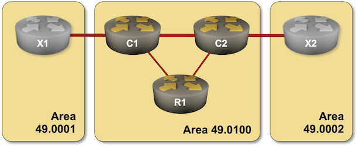

# Leaking Level-2 IS-IS Routes into Level-1 Areas

By [Dan Partelly](https://github.com/DanPartelly)
{.author-byline }

By the end of the [Multilevel IS-IS Deployments](../advanced/1-multilevel.md) exercise, we saw that every time you use level-1 areas with multiple exit points towards the level-2 IS-IS backbone, you might end up with suboptimal inter-area routing. 

In this exercise, you'll solve the suboptimal routing problem for the five-router topology we used before, using the prefix distribution from the level-2 backbone into level-1 areas, a mechanism described in [RFC 5302](https://datatracker.ietf.org/doc/html/rfc5302). 



## Device Requirements

Use any device [supported by the _netlab_ IS-IS configuration module](https://netlab.tools/platforms/#platform-routing-support) that correctly implements the distribution of inter-area (level-2) routes into level-1 areas as specified in RFC 5302.

Unfortunately, this leaves FRRouting off the table. As of August 2025, FRRouting's IS-IS implementation cannot distribute prefixes between level-1 areas and level-2 backbone.

## Starting the Lab

You can start the lab [on your own lab infrastructure](../1-setup.md) or in [GitHub Codespaces](https://github.com/codespaces/new/bgplab/isis) ([more details](https://bgplabs.net/4-codespaces/)):

* Change directory to `advanced/2-route-leak`
* Execute **netlab up**
* Log into lab devices with **netlab connect**

## Existing Device Configuration

When starting the lab, _netlab_ configures IPv4 addresses and IS-IS protocol on the lab routers, resulting in a configuration very similar to the end state of the [Multilevel IS-IS Deployments](../advanced/1-multilevel.md) lab exercise. IS-IS parameters of individual lab devices are summarized in the following table:

| Node | IS-IS Area | System ID | IS-IS type |
|------|-----------:|----------:|------------|
| x1 | 49.0001 | 0000.0000.0004 | level-2 |
| x2 | 49.0002 | 0000.0000.0005 | level-2 |
| r1 | 49.0100 | 0000.0000.0001 | level-1 |
| c1 | 49.0100 | 0000.0000.0002 | level-1-2 |
| c2 | 49.0100 | 0000.0000.0003 | level-1-2 |

## The Problem

Let's redo the *traceroute* commands we did at the [end of the Multilevel IS-IS Deployments](../advanced/1-multilevel.md) exercise:

The path from R1 to X1/X2 (as reported by Arista cEOS)
{ .code-caption }
```
r1#traceroute 10.0.0.4
traceroute to x1 (10.0.0.4), 30 hops max,* it signals to level-1 routers in the same area that it's attached through an L2 adjacency to another area and can be used as a gateway to the transit 60 byte packets
 1  c1 (10.1.0.1)  0.043 ms  0.008 ms  0.007 ms
 2  x1 (10.0.0.4)  1.113 ms  1.132 ms  1.396 ms
 
 
r1#traceroute 10.0.0.5
traceroute to x2 (10.0.0.5), 30 hops max, 60 byte packets
 1  c1 (10.1.0.1)  0.040 ms  0.009 ms  0.007 ms
 2  c2 (10.1.0.10)  0.635 ms  0.656 ms  0.863 ms
 3  x2 (10.0.0.5)  2.034 ms  2.077 ms  2.205 ms
```

As you can see, R1 uses one of the L1/L2 routers (but not necessarily the best one) to reach X1/X2. In this lab exercise, we want to ensure R1 can reach both X1 and X2 over an optimal path. Since the metrics on all links are the same, the problem reduces to reaching X1 and X2 with a minimal number of hops.

## Configuration Plan

* Leak a route from the L2 LSP database of C1 into its L1 database. This route should ensure that R1 always uses C1 as a next hop for X1
* Leak a routefrom the  L2 LSP database of C2 into its L1 database. This route should ensure that R1 always uses C2 as a next hop for X2
* Ensure that if R1<->C1 link fails, X1 is still reachable 
* Ensure that if R1<->C2 link fails, X2 is still reachable 


## Configuration hints

This is an advanced exercise, so you will only get some configuration hints and not a list of commands ready to be input at the router's configuration prompt.

Leaking routes is accomplished through a "redistribute"  command, somewhere in the routing process command hierarchy. You will have to redistribute the current IS-IS process into itself. As a reminder, we are leaking L2 routes into L1. 

Find a way to filter what routes you are redistributing. A prefix list or a route map may help. Leak the routes with their correct subnet masks. 

Once the configuration task is complete on all required routers, move on to the next section of the exercise.
 

## Examine the routing table of R1 

Let's see if we managed to inject the routes we are interested in into the L1 area. 

R1's routing table after leaking L2 routes down (as viewed on Arista cEOS)
{ .code-caption }
```
r1#show ip route isis
....
I L1 - IS-IS level 1
I L2 - IS-IS level 2
.....

Gateway of last resort:
 I L1     0.0.0.0/0 [115/10]
           via 10.1.0.1, Ethernet1
           via 10.1.0.5, Ethernet2

 I L1     10.0.0.2/32 [115/20]
           via 10.1.0.1, Ethernet1
 I L1     10.0.0.3/32 [115/20]
           via 10.1.0.5, Ethernet2
 I L1     10.0.0.4/32 [115/30]
           via 10.1.0.1, Ethernet1
 I L1     10.0.0.5/32 [115/30]
           via 10.1.0.5, Ethernet2
 I L1     10.1.0.8/30 [115/20]
           via 10.1.0.1, Ethernet1
           via 10.1.0.5, Ethernet2
 I L1     10.1.0.12/30 [115/20]
           via 10.1.0.1, Ethernet1
 I L1     10.1.0.16/30 [115/20]
           via 10.1.0.5, Ethernet2

```

As expected, we can now see two new routes towards X1 and X2. The metric is 30. Notice that those are host routes; they have the longest prefix match available for an IPv4 address. This makes them preferred over any other possible routes, including the default routes we have. 

Let's see if this solution solved our initial problem, sub-optimal inter-area routing:

The traceroute command now shows optimal routing towards both X1 and X2
{ .code-caption } 
```
r1#traceroute 10.0.0.4
traceroute to 10.0.0.4 (10.0.0.4), 30 hops max, 60 byte packets
 1  c1 (10.1.0.1)  0.047 ms  0.009 ms  0.008 ms
 2  x1 (10.0.0.4)  0.864 ms  0.874 ms  1.041 ms
r1#traceroute 10.0.0.5
traceroute to 10.0.0.5 (10.0.0.5), 30 hops max, 60 byte packets
 1  c2 (10.1.0.5)  0.043 ms  0.008 ms  0.008 ms
 2  x2 (10.0.0.5)  0.898 ms  0.908 ms  1.085 ms
```

 
 Please note that the default routes are still present in the routing table of R1 and will be used for any non-specific destination. 
 

## Sub-optimal routes as backup routes

We have already convinced ourselves that we now have optimal routing towards X1 and X2. But let's check what happens if one of the links between r1 and the transit routers fails. 

To simulate the failure, break the R1-C2 link. Shut down the Ethernet2 interface on R1.

!!! Note: The interface names depend on the lab devices you use.

On R1:

R1's adjacency relation and routing table after severing R1-C2 link (as viewed on Arista cEOS)
{ .code-caption }
```
r1#show isis neighbors 
 
Instance  VRF      System Id        Type Interface          SNPA              State Hold time   Circuit Id          
Gandalf   default  c1               L1   Ethernet1          P2P               UP    28          13   
               
r1#show ip route isis

Gateway of last resort:
 I L1     0.0.0.0/0 [115/10]
           via 10.1.0.1, Ethernet1

 I L1     10.0.0.2/32 [115/20]
           via 10.1.0.1, Ethernet1
 I L1     10.0.0.3/32 [115/30]
           via 10.1.0.1, Ethernet1
 I L1     10.0.0.4/32 [115/30]
           via 10.1.0.1, Ethernet1
 I L1     10.0.0.5/32 [115/40]
           via 10.1.0.1, Ethernet1
 I L1     10.1.0.8/30 [115/20]
           via 10.1.0.1, Ethernet1
 I L1     10.1.0.12/30 [115/20]
           via 10.1.0.1, Ethernet1
 I L1     10.1.0.16/30 [115/30]
           via 10.1.0.1, Ethernet1

```  

As expected, we lost our adjacency to c2. We also note that we still have a specific route to X2 in the routing table. This shouldn't be surprising. 10.0.0.5/32 route is leaked by c2 into it's L1 database, and propagated through it's level-1 link with C1 into the whole level-1 area. Notice the route metric. It's 40 now. This makes it clear that it's not the same route we had before.

The upside is that we have a backup path. The downside? We are back to sub-optimal routing for the R1-X2 path. If examining the routing table is not enough, you can convince yourself by running traceroute. You can also repeat the experiment for the R1-C2 link. We won't do any of those here.

Please enable any interfaces you disabled, restoring full connectivity.


## The Up/Down bit and IS-IS built-in loop prevention mechanism

Redistribution is dangerous. Every time you redistribute routes, you open Pandora's Box. It's unusable without a coherent addressing scheme through the network. Filtering mechanisms must be used to prevent routing loops.  

When discussing the configuration plan, I didn't give you any instructions to prevent routing loops.  How did we get away with this?

Most implementations of IS-IS have an in-built mechanism, based on the up/down bit, to prevent routing loops. [^NOD]

[^NOD]: You may accidentally come across an odd IS-IS implementation that does not implement the up/down bit. The solution is to tag the routes. 

Let's explore this new mechanic. On R1, start by examining the level-1 LSPs originated by one of our core routers. 

C1 originated level-1 LSP on R1. Notice the up/down flag (as viewed on Arista cEOS)
{ .code-caption }
```
r1#show isis database c1.00-00 detail
Legend:
H - hostname conflict
U - node unreachable

IS-IS Instance: Gandalf VRF: default
  IS-IS Level 1 Link State Database
    LSPID                   Seq Num  Cksum  Life Length IS  Received LSPID        Flags
    c1.00-00                     15   7142   890    142 L2  0000.0000.0002.00-00  <DefaultAtt>
      LSP received time: 2025-08-16 08:52:56
      Remaining lifetime received: 1199 s Modified to: 1200 s
      NLPID: 0xCC(IPv4)
      Hostname: c1
      Area addresses: 49.0100
      Interface address: 10.1.0.9
      Interface address: 10.1.0.1
      Interface address: 10.1.0.13
      Interface address: 10.0.0.2
      IS Neighbor          : c2.00               Metric: 10
      IS Neighbor          : r1.00               Metric: 10
      Reachability         : 10.0.0.4/32 Metric: 20 Type: 1 Down
      Reachability         : 10.1.0.8/30 Metric: 10 Type: 1 Up
      Reachability         : 10.1.0.0/30 Metric: 10 Type: 1 Up
      Reachability         : 10.1.0.12/30 Metric: 10 Type: 1 Up
      Reachability         : 10.0.0.2/32 Metric: 10 Type: 1 Up
      Router Capabilities: Router Id: 10.0.0.2 Flags: []
        Area leader priority: 250 algorithm: 0

```

Let's observe the reachability information for 10.0.0.4/32. It is a type 1 route (internal IS-IS route), and immediately to the right, you can see the current value of the up/down bit. 

This Up/Down bit is the core of the IS-IS built-in loop protection mechanism. 

The up/down bit is set to "Down" automatically for all routes leaked from the L2 to the L1.

The loop prevention mechanism rules are simple:

* When an L1/L2 router receives an LSP containing routes with the up/down bit set to "Up", it will automatically propagate the routes to its L2 database, as we saw before
* When an L1/L2 router receives an LSP containing routes with the up/down bit set to "Down", it will not propagate the route back up to its L2 database.
* L2 routes leaked into L1 are automatically marked by IS-IS as "Down". This rule is reiterated here for its importance, even if I mentioned this already just a few lines above.  


## Before Moving On


There is no specific validation test included with the lab. However, at the end of the exercise (and once you restored the C1-C2 link), you should have:

* Optimal routing between R1 and X1/X2 
* R1 should have level 1 IS-IS routes for both 10.0.0.4 and 10.0.0.5 in its routing table with a metric of 30.
* C1/C2 level-1 LSP details as viewed on R1 should both show the up/down bit set to "DOWN"

**Next**: [Build an SR-MPLS Network with IS-IS](10-sr.md)

## Reference Information

### Lab Wiring

| Origin Device | Origin Port | Destination Device | Destination Port |
|---------------|-------------|--------------------|------------------|
| r1 | Ethernet1 | c1 | Ethernet1 |
| r1 | Ethernet2 | c2 | Ethernet1 |
| c1 | Ethernet2 | c2 | Ethernet2 |
| c1 | Ethernet3 | x1 | eth1 |
| c2 | Ethernet3 | x2 | eth1 |

!!! Note
    The interface names depend on the lab devices you use. The printout was generated with user routers running Arista EOS and X1/X2 running FRRouting.


### Lab Addressing

| Node/Interface | IPv4 Address | IPv6 Address | Description |
|----------------|-------------:|-------------:|-------------|
| **r1** |  10.0.0.1/32 |  | Loopback |
| Ethernet1 | 10.1.0.2/30 |  | r1 -> c1 |
| Ethernet2 | 10.1.0.6/30 |  | r1 -> c2 |
| **c1** |  10.0.0.2/32 |  | Loopback |
| Ethernet1 | 10.1.0.1/30 |  | c1 -> r1 |
| Ethernet2 | 10.1.0.9/30 |  | c1 -> c2 |
| Ethernet3 | 10.1.0.13/30 |  | c1 -> x1 |
| **c2** |  10.0.0.3/32 |  | Loopback |
| Ethernet1 | 10.1.0.5/30 |  | c2 -> r1 |
| Ethernet2 | 10.1.0.10/30 |  | c2 -> c1 |
| Ethernet3 | 10.1.0.17/30 |  | c2 -> x2 |
| **x1** |  10.0.0.4/32 |  | Loopback |
| eth1 | 10.1.0.14/30 |  | x1 -> c1 |
| **x2** |  10.0.0.5/32 |  | Loopback |
| eth1 | 10.1.0.18/30 |  | x2 -> c2 |