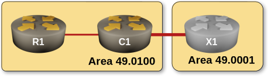

# Manual Configuration of Summary Addresses

By [Dan Partelly](https://github.com/DanPartelly)
{.author-byline }


In this exercise, we continue our focus on routing table simplification, this time on level-2 routers, and we will address a critical propagation issue in multilevel IS-IS networks. While IS-IS flooding mechanisms are designed to limit LSP changes to a single hierarchical level, without level-1 to level-2 route summarization topology changes within level-1 areas invariably propagate into the level-2 backbone.[^NE]

You'll use manual configuration of summary addresses[^SUM] on the level-1 - level-2 boundary, a mechanism described in [RFC 1195](https://datatracker.ietf.org/doc/html/rfc1195), on a three-router topology.



[^NE]: Network engineers with a background in programming will quickly realize that, besides hypothetical performance implications, minimizing information in routing tables, and implicitly, the shared state between level-1 and level-2 IS-IS hierarchy is also a tool to control complexity.

[^SUM]: Summarization is a powerful techniques. It simplifies route tables, improves network scalability and decreases complexity. Unfortunately, it cannot be employed in all situations. There are situations where you want to maintain  full L1-L2 wide visibility  to run BGP or other control plane protocols.  

## Device Requirements

Use any device [supported by the _netlab_ IS-IS configuration module](https://netlab.tools/platforms/#platform-routing-support) that correctly implements the propagation of level-1 IP prefixes into the level-2 LSP database as required by RFC 1195.

Unfortunately, this leaves FRRouting off the table. As of August 2025, FRRouting's IS-IS implementation cannot distribute prefixes between level-1 areas and level-2 backbone.

## Starting the Lab

You can start the lab [on your own lab infrastructure](../1-setup.md) or in [GitHub Codespaces](https://github.com/codespaces/new/bgplab/isis) ([more details](https://bgplabs.net/4-codespaces/)):

* Change directory to `advanced/3-summarization`
* Execute **netlab up**
* Log into lab devices with **netlab connect**

## Existing Device Configuration

When starting the lab, _netlab_ configures IPv4 addresses and IS-IS protocol on the lab routers, resulting in a small multi-area, multi-level topology.

Three stub networks are present on router R1, in the level-1 area.

IS-IS parameters of individual lab devices are summarized in the following table:

| Node | IS-IS Area | System ID | IS type |
|------|-----------:|----------:|---------|
| x1 | 49.0001 | 0000.0000.0003 | level-2 |
| r1 | 49.0100 | 0000.0000.0001 | level-1 |
| c1 | 49.0100 | 0000.0000.0002 | level-1-2 |


## Level-1 to Level 2 Spillover Effect

Let's illustrate how changes in the topology of a level-1 area can spill into the L2 backbone. Start with an examination of the routing table on X1:

X1 routing table. Notice the presence of our stub networks (as viewed on FRR)
{ .code-caption }
```
$ netlab connect x1 -s ip route
Connecting to container clab-summarization-x1, executing vtysh -c "show ip route"
.....

IPv4 unicast VRF default:
I>* 10.0.0.1/32 [115/30] via 10.1.0.5, eth1, weight 1, 00:00:16
I>* 10.0.0.2/32 [115/20] via 10.1.0.5, eth1, weight 1, 00:00:17
L * 10.0.0.3/32 is directly connected, lo, weight 1, 00:00:35
C>* 10.0.0.3/32 is directly connected, lo, weight 1, 00:00:35
I>* 10.1.0.0/30 [115/20] via 10.1.0.5, eth1, weight 1, 00:00:17
I   10.1.0.4/30 [115/20] via 10.1.0.5, eth1 inactive, weight 1, 00:00:17
C>* 10.1.0.4/30 is directly connected, eth1, weight 1, 00:00:35
L>* 10.1.0.6/32 is directly connected, eth1, weight 1, 00:00:35
I>* 172.16.0.0/24 [115/30] via 10.1.0.5, eth1, weight 1, 00:00:16
I>* 172.16.1.0/24 [115/30] via 10.1.0.5, eth1, weight 1, 00:00:16
I>* 172.16.2.0/24 [115/30] via 10.1.0.5, eth1, weight 1, 00:00:16
```


This should not be surprising. We already know that L1/L2 routers perform automatic distribution of L1 routes into the L2  backbone. Let's confirm the presence of reachability TLVs for the stub networks in the L2 LSP of C1:

C1's level-2 LSP as viewed on X1. Notice extended reachability to our stub networks. { .code-caption }
```
x1# show isis database detail c1.00-00
Area Gandalf:
IS-IS Level-2 link-state database:
LSP ID                  PduLen  SeqNumber   Chksum  Holdtime  ATT/P/OL
c1.00-00                  142   0x00000007  0xd869     874    0/0/0
Protocols Supported: IPv4
Area Address: 49.0100
Hostname: c1
Router Capability: 10.0.0.2 , D:0, S:0
Extended Reachability: 0000.0000.0003.00 (Metric: 10)
IPv4 Interface Address: 10.1.0.5
IPv4 Interface Address: 10.1.0.1
IPv4 Interface Address: 10.0.0.2
Extended IP Reachability: 172.16.0.0/24 (Metric: 20)
Extended IP Reachability: 10.0.0.1/32 (Metric: 20)
Extended IP Reachability: 172.16.1.0/24 (Metric: 20)
Extended IP Reachability: 172.16.2.0/24 (Metric: 20)
Extended IP Reachability: 10.1.0.4/30 (Metric: 10)
Extended IP Reachability: 10.1.0.0/30 (Metric: 10)
Extended IP Reachability: 10.0.0.2/32 (Metric: 10)

```

To observe the IS-IS process behavior on a router, you can monitor the real-time execution of the Shortest Path First (SPF) algorithm. This provides visibility into when and why the SPF algorithm runs, which is essential for troubleshooting and understanding network convergence behavior.

Let's do that. Connect to the target router (X1) via SSH and ensure your session is configured to monitor terminal output. [^TM] Execute the following command to enable real-time debugging of IS-IS SPF events:

```
x1# debug isis spf-events
```

Now that we have observability inside the IS-IS process running on X, we can illustrate the spilling of L1 topological changes into L2 backbone.

Connect to R1 in a separate session. Shut down one of the stub network interfaces. I choose to shut down R1's Ethernet2 interface here, but really, shutting down any of the stub interfaces will do the job.

Almost instantly, on X1, you get a trace of an SPF execution:

SPF execution trace on X1 as viewed on FRR)
{ .code-caption }
```
[DEBG] isisd: [SFWMK-K9QH2] ISIS-SPF (Gandalf) L2 SPF schedule called, lastrun 298 sec ago Caller: lsp_update isisd/isis_lsp.c:551
[DEBG] isisd: [KD9RA-6JFGA] ISIS-SPF (Gandalf) L2 SPF scheduled 0 sec from now
[DEBG] isisd: [N48RF-Z09QJ] ISIS-SPF (Gandalf) L2 SPF needed, periodic SPF
```

You can see that the SPF algorithm was executed in response to an LSP update. This is your next hint. Let's have a detailed look at C1's L2 LSP:

C1's LSP on X1 after R1's Ethernet2 interface is shutdown. Notice the reachability TLV for 172.16.0.0/24 is missing
{ .code-caption }
```
x1# show isis database detail c1.00-00
Area Gandalf:
IS-IS Level-2 link-state database:
LSP ID                  PduLen  SeqNumber   Chksum  Holdtime  ATT/P/OL
c1.00-00                  134   0x00000008  0x6bc6    1195    0/0/0
Protocols Supported: IPv4
Area Address: 49.0100
Hostname: c1
Router Capability: 10.0.0.2 , D:0, S:0
Extended Reachability: 0000.0000.0003.00 (Metric: 10)
IPv4 Interface Address: 10.1.0.5
IPv4 Interface Address: 10.1.0.1
IPv4 Interface Address: 10.0.0.2
Extended IP Reachability: 10.0.0.1/32 (Metric: 20)
Extended IP Reachability: 172.16.1.0/24 (Metric: 20)
Extended IP Reachability: 172.16.2.0/24 (Metric: 20)
Extended IP Reachability: 10.1.0.4/30 (Metric: 10)
Extended IP Reachability: 10.1.0.0/30 (Metric: 10)
Extended IP Reachability: 10.0.0.2/32 (Metric: 10)
```

It looks like we found the LSP that forced X1 IS-IS process to run SPF. Let's have a look at the whole sequence of events:

When an interface shutdown occurs on R1, the following sequence of events takes place:

* R1 generates and transmits an updated level-1 LSP to reflect the topology change
* C1 receives the LSP and performs two critical updates: Updates its level-1 LSDB with the received information, then  updates its level-2 database to reflect changes
* C1 then generates and sends a Level-2 LSP into the backbone network
* the level-2 LSP propagation triggers widespread execution of the SPF algorithm across all L2 routers in the backbone

This cascading effect demonstrates how local topology changes in level-1 areas can impact the entire IS-IS network hierarchy.

Before proceeding to the next section, re-enable any interfaces that were previously disabled on R1. This action will trigger another SPF update on X1, providing an opportunity to observe the convergence behavior with your newly acquired understanding of the IS-IS propagation mechanisms.

[^TM]: You need to enable terminal monitoring to have the data outputted to the terminal copied to an SSH session.  Terminal monitoring is enabled with a command similar to "terminal monitor". Requires separate enablement for each separate SSH session.

[^SN]: On some network devices, including Arista cEOS, you do not necessarily need debug logging. They have a command similar to "show isis spf log" which will give you the same SPF information on demand.

## Manual summarization

To address the route propagation issue, you will configure manual summarization of R1's stub networks on the Level-1-2 router C1. This will prevent individual route advertisements from flooding the level-2 backbone.

Before implementing the summarization configuration, examine C1's current routing table to establish a baseline for comparison:

C1's routing table
{ .code-caption }
```
c1#show ip route isis

VRF: default
.....

I L1     10.0.0.1/32 [115/20]
via 10.1.0.2, Ethernet1
I L2     10.0.0.3/32 [115/20]
via 10.1.0.6, Ethernet2
I L1     172.16.0.0/24 [115/20]
via 10.1.0.2, Ethernet1
I L1     172.16.1.0/24 [115/20]
via 10.1.0.2, Ethernet1
I L1     172.16.2.0/24 [115/20]
via 10.1.0.2, Ethernet1

```

The routing table confirms the expected behavior. L1 routes to R1's stub networks and loopback interface are present. From the examination of C1's L2 LSP on X1, we also know that all those routes are propagated into the L2 backbone.

## Configuration Task

On C1, summarize all the stub networks present on the R1 as a single level-2 summary route:

Summarization of level-1 routes is often done under the IS-IS process with a **summary address** command. Other devices, including Arista EOS, use a  **redistribute** command somewhere in the routing process hierarchy. That command should accept a **summary-address** (or similar) parameter that allows you to specify the summary route.

## Summarization Rules and Effects

The most important rules of manual summarization are simple. Paraphrasing the RFC:[^RF]

* the set of reachable addresses from L1 LSP is compared against the set of reachable addresses in L2 LSP. Redundant information is not copied from L1 to L2.It is expected that L2 configured information will specify more inclusive addresses.
* manually entered summary addresses are only included in the L2 LSP if they correspond to an address reachable in the level-1 area
* Any address in an L1 LSP that is not covered by a manually entered summary address is still copied in the L2 LSP.

Let's look at the effects produced by summarizing R1's stub networks. Examine the routing table on C1 again. You will notice that it's pretty much the same as before:

C1's routing table after summarization, as viewed on Arista cEOS
{ .code-caption }
```
c1#show ip route isis

VRF: default
.....

I L1     10.0.0.1/32 [115/20]
via 10.1.0.2, Ethernet1
I L2     10.0.0.3/32 [115/20]
via 10.1.0.6, Ethernet2
I L1     172.16.0.0/24 [115/20]
via 10.1.0.2, Ethernet1
I L1     172.16.1.0/24 [115/20]
via 10.1.0.2, Ethernet1
I L1     172.16.2.0/24 [115/20]
via 10.1.0.2, Ethernet1

```

If you are on a device like cEOS, note the absence of any summary routes in the routing table. You will find it in the level 2 LSPs generated by C1.

Cisco IOS devices have a different behavior. Notice the presence of an IS-IS summary route with a next hop at interface Null0:

C1's routing table after summarization as viewed on Cisco IOL
{ .code-caption }
```
c1# show ip route isis

Gateway of last resort is not set

10.0.0.0/8 is variably subnetted, 7 subnets, 2 masks
i L1     10.0.0.1/32 [115/20] via 10.1.0.2, 00:07:19, Ethernet0/1
i L2     10.0.0.3/32 [115/20] via 10.1.0.6, 00:07:16, Ethernet0/2
172.16.0.0/16 is variably subnetted, 4 subnets, 2 masks
i su     172.16.0.0/22 [115/10], 00:03:41, Null0
i L1     172.16.0.0/24 [115/10] via 10.1.0.2, 00:07:19, Ethernet0/1
i L1     172.16.1.0/24 [115/10] via 10.1.0.2, 00:07:19, Ethernet0/1
i L1     172.16.2.0/24 [115/10] via 10.1.0.2, 00:07:19, Ethernet0/1

```

The relevance of this route will become apparent soon.

Examine C1's L2 LSP to confirm the presence of our summary route in the reachability TLVs:

C1's L2 LSP detail.
{ .code-caption }
```
c1#show isis database level-2 detail c1.00-00
Legend:
H - hostname conflict
U - node unreachable

IS-IS Instance: Gandalf VRF: default
IS-IS Level 2 Link State Database
LSPID                   Seq Num  Cksum  Life Length IS  Received LSPID        Flags
c1.00-00                     14   5909   619    126 L2  0000.0000.0002.00-00  <>
LSP generation remaining wait time: 0 ms
Time remaining until refresh: 319 s
NLPID: 0xCC(IPv4)
Hostname: c1
Area addresses: 49.0100
Interface address: 10.1.0.5
Interface address: 10.1.0.1
Interface address: 10.0.0.2
IS Neighbor          : x1.00               Metric: 10
Reachability         : 172.16.0.0/22 Metric: 10 Type: 1 Up
Reachability         : 10.0.0.1/32 Metric: 20 Type: 1 Up
Reachability         : 10.1.0.4/30 Metric: 10 Type: 1 Up
Reachability         : 10.1.0.0/30 Metric: 10 Type: 1 Up
Reachability         : 10.0.0.2/32 Metric: 10 Type: 1 Up
Router Capabilities: Router Id: 10.0.0.2 Flags: []
Area leader priority: 250 algorithm: 0

```

And last but not least, examine X1's routing table:

IS-IS routes on X1. The summary network is present.
{ .code-caption }
```
x1# show ip route isis
.....
IPv4 unicast VRF default
I>* 10.0.0.1/32 [115/30] via 10.1.0.5, eth1, weight 1, 01:38:52
I>* 10.0.0.2/32 [115/20] via 10.1.0.5, eth1, weight 1, 01:38:53
I>* 10.1.0.0/30 [115/20] via 10.1.0.5, eth1, weight 1, 01:38:53
I   10.1.0.4/30 [115/20] via 10.1.0.5, eth1 inactive, weight 1, 01:38:53
I>* 172.16.0.0/22 [115/20] via 10.1.0.5, eth1, weight 1, 00:17:06

```


Summarization has immediate effects at multiple levels:

* Individual reachability TLVs for the summarized stub networks are no longer present in Level-2 LSPs, replaced by the configured summary route
* Routes without corresponding summary addresses continue to propagate individually (observe R1's loopback 10.0.0.1/32 still being advertised)
* level-2 routers now have significantly simplified routing tables.

An important consequence of summarization is enhanced network stability. Topological changes affecting any of the summarized networks will no longer trigger SPF recalculations in the L2 backbone, containing the convergence impact to the local L1 area.

To confirm that stub network topology changes are now isolated from the Level-2 backbone:

On R1, shut down the Ethernet2 interface.
The SPF debug log on X1 should remain silent. [^SPF]

## Platform-specific behavior

If you run the lab on an Arista cEOS, we have the opportunity to illustrate additional summarization behavior.

Continue the exercise by shutting down all remaining stub network interfaces on R1. Assuming you are on an Arisa cEOS as I am, and disabled Ethernet2 earlier, shut down Ethernet3 and Ethernet4 interfaces.

Once the last stub network interface is shut down, the IS-IS SPF debug log reports a new SPF calculation as a result of an LSP change.

Let's unpack what is happening. On C1:

C1's routing table after shutting down all stub network interfaces on R1 (Arista cEOS)
{ .code-caption }
```
c1#show ip route isis

......

I L1     10.0.0.1/32 [115/20]
via 10.1.0.2, Ethernet1
I L2     10.0.0.3/32 [115/20]
via 10.1.0.6, Ethernet2
```


According to the IS-IS manual summarization rules outlined above, summary routes in L2 LSPs are maintained only when they correspond to at least one reachable address within the L1 area. When all constituent networks become unreachable, the summary route is withdrawn.

Let's confirm this:

C1's L2 LSP detail after shutting down all stub network interfaces on R1 (Arista cEOS)
{ .code-caption }
```
c1#show isis database level-2 c1.00-00 detail
Legend:
H - hostname conflict
U - node unreachable

IS-IS Instance: Gandalf VRF: default
IS-IS Level 2 Link State Database
LSPID                   Seq Num  Cksum  Life Length IS  Received LSPID        Flags
c1.00-00                      9  42097  1184    118 L2  0000.0000.0002.00-00  <>
LSP generation remaining wait time: 0 ms
Time remaining until refresh: 884 s
NLPID: 0xCC(IPv4)
Hostname: c1
Area addresses: 49.0100
Interface address: 10.1.0.1
Interface address: 10.1.0.5
Interface address: 10.0.0.2
IS Neighbor          : x1.00               Metric: 10
Reachability         : 10.0.0.1/32 Metric: 20 Type: 1 Up
Reachability         : 10.1.0.0/30 Metric: 10 Type: 1 Up
Reachability         : 10.1.0.4/30 Metric: 10 Type: 1 Up
Reachability         : 10.0.0.2/32 Metric: 10 Type: 1 Up
Router Capabilities: Router Id: 10.0.0.2 Flags: []
Area leader priority: 250 algorithm: 0

```

In the printout above, you can see that the reachability TLV  for the 172.16.0.0/22 summary address is gone. The L2 LSP was updated, and the update propagated across the L2 backbone.

This stands in stark contrast to what happens on an IOS device. Shutting down all stub interfaces on R1 has no ill effects. The presence of the IS-IS summary route in the routing table is enough to prevent the removal of the summary route from the L2 LSP of C1. No new LSP will be generated.

Before moving on, enable all stub interfaces previously disabled on router R1.

[^RF]: Manual summarization and the full rule set are described in detail in section 3.2 of RFC 1195


## Validation

Ensure the summary route 172.16.0.0/22 is present in X1 routing table:

IS-IS routes on X1. The summary network is present.
{ .code-caption }

```
x1# show ip route isis
.....
IPv4 unicast VRF default
I>* 10.0.0.1/32 [115/30] via 10.1.0.5, eth1, weight 1, 01:38:52
I>* 10.0.0.2/32 [115/20] via 10.1.0.5, eth1, weight 1, 01:38:53
I>* 10.1.0.0/30 [115/20] via 10.1.0.5, eth1, weight 1, 01:38:53
I   10.1.0.4/30 [115/20] via 10.1.0.5, eth1 inactive, weight 1, 01:38:53
I>* 172.16.0.0/22 [115/20] via 10.1.0.5, eth1, weight 1, 00:17:06
```


Ensure we have full reachability:

Dataplane reachability test between X1 and R1
{ .code-caption }
```
x1# show ip route isis
x1# ping 10.0.0.1
PING 10.0.0.1 (10.0.0.1): 56 data bytes
64 bytes from 10.0.0.1: seq=0 ttl=63 time=1.877 ms
64 bytes from 10.0.0.1: seq=1 ttl=63 time=0.845 ms
....
--- 10.0.0.1 ping statistics ---
3 packets transmitted, 3 packets received, 0% packet loss
round-trip min/avg/max = 0.845/1.423/1.877 ms

```


[^SPF]: Unless you are unlucky and witness a periodic SPF run by pure coincidence. But it's easy to distinguish between the two.

**Next**: [Build an SR-MPLS Network with IS-IS](10-sr.md)

## Reference Information

### Lab Wiring

Point-to-Point Links

| Origin Device | Origin Port | Destination Device | Destination Port |
|---------------|-------------|--------------------|------------------|
| r1 | Ethernet1 | c1 | Ethernet1 |
| c1 | Ethernet2 | x1 | eth1 |


Stub Links

| Origin Device | Origin Port | Description          |
|---------------|-------------|----------------------|
| r1 | Ethernet2 | r1 -> stub |
| r1 | Ethernet3 | r1 -> stub |
| r1 | Ethernet4 | r1 -> stub |


!!! Note
	The interface names depend on the lab devices you use. The printout was 		generated with user routers running Arista EOS and X1 running FRRouting.


### Lab Addressing

| Node/Interface | IPv4 Address | IPv6 Address | Description |
|----------------|-------------:|-------------:|-------------|
| **c1** |  10.0.0.2/32 |  | Loopback |
| Ethernet1 | 10.1.0.1/30 |  | c1 -> r1 |
| Ethernet2 | 10.1.0.5/30 |  | c1 -> x1 |
| **r1** |  10.0.0.1/32 |  | Loopback |
| Ethernet1 | 10.1.0.2/30 |  | r1 -> c1 |
| Ethernet2 | 172.16.0.1/24 |  | r1 -> stub |
| Ethernet3 | 172.16.1.1/24 |  | r1 -> stub |
| Ethernet4 | 172.16.2.1/24 |  | r1 -> stub |
| **x1** |  10.0.0.3/32 |  | Loopback |
| eth1 | 10.1.0.6/30 |  | x1 -> c1 |
