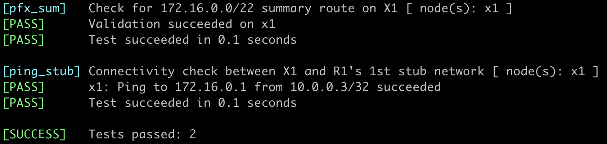

# Summarizing Level-1 Routes into Level-2 Backbone

By [Dan Partelly](https://github.com/DanPartelly)
{.author-byline }

In this exercise, we continue to reduce the amount of routing information in our network, this time on level-2 routers. At the same time, we'll address a critical instability issue in multilevel IS-IS networks. IS-IS was designed to limit the impact of topology changes in a CLNP[^CLNP] network to a single hierarchical level; the automatic distribution of level-1 IP routes into level-2 backbone (introduced in RFC 1195) broke that. Without route summarization, every change in IP reachability in a level-1 area is inevitably propagated into the level-2 backbone[^NE].

[^CLNP]: Connection-Less Network Protocol, the layer-3 protocol used in the long-obsolete ISO OSI network stack.

[^NE]: Network engineers with a background in programming will quickly realize that (besides hypothetical performance implications) minimizing information in routing tables and the shared state between level-1 and level-2 IS-IS hierarchy is also a tool to control complexity.

!!! tip
    Summarization is a powerful technique. It simplifies route tables, improves network scalability, and decreases complexity, but cannot be employed in all situations. For example, you might want to maintain the end-to-end visibility of router loopbacks (the /32 prefixes) to run a BGP-free MPLS core.

You'll practice the summarization of level-1 IS-IS routes (called *‌[Hierarchical Abbreviation of IP Reachability Information](https://datatracker.ietf.org/doc/html/rfc1195#section-3.2)* in [RFC 1195](https://datatracker.ietf.org/doc/html/rfc1195)) on a very simple three-router topology.


## Device Requirements

Use any device [supported by the _netlab_ IS-IS configuration module](https://netlab.tools/platforms/#platform-routing-support) that correctly implements the propagation of level-1 IP prefixes into the level-2 LSP database as required by RFC 1195.

Unfortunately, as of August 2025, FRRouting's IS-IS implementation does not distribute prefixes between level-1 areas and level-2 backbone, and thus cannot be used in this lab exercise.

## Starting the Lab

You can start the lab [on your own lab infrastructure](../1-setup.md) or in [GitHub Codespaces](https://github.com/codespaces/new/bgplab/isis) ([more details](https://bgplabs.net/4-codespaces/)):

* Change directory to `advanced/3-summarization`
* Execute **netlab up**
* Log into lab devices with **netlab connect**

## Existing Device Configuration

When starting the lab, _netlab_ configures IPv4 addresses and the IS-IS protocol on the lab routers, resulting in a small multi-area, multi-level topology.

IS-IS parameters of individual lab devices are summarized in the following table:

| Node | IS-IS Area | System ID | IS type |
|------|-----------:|----------:|---------|
| x1 | 49.0001 | 0000.0000.0003 | level-2 |
| r1 | 49.0100 | 0000.0000.0001 | level-1 |
| c1 | 49.0100 | 0000.0000.0002 | level-1-2 |

R1 has three stub networks; their prefixes are advertised in the level-1 area 49.0100.

## Level-1 to Level 2 Spillover Effect

Before rushing into the router configuration, let's see what problem we're dealing with. This is what X1 has in its routing table after the lab is started:

IP routing table on X1 running FRR. It includes the three stub networks from the 172.16.0.0/16 range
{ .code-caption }
```
$ netlab connect x1 --show ip route
Connecting to container clab-summarization-x1, executing vtysh -c "show ip route"
...

IPv4 unicast VRF default:
I>* 10.0.0.1/32 [115/30] via 10.1.0.5, eth1, weight 1, 00:00:16
I>* 10.0.0.2/32 [115/20] via 10.1.0.5, eth1, weight 1, 00:00:17
L * 10.0.0.3/32 is directly connected, lo, weight 1, 00:00:35
C>* 10.0.0.3/32 is directly connected, lo, weight 1, 00:00:35
I>* 10.1.0.0/30 [115/20] via 10.1.0.5, eth1, weight 1, 00:00:17
I   10.1.0.4/30 [115/20] via 10.1.0.5, eth1 inactive, weight 1, 00:00:17
C>* 10.1.0.4/30 is directly connected, eth1, weight 1, 00:00:35
L>* 10.1.0.6/32 is directly connected, eth1, weight 1, 00:00:35
I>* 172.16.0.0/24 [115/30] via 10.1.0.5, eth1, weight 1, 00:00:16
I>* 172.16.1.0/24 [115/30] via 10.1.0.5, eth1, weight 1, 00:00:16
I>* 172.16.2.0/24 [115/30] via 10.1.0.5, eth1, weight 1, 00:00:16
```

This should not be surprising (we learned in the [Multilevel IS-IS Deployments](1-multilevel.md) exercise that L1/L2 routers distribute L1 routes into the L2  backbone). Let's confirm the presence of reachability TLVs for the R1's stub networks in the L2 LSP of C1:

C1's level-2 LSP as viewed on X1. The stub networks are included in the LSP
{ .code-caption }
```
x1# show isis database detail c1.00-00
Area Gandalf:
IS-IS Level-2 link-state database:
LSP ID                  PduLen  SeqNumber   Chksum  Holdtime  ATT/P/OL
c1.00-00                  142   0x00000007  0xd869     874    0/0/0
Protocols Supported: IPv4
Area Address: 49.0100
Hostname: c1
Router Capability: 10.0.0.2 , D:0, S:0
Extended Reachability: 0000.0000.0003.00 (Metric: 10)
IPv4 Interface Address: 10.1.0.5
IPv4 Interface Address: 10.1.0.1
IPv4 Interface Address: 10.0.0.2
Extended IP Reachability: 172.16.0.0/24 (Metric: 20)
Extended IP Reachability: 10.0.0.1/32 (Metric: 20)
Extended IP Reachability: 172.16.1.0/24 (Metric: 20)
Extended IP Reachability: 172.16.2.0/24 (Metric: 20)
Extended IP Reachability: 10.1.0.4/30 (Metric: 10)
Extended IP Reachability: 10.1.0.0/30 (Metric: 10)
Extended IP Reachability: 10.0.0.2/32 (Metric: 10)
```

Next, let's verify that a change in the topology of the level-1 area 49.0100 propagates into the level-2 backbone and triggers the IS-IS Shortest Path First (SPF) algorithm on other level-2 routers:

* Connect to the target router (X1) via SSH
* Ensure your session is configured to monitor logging messages[^TM]
* Enable debugging of IS-IS SPF events[^SN].

Enable IS-IS SPF debugging on X1 running FRRouting
{ .code-caption }
```
x1# terminal monitor
x1# debug isis spf-events
```

[^TM]: Logging messages are usually not sent to SSH sessions. You have to enable that on every SSH session with a command similar to **terminal monitor** (don't ask about the meaning of that command; it's a long story going all the way back to the 1980s).

[^SN]: You do not have to enable SPF debugging on some network devices, including Arista cEOS. They have a command similar to **show isis spf log** that displays the relevant information on demand.

Now we're ready to observe whether the changes in level-1 area 49.0100 are spilling over into the level-2 backbone:

* Connect to R1 in a separate session
* Shut down one of the stub network interfaces.

Almost instantly, the SPF algorithm runs on X1:

SPF events on X1 (running FRRouting) triggered by a subnet loss on R1
{ .code-caption }
```
[DEBG] isisd: [SFWMK-K9QH2] ISIS-SPF (Gandalf) L2 SPF schedule called, lastrun 298 sec ago Caller: lsp_update isisd/isis_lsp.c:551
[DEBG] isisd: [KD9RA-6JFGA] ISIS-SPF (Gandalf) L2 SPF scheduled 0 sec from now
[DEBG] isisd: [N48RF-Z09QJ] ISIS-SPF (Gandalf) L2 SPF needed, periodic SPF
```

You can also check that the C1 L2 LSP has been changed:

C1's LSP on X1 after R1's Ethernet2 interface is shut down. The reachability TLV for 172.16.0.0/24 is missing
{ .code-caption }
```
x1# show isis database detail c1.00-00
Area Gandalf:
IS-IS Level-2 link-state database:
LSP ID                  PduLen  SeqNumber   Chksum  Holdtime  ATT/P/OL
c1.00-00                  134   0x00000008  0x6bc6    1195    0/0/0
Protocols Supported: IPv4
Area Address: 49.0100
Hostname: c1
Router Capability: 10.0.0.2 , D:0, S:0
Extended Reachability: 0000.0000.0003.00 (Metric: 10)
IPv4 Interface Address: 10.1.0.5
IPv4 Interface Address: 10.1.0.1
IPv4 Interface Address: 10.0.0.2
Extended IP Reachability: 10.0.0.1/32 (Metric: 20)
Extended IP Reachability: 172.16.1.0/24 (Metric: 20)
Extended IP Reachability: 172.16.2.0/24 (Metric: 20)
Extended IP Reachability: 10.1.0.4/30 (Metric: 10)
Extended IP Reachability: 10.1.0.0/30 (Metric: 10)
Extended IP Reachability: 10.0.0.2/32 (Metric: 10)
```

Let's recap the whole sequence of events triggered by the interface shutdown on R1:

* R1 generates and transmits an updated level-1 LSP to reflect the topology change
* C1 receives the LSP and updates its level-1 LSDB
* C1 runs L1 SPF and calculates the new best routes
* C1 updates its level-2 LSP to reflect the changes in level-1 routes
* C1 sends the updated Level-2 LSP to its neighbors
* The updated C1 level-2 LSP triggers the SPF algorithm on all L2 routers

This cascading effect demonstrates how a local topology change in a level-1 area can impact the entire level-2 backbone.

Before proceeding to the next section, re-enable any interfaces you shut down on R1. This action will trigger another SPF update on X1 (but now you know what's causing it).

## Configure Route Summarization

To minimize the impact of changes in a level-1 area[^WC], configure summarization of R1's stub networks on the Level-1-2 router C1 into a single level-2 summary route (172.16.0.0/22).

[^WC]: As long as the summary information won't change, the changes in the level-1 area won't be flooded into the level-2 backbone anymore. However, the summary prefix might be removed from the L2 LSP when all the level-1 routes within the prefix disappear. The L2 LSP should also change when the cost of the summary prefix (as calculated from the costs to reach the level-1 routes) changes.

!!! Tip
    Summarization of level-1 routes is often done under the IS-IS process with a **summary address** command. Other devices, including Arista EOS, use a  **redistribute** command somewhere in the routing process hierarchy. That command should accept a **summary-address** (or similar) parameter that allows you to specify the summary route.

## The Effects of Route Summarization

Here are the highlights of the [lengthy RFC 1195 section](https://datatracker.ietf.org/doc/html/rfc1195#section-3.2) describing the route summarization process (read the original if you're interested in gory details):

* Each level-2 router may be configured with one or more summary prefixes
* The set of reachable addresses from L1 LSPs is compared against those in the L2 LSP. Redundant information is not copied from L1 to L2.
* The metric of the summary prefixes is configured, not calculated from the costs of level-1 prefixes[^SPM]
* Summary prefixes are only included in the L2 LSP if they correspond to at least one in-area prefix.
* Any address in an L1 LSP not covered by a summary prefix is still copied in the L2 LSP.

[^SPM]: A stark deviation from how engineers familiar with OSPF would expect route summarization to work.

We should thus see the following effects of route summarization in our network:

* Individual reachability TLVs for the summarized level-1 prefixes are no longer present in Level-2 LSPs; the configured summary route replaces them. Instead of the three TLVs for the R1 stub subnets, the C1 L2 LSP should contain a single reachability TLV for the summary prefix.
* Level-1 routes without a corresponding summary prefix are still distributed into level-2 LSP (we should see R1's loopback 10.0.0.1/32 still being advertised)
* Level-2 routers have smaller routing tables.

An even more important consequence of summarization is enhanced network stability. Topological changes within a level-1 area no longer trigger the SPF algorithm in the L2 backbone *as long as the impact of the changes is limited to the summarized prefixes*. 

## Validation

You can use the **netlab validate** command if you’re using netlab release 2.0 or later and running FRRouting on the external routers. This is the printout you should get after completing the lab exercise:



You could also do manual validation on C1 and X1. Some platforms make it trivial; they have a command similar to **show isis summary-address**. This is what it displays on Arista EOS:

Summary IS-IS addresses displayed by C1 running Arista cEOS
{ .code-caption }
```
c1#show isis summary-address

IS-IS Instance: Gandalf VRF: default

IS-IS summary-address level-1 to level-2

Summary address              Metric Total Contributors Advertised
---------------------------- ------ ------------------ ----------
172.16.0.0/22                    10                  3 yes
```

If you're using a different device (or want to go into the details), start with C1's L2 LSP:

C1's L2 LSP detail.
{ .code-caption }
```
c1#show isis database level-2 detail c1.00-00
Legend:
H - hostname conflict
U - node unreachable

IS-IS Instance: Gandalf VRF: default
IS-IS Level 2 Link State Database
LSPID                   Seq Num  Cksum  Life Length IS  Received LSPID        Flags
c1.00-00                     14   5909   619    126 L2  0000.0000.0002.00-00  <>
LSP generation remaining wait time: 0 ms
Time remaining until refresh: 319 s
NLPID: 0xCC(IPv4)
Hostname: c1
Area addresses: 49.0100
Interface address: 10.1.0.5
Interface address: 10.1.0.1
Interface address: 10.0.0.2
IS Neighbor          : x1.00               Metric: 10
Reachability         : 172.16.0.0/22 Metric: 10 Type: 1 Up
Reachability         : 10.0.0.1/32 Metric: 20 Type: 1 Up
Reachability         : 10.1.0.4/30 Metric: 10 Type: 1 Up
Reachability         : 10.1.0.0/30 Metric: 10 Type: 1 Up
Reachability         : 10.0.0.2/32 Metric: 10 Type: 1 Up
Router Capabilities: Router Id: 10.0.0.2 Flags: []
Area leader priority: 250 algorithm: 0

```

The three TLVs describing the R1 stub networks should be gone, replaced by a single 172.16.0.0/22 reachability TLV.

Next, examine the X1's routing table to verify that it can still reach R1's stub networks.

IS-IS routes on X1 include the summary prefix advertised by C1
{ .code-caption }
```
x1# show ip route isis
.....
IPv4 unicast VRF default
I>* 10.0.0.1/32 [115/30] via 10.1.0.5, eth1, weight 1, 01:38:52
I>* 10.0.0.2/32 [115/20] via 10.1.0.5, eth1, weight 1, 01:38:53
I>* 10.1.0.0/30 [115/20] via 10.1.0.5, eth1, weight 1, 01:38:53
I   10.1.0.4/30 [115/20] via 10.1.0.5, eth1 inactive, weight 1, 01:38:53
I>* 172.16.0.0/22 [115/20] via 10.1.0.5, eth1, weight 1, 00:17:06

```

Finally, to confirm that the changes in stub networks are no longer propagated into the level-2 backbone:

* Enable IS-IS SPF debugging on X1
* Shut down the loopback interface on R1. You should observe an SPF event on X1
* Shut down a stub interface on R1
* Verify that the change in a stub network reachability does not trigger an SPF event on X1[^SPF]
* Reenable all interfaces on R1.

[^SPF]: Unless you are unlucky and witness a periodic SPF run by pure coincidence. It's usually easy to distinguish between the two.

## Platform-Specific Behavior

Unfortunately, different vendors tend to read RFC 1195 in slightly different ways. In this section, we'll explore how Arista cEOS and Cisco IOS/XE interpret various requirements from the *‌[Hierarchical Abbreviation of IP Reachability Information](https://datatracker.ietf.org/doc/html/rfc1195#section-3.2)* of [RFC 1195](https://datatracker.ietf.org/doc/html/rfc1195).

> For manually configured level 2 addresses, the associated metric values to announce in level 2 LSPs are also manually configured.

* Cisco IOS/XE accepts a **metric** option in the **summary-address** command.
* Arista EOS has no such option in the **redistribute ... summary-address** command. It advertises the summary prefix with a default cost of 10 (see the printout of the C1 L2 LSP above)

> There may be some IP addresses which match the manually configured addresses, but which are not reachable via level 1 routing. If a level 2 router receives an IP packet whose IP address matches a manually configured address which it is including in its level 2 LSP, but which is not reachable via level 1 routing in the area, then the packet must be discarded.

Cisco IOS/XE implements this requirement with a *summary route* (similar to its OSPF implementation). Here's the routing table of C1 running Cisco IOS/XE after the route summarization has been configured:

C1's routing table after summarization (Cisco IOS/XE)
{ .code-caption }
```
c1# show ip route isis

Gateway of last resort is not set

10.0.0.0/8 is variably subnetted, 7 subnets, 2 masks
i L1     10.0.0.1/32 [115/20] via 10.1.0.2, 00:07:19, Ethernet0/1
i L2     10.0.0.3/32 [115/20] via 10.1.0.6, 00:07:16, Ethernet0/2
172.16.0.0/16 is variably subnetted, 4 subnets, 2 masks
i su     172.16.0.0/22 [115/10], 00:03:41, Null0
i L1     172.16.0.0/24 [115/10] via 10.1.0.2, 00:07:19, Ethernet0/1
i L1     172.16.1.0/24 [115/10] via 10.1.0.2, 00:07:19, Ethernet0/1
i L1     172.16.2.0/24 [115/10] via 10.1.0.2, 00:07:19, Ethernet0/1

```

The traceroute to an unreachable destination within the summary prefix therefore stops at C1:

```
x1(bash)# traceroute 172.16.3.1 -s 10.0.0.3
traceroute to 172.16.3.1 (172.16.3.1) from 10.0.0.3, 30 hops max, 46 byte packets
 1  Ethernet0-2.c1 (10.1.0.5)  0.984 ms  0.307 ms  0.205 ms
 2  Ethernet0-2.c1 (10.1.0.5)  0.136 ms !H  *  0.691 ms !H
```

Arista EOS does not insert the summary prefix into its IP routing table, even though it adds the summary prefix to its L2 LSP, violating one of the fundamental principles of sane IP routing implementations: *never advertise something you don't know how to reach.*

C1's routing table after summarization (Arista cEOS)
{ .code-caption }
```
c1#show ip route isis

VRF: default
.....

I L1     10.0.0.1/32 [115/20]
via 10.1.0.2, Ethernet1
I L2     10.0.0.3/32 [115/20]
via 10.1.0.6, Ethernet2
I L1     172.16.0.0/24 [115/20]
via 10.1.0.2, Ethernet1
I L1     172.16.1.0/24 [115/20]
via 10.1.0.2, Ethernet1
I L1     172.16.2.0/24 [115/20]
via 10.1.0.2, Ethernet1
```

Finally, RFC 1195 specifies that a summary prefix should not be advertised if there are no level-1 routes within that prefix:

>  The manually configured addresses are included in level 2 LSPs only if they correspond to at least one address which is reachable in the area. 

It's easy to check whether your IS-IS implementation meets this requirement:

* Shut down the C1-R1 link
* Inspect the C1 L2 LSP. The summary prefix 172.16.0.0/22 should no longer be advertised.

While Arista EOS works as expected (try it out), Cisco IOS XE keeps advertising the summary prefix even after the R1 LSP is aged out from the L1 database[^SPB]:

[^SPB]: That seems to be a bug in the Cisco IOS release 17.16.01a; after the C1-R1 link is reestablished, the summary prefix *disappears from the L2 LSP*.

C1 L2 LSP (generated by Cisco IOS XE) hours after the C1-R1 link is shut down
```
x1# show isis database detail c1.00-00
Area Gandalf:
IS-IS Level-2 link-state database:
LSP ID                  PduLen  SeqNumber   Chksum  Holdtime  ATT/P/OL
c1.00-00                  103   0x00000075  0xe019     738    0/0/0
  Protocols Supported: IPv4
  Area Address: 49.0100
  Hostname: c1
  Extended Reachability: 0000.0000.0003.00 (Metric: 10)
  IPv4 Interface Address: 10.0.0.2
  Extended IP Reachability: 10.0.0.2/32 (Metric: 10)
  Extended IP Reachability: 10.1.0.4/30 (Metric: 10)
  Extended IP Reachability: 172.16.0.0/22 (Metric: 17)
```

**Next**: [Suboptimal IS-IS intra-area routing](4-l1split.md)

## Reference Information

### Lab Wiring

Point-to-Point Links

| Origin Device | Origin Port | Destination Device | Destination Port |
|---------------|-------------|--------------------|------------------|
| r1 | Ethernet1 | c1 | Ethernet1 |
| c1 | Ethernet2 | x1 | eth1 |

Stub Links

| Origin Device | Origin Port | Description          |
|---------------|-------------|----------------------|
| r1 | Ethernet2 | r1 -> stub |
| r1 | Ethernet3 | r1 -> stub |
| r1 | Ethernet4 | r1 -> stub |


!!! Note
	  The interface names depend on the lab devices you use. The printout was generated with R1 and C1 running Arista EOS, and X1 running FRRouting.

### Lab Addressing

| Node/Interface | IPv4 Address | IPv6 Address | Description |
|----------------|-------------:|-------------:|-------------|
| **c1** |  10.0.0.2/32 |  | Loopback |
| Ethernet1 | 10.1.0.1/30 |  | c1 -> r1 |
| Ethernet2 | 10.1.0.5/30 |  | c1 -> x1 |
| **r1** |  10.0.0.1/32 |  | Loopback |
| Ethernet1 | 10.1.0.2/30 |  | r1 -> c1 |
| Ethernet2 | 172.16.0.1/24 |  | r1 -> stub |
| Ethernet3 | 172.16.1.1/24 |  | r1 -> stub |
| Ethernet4 | 172.16.2.1/24 |  | r1 -> stub |
| **x1** |  10.0.0.3/32 |  | Loopback |
| eth1 | 10.1.0.6/30 |  | x1 -> c1 |
