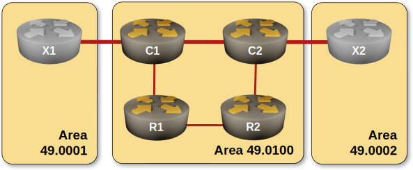

# The Impact of Level-1 IS-IS Area Partitioning

By [Dan Partelly](https://github.com/DanPartelly)
{.author-byline }

In previous exercises, we saw that every time you use level-1 areas with multiple exit points towards the level-2 IS-IS backbone, you have the potential to create suboptimal routing.

In this exercise, you will see how the design of a level-1 area can impact routing. You will be introduced to IS-IS in-area routing preferences and learn how to solve suboptimal routing induced by incorrect area design. Finally, you will explore what happens when a level-1 area partitions.



## Device Requirements

Use any device supported by the Netlab IS-IS configuration module that correctly implements the distribution of intra-area (level-1) routes into inter-area (level-2) backbone.

Unfortunately, this leaves FRRouting off the table. As of February 2026, FRRouting’s IS-IS implementation is incomplete and does not propagate level-1 IP prefixes into the level-2 LSP database as required by RFC 1195. Nevertheless, the implemented parts are solid, and FRR can be used without problems in single-level IS-IS deployments.

## Starting the Lab

You can start the lab [on your own lab infrastructure](../1-setup.md) or in [GitHub Codespaces](https://github.com/codespaces/new/bgplab/isis) ([more details](https://bgplabs.net/4-codespaces/)):

* Change directory to `advanced/4-l1split`
* Execute **netlab up**
* Log into lab devices with **netlab connect**

## Existing Device Configuration

When starting the lab, _netlab_ configures IPv4 addresses and IS-IS protocol on the lab router. IS-IS parameters of individual lab devices are summarized in the table below.

Links between X1-C1, C1-C2, and C2-X2 are high-speed links (low metric).
Links between C1-R1, R1-R2, and R2-C2 are low-speed links (high metric).
X1-X2 are part of your level2 backbone.
The circuit type on the link between C1 and C2  is level-2. Circuit type on C1-R1, R1-R2, R2-C2 is level-1.


| Node | IS-IS Area | System ID | IS type |
|------|-----------:|----------:|---------|
| x1 | 49.0001 | 0000.0000.0005 | level-2 |
| x2 | 49.0002 | 0000.0000.0006 | level-2 |
| r1 | 49.0100 | 0000.0000.0001 | level-1 |
| r2 | 49.0100 | 0000.0000.0002 | level-1 |
| c1 | 49.0100 | 0000.0000.0003 | level-1-2 |
| c2 | 49.0100 | 0000.0000.0004 | level-1-2 |


## The Problem

Once you examined the running configuration of your routers and you are familiar with their configurations, let's start by mapping the routing paths starting at C1.

Traceroute to R2, starting on C1
{ .code-caption }
```
netlab connect c1 traceroute 10.0.0.2
Connecting to 192.168.121.103 using SSH port 22, executing traceroute 10.0.0.2
traceroute to 10.0.0.2 (10.0.0.2), 30 hops max, 60 byte packets
1  r1 (10.1.0.2)  0.050 ms  0.009 ms  0.007 ms
2  r2 (10.0.0.2)  1.103 ms  1.115 ms  1.325 ms

```

This is interesting. C1 has reachability to R2 over high-cost links, instead of using the cheaper route through C2.

Let's try a traceroute to C2, starting from C1.

Traceroute to R2, starting on C1
{ .code-caption }
```
netlab connect c1 traceroute 10.0.0.4

Connecting to 192.168.121.103 using SSH port 22, executing traceroute 10.0.0.4
traceroute to 10.0.0.4 (10.0.0.4), 30 hops max, 60 byte packets
1  r1 (10.1.0.2)  0.052 ms  0.009 ms  0.007 ms
2  r2 (10.1.0.6)  0.955 ms  0.966 ms  1.103 ms
3  c2 (10.0.0.4)  1.473 ms  1.856 ms  2.228 ms

```

If the previous trace was interesting, this one is downright surprising. Although C1 is directly connected to C2 over a low-metric link, the routing table shows that C2 is reachable over multiple hops, over high-cost links.

Let's confirm that the link between C1 and C2 is up. According to our wiring report, the link between C1 and C2 is on Ethernet2:

IP interface view on C1, Arista cEOS:
{ .code-caption }
```
netlab exec c1 show ip interface brief
Connecting to 192.168.121.103 using SSH port 22, executing show ip interface
Interface      IP Address             Status     Protocol         MTU   Owner
-------------- ---------------------- ---------- ------------ --------- -------
Ethernet1      10.1.0.1/30            up         up              1500
Ethernet2      10.1.0.13/30           up         up              1500
.....
.....

```

Let's examine the routing table on C1:
Routing table of C1, Arista cEOS:
{ .code-caption }
```
c1#show ip route | beg Gat
Gateway of last resort is not set

I L1     10.0.0.1/32 [115/30]
via 10.1.0.2, Ethernet1
I L1     10.0.0.2/32 [115/50]
via 10.1.0.2, Ethernet1
C        10.0.0.3/32
directly connected, Loopback0
I L1     10.0.0.4/32 [115/70]
via 10.1.0.2, Ethernet1
I L2     10.0.0.5/32 [115/15]
via 10.1.0.18, Ethernet3
I L2     10.0.0.6/32 [115/20]
via 10.1.0.14, Ethernet2
C        10.1.0.0/30
directly connected, Ethernet1
I L1     10.1.0.4/30 [115/40]
via 10.1.0.2, Ethernet1
I L1     10.1.0.8/30 [115/60]
via 10.1.0.2, Ethernet1
C        10.1.0.12/30
directly connected, Ethernet2
C        10.1.0.16/30
directly connected, Ethernet3
I L2     10.1.0.20/30 [115/10]
via 10.1.0.14, Ethernet2
```


We can see that IS-IS installed a level-1 route to C2 in the routing table of C1, with a metric of 70.

Look at the IS-IS RIB. A "show isis rib command" is not available on cEOS, the device we used most in this series. Cisco IOL provides it, so I will take advantage of Netlab's device abstraction power to quickly change the devices:


IS-IS Rib entry for C2, as viewed on C1,  Cisco IOL:
{ .code-caption }
```
c1#show isis rib 10.0.0.4 255.255.255.255


IPv4 local RIB for IS-IS process Gandalf

IPV4 unicast topology base (TID 0, TOPOID 0x0) =================

10.0.0.4/32  prefix attr X:0 R:0 N:1
[115/L1/70] via 10.1.0.2(Ethernet0/1), from 10.0.0.4, tag 0
prefix attr: X:0 R:0 N:1
(installed)
[115/L2/15] via 10.1.0.14(Ethernet0/2), from 10.0.0.4, tag 0
prefix attr: X:0 R:0 N:1

```

This rib printout from Cisco IOL clearly shows that the IS-IS process has information about both routes to 10.0.0.4/32. You can see an L1 route with a metric of 70, and an L2 route with a metric of 15. (The same information can be extracted from the IS-IS database by examining both the level 1 and level 2 LSPs of C2 in detail, but having a direct view of the routing process rib is very nice.)

The L1 route ends up installed in the routing table by the IS-IS process.

This IS-IS behavior is documented in [RFC 1195](https://datatracker.ietf.org/doc/html/rfc1195) - chapter 3.10 -  Order of Preference of Routes / Dijkstra Computation. A qoute from the [RFC](https://datatracker.ietf.org/doc/html/rfc1195) is in order:

"The Integrated IS-IS prefers routes within the area (via level 1 routing) whenever possible. If level 2 routes must be used, then routes within the routing domain (specifically, those routes using internal metrics) are preferred to routes outside of the routing domain (using external metrics)."

## Split the L1 area

Split the L1 area by disabling the link between R1 and R2. Shutdown Ethernet2 on R1(the name of the interface will be different if you do not use cEOS). Once you are done, let's see what changed in C1's routing table:

C1's routing table after L1 split, Arista cEOS:
{ .code-caption }
```
I L1     10.0.0.1/32 [115/30]
via 10.1.0.2, Ethernet1
I L2     10.0.0.2/32 [115/35]
via 10.1.0.14, Ethernet2
C        10.0.0.3/32
directly connected, Loopback0
I L2     10.0.0.4/32 [115/15]
via 10.1.0.14, Ethernet2
I L2     10.0.0.5/32 [115/15]
via 10.1.0.18, Ethernet3
I L2     10.0.0.6/32 [115/20]
via 10.1.0.14, Ethernet2
C        10.1.0.0/30
directly connected, Ethernet1
I L2     10.1.0.8/30 [115/25]
via 10.1.0.14, Ethernet2
C        10.1.0.12/30
directly connected, Ethernet2
C        10.1.0.16/30
directly connected, Ethernet3
I L2     10.1.0.20/30 [115/10]
via 10.1.0.14, Ethernet2

```


Most L1 IS-IS routes we observed earlier are no longer present in the routing table.  C2 and R2 are now directly accessible over low-cost L2 routes. Furthermore, we have complete reachability between all our routers.

After this short detour, re-enable the link between R1 and R2. 
You can now start to solve the problem of suboptimal routing.

## Configuration Task

* Change the ISIS circuit type on the interfaces used for the p2p link between C1 and C2 to a  level-1-2 circuit. You will find the relevant command under the interface configuration.

By changing the IS-IS circuit type on the interfaces participating in the C1-C2 link, you ensured that from the point of view of IS-IS routing, the level-2 link now doubles as a level-1 link.

## Validation

Examine the routing table on C1.

C1's routing table, Arista cEOS
{ .code-caption }
```
c1#show ip route | beg  Gate
Gateway of last resort is not set

I L1     10.0.0.1/32 [115/30]
via 10.1.0.2, Ethernet1
I L1     10.0.0.2/32 [115/35]
via 10.1.0.14, Ethernet2
C        10.0.0.3/32
directly connected, Loopback0
I L1     10.0.0.4/32 [115/15]
via 10.1.0.14, Ethernet2
I L2     10.0.0.5/32 [115/15]
via 10.1.0.18, Ethernet3
I L2     10.0.0.6/32 [115/20]
via 10.1.0.14, Ethernet2
C        10.1.0.0/30
directly connected, Ethernet1
I L1     10.1.0.8/30 [115/25]
via 10.1.0.14, Ethernet2
C        10.1.0.12/30
directly connected, Ethernet2
C        10.1.0.16/30
directly connected, Ethernet3
I L2     10.1.0.20/30 [115/10]
via 10.1.0.14, Ethernet2
```

The routing table should contain an L1 ISIS route to C2, with a metric of 15.
It should also contain an L1 ISIS route to R2 with a metric of 35. Compare the metrics with the metrics from the first printout of C1's route table.

If you need more information to confirm that the suboptimal routing problem is resolved, you can repeat the traceroutes. It is not necessary, as it's obvious from the routing table that the problem is solved, but it won't hurt either. I will only trace R2 from C1 here, in the interest of brevity.


Traceroute from C1 to R2
{ .code-caption }
```
netlab connect c1 traceroute 10.0.0.2
Connecting to 192.168.121.103 using SSH port 22, executing traceroute 10.0.0.2
traceroute to 10.0.0.2 (10.0.0.2), 30 hops max, 60 byte packets
1  c2 (10.1.0.14)  0.053 ms  0.009 ms  0.007 ms
2  r2 (10.0.0.2)  1.145 ms  1.166 ms  1.341 ms

```

If you split the L1 area at the link R1-R2, there should be no impact. All routers should be able to reach each other.

**Next**: [Build an SR-MPLS Network with IS-IS](10-sr.md)

## Reference Information

### Lab Wiring

| Origin Device | Origin Port | Destination Device | Destination Port |
|---------------|-------------|--------------------|------------------|
| r1 | Ethernet1 | c1 | Ethernet1 |
| r1 | Ethernet2 | r2 | Ethernet1 |
| r2 | Ethernet2 | c2 | Ethernet1 |
| c1 | Ethernet2 | c2 | Ethernet2 |
| c1 | Ethernet3 | x1 | eth1 |
| c2 | Ethernet3 | x2 | eth1 |

!!! Note
The interface names depend on the lab devices you use. The printout was generated with user routers running Arista EOS and X1/X2 running FRRouting.


### Lab Addressing

| Node/Interface | IPv4 Address | IPv6 Address | Description |
|----------------|-------------:|-------------:|-------------|
| **r1** |  10.0.0.1/32 |  | Loopback |
| Ethernet1 | 10.1.0.2/30 |  | r1 -> c1 |
| Ethernet2 | 10.1.0.5/30 |  | r1 -> r2 |
| **r2** |  10.0.0.2/32 |  | Loopback |
| Ethernet1 | 10.1.0.6/30 |  | r2 -> r1 |
| Ethernet2 | 10.1.0.10/30 |  | r2 -> c2 |
| **c1** |  10.0.0.3/32 |  | Loopback |
| Ethernet1 | 10.1.0.1/30 |  | c1 -> r1 |
| Ethernet2 | 10.1.0.13/30 |  | c1 -> c2 |
| Ethernet3 | 10.1.0.17/30 |  | c1 -> x1 |
| **c2** |  10.0.0.4/32 |  | Loopback |
| Ethernet1 | 10.1.0.9/30 |  | c2 -> r2 |
| Ethernet2 | 10.1.0.14/30 |  | c2 -> c1 |
| Ethernet3 | 10.1.0.21/30 |  | c2 -> x2 |
| **x1** |  10.0.0.5/32 |  | Loopback |
| eth1 | 10.1.0.18/30 |  | x1 -> c1 |
| **x2** |  10.0.0.6/32 |  | Loopback |
| eth1 | 10.1.0.22/30 |  | x2 -> c2 |
