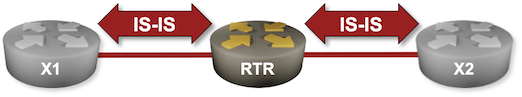
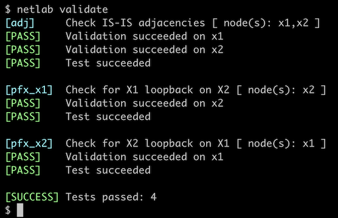

# Configure IS-IS Routing for IPv4

We'll start with the simplest possible scenario: we're adding a new router to an existing IS-IS network and have to configure IS-IS routing on it.



## Device Requirements

* Use [any _netlab_-supported device](https://netlab.tools/platforms/) for the router you'll be configuring.
* Use a device [supported by the _netlab_ IS-IS configuration module](https://netlab.tools/platforms/#platform-routing-support) for X1 and X2 (default: FRRouting virtual machines or containers).
* You can do automated lab validation when using FRRouting on the external routers.

## Starting the Lab

You can start the lab [on your own lab infrastructure](../1-setup.md) or in [GitHub Codespaces](https://github.com/codespaces/new/bgplab/isis) ([more details](https://bgplabs.net/4-codespaces/)):

* Change directory to `basic/1-simple-ipv4`
* Execute **netlab up**
* Log into your device (RTR) with **netlab connect rtr** and verify that the IP addresses are configured on all its interfaces.

You'll get a lab with IPv4 addresses configured on all interfaces and IS-IS routing configured on X1 and X2 but not  RTR.

## Configuration Tasks

The minimal IS-IS configuration process has three or four steps:

* Start an IS-IS routing process with a global configuration command similar to **router isis**. You might have to specify a *routing process tag* -- a string that identifies the IS-IS instance in other configuration commands.
* Assign a CLNS address (NET -- Network Entity Title) to the IS-IS routing process with a routing configuration command similar to **net _address_** ([more details](#bg)). The NET assigned to your router is `49.0001.0000.0000.0042.00`
* Enable IS-IS routing for IPv4 on individual interfaces with an interface configuration command similar to **ip router isis _tag_** or **isis enable _tag_**.
* Some devices also want you to configure which *address families* (IPv4 or IPv6) you want to route with IS-IS. The router configuration command to do that is often **address-family ipv4**.

!!! Tip
    If you're using FRRouting on RTR, you might have to enable the IS-IS daemon first. You'll find more details in the [Configuring IS-IS on FRRouting](0-frrouting.md#daemon) lab.

Unfortunately, most IS-IS implementations are ancient and use defaults that might have made sense decades ago. You should also configure the following parameters[^TMGT]:

[^TMGT]: Trust me for the moment; we'll discuss them in great detail in subsequent lab exercises.

* Configure the links with two nodes attached to them as point-to-point links with an interface configuration command similar to **isis network point-to-point** (more details in [IS-IS on Point-to-Point Links](3-p2p.md))
* Configure your router to be a Level-2-Only router with the router configuration command similar to **is-type level-2-only**[^NCC] (more details in [Optimize Simple IS-IS Deployments](6-level-2.md)).
* On some devices, you'll have to configure *wide* metrics with a router configuration command similar to **metric-style wide**[^MSW] (more details in [Using IS-IS Metrics](4-metric.md)).
* Finally, you might have to configure the standard point-to-point three-way handshake on Cisco IOSv[^PS3W]. The interface configuration command to do that is **‌isis three-way-handshake ietf**.

[^NCC]: You don't have to configure the interface **circuit-type** once you configured the device to be a **level-2-only** router. A **level-2-only** router will never send level-1 hellos.

[^PS3W]: The IOSv image on which I had to do that was obviously ancient but still 13 years younger than the [RFC 3373](https://datatracker.ietf.org/doc/html/rfc3373) that standardized the three-way handshake.

[^MSW]: As crazy as it sounds, some devices still use the ancient *narrow* metrics as the default setting 20 years after the *wide* metrics were defined in [RFC 3784](https://www.rfc-editor.org/rfc/rfc3784).

Finally, make sure your configuration includes these settings:

* Logging of adjacency changes (typically configured with a router configuration command like **log-adjacency-changes**)
* Dynamic mapping of NETs to hostnames (usually enabled; sometimes you can't turn it off)

## Validation

You can use the **netlab validate** command if you're using *netlab* release 1.8.4 or later and run FRRouting on the external routers. This is the printout you should get after completing the lab exercise:



You should also do basic manual validation on your device:

* Inspect IS-IS adjacencies with a command similar to **show isis neighbors** or **show isis adjacency**. Your router should have level-2 adjacencies with X1 and X2; this is the printout you should get on FRRouting:

IS-IS neighbors (FRRouting)
{.code-caption}
```
rtr# show isis neighbor
Area SomeTag:
  System Id           Interface   L  State        Holdtime SNPA
 x1                  eth1        2  Up            29       2020.2020.2020
 x2                  eth2        2  Up            30       2020.2020.2020
```

* If your device has commands similar to **show isis topology**, **show isis network topology**, or **show isis route**, use them to display the shortest paths to other routers and the best IS-IS paths.

IS-IS network topology (first part of the printout) and IPv4 routing table on FRRouting
{.code-caption}
```
rtr# show isis route
Area SomeTag:
IS-IS paths to level-2 routers that speak IP
Vertex               Type         Metric Next-Hop             Interface Parent
rtr
10.1.0.0/30          IP internal  0                                     rtr(4)
10.1.0.4/30          IP internal  0                                     rtr(4)
x1                   TE-IS        10     x1                   eth1      rtr(4)
x2                   TE-IS        10     x2                   eth2      rtr(4)
10.0.0.2/32          IP TE        20     x1                   eth1      x1(4)
10.1.0.0/30          IP TE        20     x1                   eth1      x1(4)
10.0.0.3/32          IP TE        20     x2                   eth2      x2(4)
10.1.0.4/30          IP TE        20     x2                   eth2      x2(4)

IS-IS L2 IPv4 routing table:

 Prefix       Metric  Interface  Nexthop   Label(s)
 ----------------------------------------------------
 10.0.0.2/32  20      eth1       10.1.0.2  -
 10.0.0.3/32  20      eth2       10.1.0.6  -
 10.1.0.0/30  20      eth1       10.1.0.2  -
 10.1.0.4/30  20      eth2       10.1.0.6  -
```

IS-IS network topology on Arista EOS
{.code-caption}
```
rtr>show isis network topology

IS-IS Instance: SomeTag VRF: default
  IS-IS paths to level-2 routers
    System Id        Metric   IA Metric Next-Hop         Interface                SNPA
    x1               10       0         x1               Ethernet1                P2P
    x2               10       0         x2               Ethernet2                P2P
```

* Finally, inspect the IP routing table and verify that you can see three loopback prefixes (10.0.0.1/32 through 10.0.0.3/32). This is the printout you should get on FRRouting

IS-IS routes in the IPv4 routing table (FRRouting)
{.code-caption}
```
rtr# show ip route isis
Codes: K - kernel route, C - connected, L - local, S - static,
       R - RIP, O - OSPF, I - IS-IS, B - BGP, E - EIGRP, N - NHRP,
       T - Table, v - VNC, V - VNC-Direct, A - Babel, F - PBR,
       f - OpenFabric, t - Table-Direct,
       > - selected route, * - FIB route, q - queued, r - rejected, b - backup
       t - trapped, o - offload failure

I>* 10.0.0.2/32 [115/20] via 10.1.0.2, eth1, weight 1, 00:00:47
I>* 10.0.0.3/32 [115/20] via 10.1.0.6, eth2, weight 1, 00:00:18
I   10.1.0.0/30 [115/20] via 10.1.0.2, eth1 inactive, weight 1, 00:00:47
I   10.1.0.4/30 [115/20] via 10.1.0.6, eth2 inactive, weight 1, 00:00:18
```

FRRouting uses the IP routing table as the repository of *all routes*, not just the *best routes*, so it displays the *inactive* IS-IS routes. Other network devices, for example Arista EOS[^DP], display just the *active* IS-IS routes:

[^DP]: The **detail** option of the **show ip route** command includes the interface description, and the `|begin Priority` output filter removes the legend.

IS-IS routes in IPv4 routing table on Arista EOS
{.code-caption}
```
rtr#show ip route isis detail|begin Priority
Priority Codes:
       PL - Priority low, PM - Priority medium, PH - Priority high

 I L2     10.0.0.2/32 [115/20]
           via 10.1.0.2, Ethernet1 rtr -> x1
 I L2     10.0.0.3/32 [115/20]
           via 10.1.0.6, Ethernet2 rtr -> x2
```

**Next:** [Explore IS-IS Data Structures](2-explore.md). That lab uses the same topology and device configurations, so you can keep going without restarting the lab.

## Background Information {#bg}

IS-IS was designed to be the routing protocol for the ISO/OSI protocol stack. Its name is derived from ISO terminology: IS stands for Intermediate System (the device also known as *router*, *gateway* or *layer-3 switch*). Thus, IS-IS is the protocol that runs between Intermediate Systems (in other words, the router-to-router protocol).

While ISO designed IS-IS to be used with CLNP, its data structures (everything is CLV[^TLV]-based) made it easy to extend, and so IETF quickly specified how to use IS-IS for IPv4 and (later) IPv6 routing.

[^TLV]: Code/Length/Value: every bit of information starts with a *code* (one byte), followed by *length* (one byte) and the actual value. This encoding approach is more commonly called TLV (Type/Length/Value).

IS-IS does not run on top of another layer-3 protocol like OSPF or BGP run on top of IP; it is an independent protocol at layer-3 and uses a dedicated 802.1 SAP ([more details](https://blog.ipspace.net/2009/06/is-is-is-not-running-over-clnp/)). You cannot use the standard IP access control mechanisms with IS-IS; on the other hand, it's impossible to spoof IS-IS messages if the intruder does not have access to the underlying layer-2 infrastructure.

IS-IS addressing follows the OSI addressing principles. Network addresses (Network Service Access Points -- NSAPs) are [assigned to *nodes*, not *interfaces*](https://blog.ipspace.net/2024/02/interface-node-addresses/). OSI protocol suite used *variable-length* addresses, and according to the ([poorly formatted copy of](https://www.rfc-editor.org/rfc/rfc1142.html)) IS-IS specifications, the NET is split into three parts (you'll find more details in [RFC 1237](https://www.rfc-editor.org/rfc/rfc1237)):

```
+--------+-----------+----+
|   Area | System-ID | NS |
+--------+-----------+----+
```

* The NSAP Selector (the last byte) specifies the software entity on the node that should receive the packet (similar to the TCP/UDP/OSPF protocol type within the IPv4 header). IS-IS uses NSAP selector value zero and calls the resulting address Network Entity Title (NET). Thus, the last byte of NET always has to be zero.
* The System ID (node address within an area, similar to the subnet part of an IP address) is one to eight bytes long. Subsequent parts of IS-IS specification assume a 6-byte System ID (12 hexadecimal characters), and that's what all implementations use.
* The Area is whatever is left on the left-hand side of the NET after you take away the rightmost seven bytes.

The NET is usually formatted as a hexadecimal string (two hexadecimal digits per byte) with two-byte portions (four hexadecimal digits) separated by a dot. The placement of dots is a bit counterintuitive:

* The rightmost dot has to be between the System ID and NSAP Selector.
* Subsequent dots have to be four characters left of the previous dot, resulting in two dots within the System ID and a dot between the node System ID and the IS-IS area.

For example, the NET we used in this lab (`49000100000000004200`)has to be written as `49.0001.0000.0000.0042.00`.

The area address could have any length[^MBSL] as long as it's specified as a whole number of bytes (an even number of digits). IS-IS doesn't care about the contents of the area address. If two routers have the value in that part of the NET, they belong to the same area; if not, they don't.

Finally, other ISO standards define the meaning of the leftmost part of a network address (NSAP). The first (leftmost) byte is the Authority and Format Identifier (AFI), and the value `49` indicates _private address space_ (similar to [RFC 1918](https://datatracker.ietf.org/doc/html/rfc1918) IPv4 address space) (see [RFC 1629](https://datatracker.ietf.org/doc/html/rfc1629) for more details). Using two bytes as the area ID usually makes sense, and that's why most NETs you find in online examples start with 49.0001 ;)[^EDAD]

[^MBSL]: There must be some upper limit.

[^EDAD]: In the early days of IS-IS, when people still believed that the OSI protocol stack (with CLNS at layer-3) might win the protocol wars, service providers used official NSAP prefixes allocated by government agencies (see [RFC 1237 for details](https://www.rfc-editor.org/rfc/rfc1237)). CLNS is long gone, and we only need NETs to address IS-IS routers. Area 49.0001 is good enough for that. You can also use Area 51 if you're so inclined (yes, it works; IS-IS does not care about the contents of the area field).

## Reference Information

### Lab Wiring

| Origin Device | Origin Port | Destination Device | Destination Port |
|---------------|-------------|--------------------|------------------|
| rtr | Ethernet1 | x1 | eth1 |
| rtr | Ethernet2 | x2 | eth1 |

**Note:** The interface names depend on the devices you use in the lab. The printout was generated with Arista EOS running on RTR and FRRouting running on X1 and X2.

### Lab Addressing

| Node/Interface | IPv4 Address | IPv6 Address | Description |
|----------------|-------------:|-------------:|-------------|
| **rtr** |  10.0.0.1/32 |  | Loopback |
| Ethernet1 | 10.1.0.1/30 |  | rtr -> x1 |
| Ethernet2 | 10.1.0.5/30 |  | rtr -> x2 |
| **x1** |  10.0.0.2/32 |  | Loopback |
| eth1 | 10.1.0.2/30 |  | x1 -> rtr |
| **x2** |  10.0.0.3/32 |  | Loopback |
| eth1 | 10.1.0.6/30 |  | x2 -> rtr |
