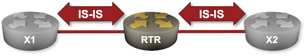

# Explore IS-IS Data Structures

You'll explore IS-IS adjacencies and the IS-IS topology database in this lab. We'll use the topology from the [Configure IS-IS Routing for IPv4](1-simple-ipv4.md) lab exercise:



## Device Requirements

Use any device [supported by the _netlab_ IS-IS configuration module](https://netlab.tools/platforms/#platform-routing-support).

## Starting the Lab

Assuming you already [set up your lab infrastructure](../1-setup.md):

* Change directory to `basic/2-explore`
* Execute **netlab up**
* Log into your device (RTR) with **netlab connect rtr**

You'll get a lab with IPv4 addresses and IS-IS routing configured on all lab devices.

## Explore Router Configuration

Unless you're absolutely sure how your router is configured, always start with a high-level overview of IS-IS settings, usually displayed with a command like **show isis summary**.

The most significant bits of information include:

* **NET**, which can be split into **area** and **system ID**. Some devices display NET; others display the IS-IS area and the system ID as independent components.
* The address families (IPv4, IPv6)
* Router type: intra-area router (level-1), inter-area router (level-2) or multi-level router[^ABR] (level-1-2).

[^ABR]: Similar, but not exactly equivalent to OSPF ABR

Try to find the above information in the printout produced by FRRouting and Arista cEOS:

Basic IS-IS information displayed by FRRouting
{: .code-caption }
```
$ netlab connect rtr --show isis summary
vrf             : default
Process Id      : 32
System Id       : 0000.0000.0001
Up time         : 00:00:15 ago
Number of areas : 1
Area Gandalf:
  Net: 49.0001.0000.0000.0001.00
  TX counters per PDU type:
     L2 IIH: 2
    P2P IIH: 14
     L2 LSP: 8
    L2 CSNP: 4
    L2 PSNP: 4
   LSP RXMT: 0
  RX counters per PDU type:
    P2P IIH: 14
     L2 LSP: 4
    L2 CSNP: 4
    L2 PSNP: 4
  Drop counters per PDU type:
  Advertise high metrics: Disabled
  Level-2:
    LSP0 regenerated: 2
         LSPs purged: 0
    SPF:
      minimum interval  : 1
    IPv4 route computation:
      last run elapsed  : 00:00:13 ago
      last run duration : 152 usec
      run count         : 2
```

Basic IS-IS information displayed by Arista cEOS
{: .code-caption }
```
rtr>show isis summary

IS-IS Instance: Gandalf VRF: default
  Instance ID: 0
  System ID: 0000.0000.0001, administratively enabled
  Router ID: IPv4: 10.0.0.1
  Hostname: rtr
  Multi Topology disabled, not attached
  IPv4 Preference: Level 1: 115, Level 2: 115
  IPv6 Preference: Level 1: 115, Level 2: 115
  IS-Type: Level 2, Number active interfaces: 3
  Routes IPv4 only
  LSP size maximum: Level 1: 1492, Level 2: 1492
  Interval Type           Max Wait Initial Wait Hold Interval
  ----------------------- -------- ------------ -------------
  LSP generation interval      5 s        50 ms         50 ms
  SPF interval             2000 ms      1000 ms       1000 ms
  Current SPF hold interval(ms): Level 1: 0, Level 2: 2000
  Last Level 2 SPF run 7 seconds ago
  CSNP generation interval: 10 seconds
  Dynamic Flooding: Disabled
  Authentication mode: Level 1: None, Level 2: None
  Graceful Restart: Disabled, Graceful Restart Helper: Enabled
  Area addresses: 49.0001
  level 2: number DIS interfaces: 0, LSDB size: 3
    Area Leader: None
    Overload Bit is not set.
  Redistributed Level 1 routes: 0 limit: Not Configured
  Redistributed Level 2 routes: 0 limit: Not Configured
```

## Explore IS-IS Adjacencies

IS-IS high-level principles are similar to OSPF ones:

* A hello protocol is used to discover neighbors (unlike OSPF, which uses IP, IS-IS uses a dedicated layer-3 protocol).
* Once the neighbors are discovered, an adjacency is established with them.
* Neighbors exchange their topology database information and any missing topology database records.

Examining IS-IS neighbors is thus the next logical step after examining the local IS-IS parameters; the command to use is often **show isis neighbor** (or **show isis adjacency**). You should be looking for the following information:

* The local interface
* Neighbor name or system ID. Most modern IS-IS implementations display neighbor names[^RFC5301].
* The state of adjacency (it should be *Up* on point-to-point links)
* The type of adjacency: intra-area adjacency (level-1), inter-area adjacency (level-2) or multi-level adjacency (level-1-2)[^MLNA].
* Remote MAC address (SNPA[^SNPA]). The remote MAC address is sometimes displayed as `2020.2020.2020` on point-to-point links.

!!! tip
    All routers in your lab are configured as level-2 routers and should have only level-2 adjacencies.

[^RFC5301]: Router names are advertised using the Dynamic Hostname TLV defined in [RFC 5301](https://www.rfc-editor.org/rfc/rfc5301.html).

[^SNPA]: Subnetwork point of attachment -- a fancy OSI name for a MAC address.

[^MLNA]: We're using **level-2-only** routers in the initial lab exercises. We'll explore multi-level routing in one of the more advanced exercises.

Try to extract the above information from the printouts generated by FRRouting and Arista cEOS:

IS-IS neighbors displayed by FRRouting
{: .code-caption }
```
$ netlab connect rtr --show isis neighbor
Area Gandalf:
  System Id           Interface   L  State        Holdtime SNPA
 x1                  eth1        2  Up            29       2020.2020.2020
 x2                  eth2        2  Up            29       2020.2020.2020
```

IS-IS neighbors displayed by Arista cEOS
{: .code-caption }
```
rtr>show isis neighbors

Instance  VRF      System Id        Type Interface          SNPA              State Hold time   Circuit Id
Gandalf   default  x1               L2   Ethernet1          P2P               UP    29          00
Gandalf   default  x2               L2   Ethernet2          P2P               UP    29          00
```

Sometimes, you have to dig deeper and display neighbor details; a typical command to display those details is **show isis neighbor detail**. The details include:

* The address families supported by the neighbor (IPv4, IPv6)
* Neighbor's area address and interface IPv4/IPv6 address.
* Neighbor health statistics, including the number of flaps and the remaining hold timer.

Extract the above information from the printouts generated by FRRouting and Arista cEOS.

The IS-IS neighbor details displayed by FRRouting
{: .code-caption }
```
$ netlab connect rtr --show isis neighbor detail
Area Gandalf:
 x1
    Interface: eth1, Level: 2, State: Up, Expires in 28s
    Adjacency flaps: 1, Last: 1m22s ago
    Circuit type: L2, Speaks: IPv4
    SNPA: 2020.2020.2020
    Area Address(es):
      49.0001
    IPv4 Address(es):
      10.1.0.2

 x2
    Interface: eth2, Level: 2, State: Up, Expires in 27s
    Adjacency flaps: 1, Last: 1m22s ago
    Circuit type: L2, Speaks: IPv4
    SNPA: 2020.2020.2020
    Area Address(es):
      49.0001
    IPv4 Address(es):
      10.1.0.6
```

The IS-IS neighbor details displayed by Arista cEOS
{: .code-caption }
```
rtr>show isis neighbors detail

Instance  VRF      System Id        Type Interface          SNPA              State Hold time   Circuit Id
Gandalf   default  x1               L2   Ethernet1          P2P               UP    29          00
  Area addresses: 49.0001
  SNPA: P2P
  Router ID: 0.0.0.0
  Advertised Hold Time: 30
  State Changed: 00:02:19 ago at 2024-08-08 10:46:49
  IPv4 Interface Address: 10.1.0.2
  IPv6 Interface Address: none
  Interface name: Ethernet1
  Graceful Restart: Not Supported
  Supported Address Families: IPv4
  Neighbor Supported Address Families: IPv4
```

## Explore IS-IS Database

Like OSPF, IS-IS uses a *topology database* -- a distributed, eventually consistent database shared among all routers in an area or among all inter-area routers.

Unlike OSPF, where an ABR could have topology information for multiple areas, IS-IS uses a simpler two-level approach:

* Routers participating in intra-area routing (level-1 and level-1-2 routers) share a level-1 link-state database containing intra-area topology and prefixes.
* Level-1-2 and level-2 routers (inter-area routers) share a level-2 link-state database containing inter-area topology and prefixes from all IS-IS areas.

!!! tip
    All routers in your lab are configured as level-2 routers and thus share only the level-2 link-state database[^MLL].

OSPF stores various bits of topology information in multiple types of Link State Advertisements (LSA). IS-IS stores all information generated by a single router in a single Link State Information Packet (LSP) unless it has too much information for a single LSP, in which case it generates multiple LSP fragments ([more details](#frag)).

!!! tip
    IS-IS cannot fragment LSPs in transit; the maximum LSP size must never exceed the lowest MTU of any link in the IS-IS network. IS-IS contains no mechanism to dynamically detect the minimum network-wide MTU; you have to set the maximum LSP size with a router configuration command similar to **lsp-mtu**.

[^MLL]: We'll cover multi-level IS-IS routing in another lab exercise.

The identifier of an IS-IS LSP is always in the format `router-id.lsp-id.fragment-id`. The `router-id` is the NET (although you can usually use hostnames), the `lsp-id` becomes relevant on multi-access links (we'll get there in another lab exercise), and the `fragment-id` is the sequence number of the LSP fragment.

You can inspect the IS-IS topology database with a command similar to **show isis database**. The short printout usually lists the LSPs (their ID), the LSP length, their sequence number, and their remaining lifetime.

!!! tip
    A quickly increasing LSP sequence number might indicate routing instabilities.

The IS-IS topology database overview displayed by FRRouting
{: .code-caption }
```
$ netlab connect rtr --show isis database
Area Gandalf:
IS-IS Level-2 link-state database:
LSP ID                  PduLen  SeqNumber   Chksum  Holdtime  ATT/P/OL
rtr.00-00            *    113   0x00000002  0x902e    1626    0/0/0
x1.00-00                   92   0x00000002  0x23a0    1659    0/0/0
x2.00-00                   92   0x00000002  0xc8f0    1633    0/0/0
    3 LSPs
```

The IS-IS topology database overview displayed by Arista cEOS
{: .code-caption }
```
rtr>show isis database
Legend:
H - hostname conflict
U - node unreachable

IS-IS Instance: Gandalf VRF: default
  IS-IS Level 2 Link State Database
    LSPID                   Seq Num  Cksum  Life Length IS  Received LSPID        Flags
    rtr.00-00                     2  26795  1042    119 L2  0000.0000.0001.00-00  <>
    x1.00-00                      2   9120  1610     92 L2  0000.0000.0002.00-00  <>
    x2.00-00                      2  51440  1610     92 L2  0000.0000.0003.00-00  <>
```

You can inspect the contents of an IS-IS LSP with a command similar to **show isis database detail**. Each IS-IS LSP contains numerous data items encoded as Type-Length-Value triplets. The TLV values are usually displayed in a human-friendly format; you'd have to use a packet capture tool like **tcpdump** or **wireshark** to see the dirty details.

The recognized IS-IS data types are collected in the [IANA IS-IS TLV Codepoints](https://www.iana.org/assignments/isis-tlv-codepoints/isis-tlv-codepoints.xhtml) registry; you'd usually see the following TLVs in a modern IPv4 network:

| TLV | Description |
|----:|-------------|
| 1   | Area address |
| 137 | Hostname |
| 242 | Router capabilities |
| 129 | Supported protocols (IPv4/IPv6) |
| 22  | Extended IS Reachability[^WM]<br>The cost to reach adjacent routers |
| 132 | IPv4 Interface Address |
| 135 | IPv4 Extended Reachability<br>The cost of a connected prefix |

[^WM]: Also known as Wide Metrics (covered in another lab exercise).

This is how FRRouting and Arista cEOS display the LSP information:

LSP content displayed by FRRouting
{: .code-caption }
```
$ netlab connect rtr --show isis database detail rtr.00-00
Connecting to container clab-explore-rtr, executing vtysh -c "show isis database detail rtr.00-00"
Area Gandalf:
IS-IS Level-2 link-state database:
LSP ID                  PduLen  SeqNumber   Chksum  Holdtime  ATT/P/OL
rtr.00-00            *    113   0x00000002  0x902e    1589    0/0/0
  Protocols Supported: IPv4
  Area Address: 49.0001
  Hostname: rtr
  TE Router ID: 10.0.0.1
  Router Capability: 10.0.0.1 , D:0, S:0
  Extended Reachability: 0000.0000.0002.00 (Metric: 10)
  Extended Reachability: 0000.0000.0003.00 (Metric: 10)
  IPv4 Interface Address: 10.0.0.1
  Extended IP Reachability: 10.0.0.1/32 (Metric: 10)
  Extended IP Reachability: 10.1.0.0/30 (Metric: 10)
  Extended IP Reachability: 10.1.0.4/30 (Metric: 10)
```

LSP content displayed by Arista EOS
{: .code-caption }
```
rtr>show isis database rtr.00-00 detail
Legend:
H - hostname conflict
U - node unreachable

IS-IS Instance: Gandalf VRF: default
  IS-IS Level 2 Link State Database
    LSPID                   Seq Num  Cksum  Life Length IS  Received LSPID        Flags
    rtr.00-00                     2  26795  1001    119 L2  0000.0000.0001.00-00  <>
      LSP generation remaining wait time: 0 ms
      Time remaining until refresh: 701 s
      NLPID: 0xCC(IPv4)
      Hostname: rtr
      Area addresses: 49.0001
      Interface address: 10.1.0.5
      Interface address: 10.1.0.1
      Interface address: 10.0.0.1
      IS Neighbor          : x1.00               Metric: 10
      IS Neighbor          : x2.00               Metric: 10
      Reachability         : 10.1.0.4/30 Metric: 10 Type: 1 Up
      Reachability         : 10.1.0.0/30 Metric: 10 Type: 1 Up
      Reachability         : 10.0.0.1/32 Metric: 10 Type: 1 Up
      Router Capabilities: Router Id: 10.0.0.1 Flags: []
        Area leader priority: 250 algorithm: 0
```

The LSP information is used to build a topology graph that the SPF algorithm uses to find the lowest cost path to every known IP prefix:

* The LSPs are nodes in the topology graph
* The **‌Extended IS Reachability** TLV describes the unidirectional links in the topology graph
* The **Extended IP Reachability** TLVs describe leaf nodes (IP prefixes) attached to the LSPs

In the first phase, the SPF algorithm finds the shortest path to every LSP in the topology graph; in the second phase, it finds the minimum cost path toward every prefix advertised by other routers.

## LSP Fragments {#frag}

You rarely see LSP fragments in small networks, but it's pretty easy to generate them by lowering the maximum LSP size. For example, if we reduce the LSP size on **rtr** to 256, we'll get two fragments:

```
rtr# show isis database
Area Gandalf:
IS-IS Level-2 link-state database:
LSP ID                  PduLen  SeqNumber   Chksum  Holdtime  ATT/P/OL
rtr.00-00            *     67   0x00000024  0xe3a6    1648    0/0/0
rtr.00-01            *     75   0x00000006  0xa54b    1648    0/0/0
x1.00-00                   92   0x00000017  0xf8b5    1288    0/0/0
x2.00-00                   92   0x00000018  0x9c07    1043    0/0/0
```

The LSP fragments contain the same information as the original LSP, only split across multiple smaller database objects:

```
rtr# show isis database detail rtr.00-00
Area Gandalf:
IS-IS Level-2 link-state database:
LSP ID                  PduLen  SeqNumber   Chksum  Holdtime  ATT/P/OL
rtr.00-00            *     67   0x00000024  0xe3a6    1590    0/0/0
  Protocols Supported: IPv4
  Area Address: 49.0001
  Hostname: rtr
  TE Router ID: 10.0.0.1
  Router Capability: 10.0.0.1 , D:0, S:0
  Extended Reachability: 0000.0000.0002.00 (Metric: 10)

rtr# show isis database detail rtr.00-01
Area Gandalf:
IS-IS Level-2 link-state database:
LSP ID                  PduLen  SeqNumber   Chksum  Holdtime  ATT/P/OL
rtr.00-01            *     75   0x00000006  0xa54b    1589    0/0/0
  Extended Reachability: 0000.0000.0003.00 (Metric: 10)
  IPv4 Interface Address: 10.0.0.1
  Extended IP Reachability: 10.0.0.1/32 (Metric: 10)
  Extended IP Reachability: 10.1.0.0/30 (Metric: 10)
  Extended IP Reachability: 10.1.0.4/30 (Metric: 10)
```

**Next:** [IS-IS on Point-to-Point Links](3-p2p.md)

## Reference Information

### Lab Wiring

| Origin Device | Origin Port | Destination Device | Destination Port |
|---------------|-------------|--------------------|------------------|
| rtr | Ethernet1 | x1 | eth1 |
| rtr | Ethernet2 | x2 | eth1 |

**Note:** The interface names depend on the devices you use in the lab. The printout was generated with Arista EOS running on RTR and FRRouting running on X1 and X2.

### Lab Addressing

| Node/Interface | IPv4 Address | IPv6 Address | Description |
|----------------|-------------:|-------------:|-------------|
| **rtr** |  10.0.0.1/32 |  | Loopback |
| Ethernet1 | 10.1.0.1/30 |  | rtr -> x1 |
| Ethernet2 | 10.1.0.5/30 |  | rtr -> x2 |
| **x1** |  10.0.0.2/32 |  | Loopback |
| eth1 | 10.1.0.2/30 |  | x1 -> rtr |
| **x2** |  10.0.0.3/32 |  | Loopback |
| eth1 | 10.1.0.6/30 |  | x2 -> rtr |
