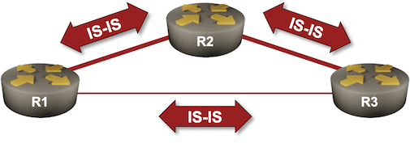

# Using IS-IS Metrics

Like OSPF, IS-IS uses interface costs (called *link metrics*) to calculate the best path toward destination IP prefixes. Unlike OSPF, the default metrics are fixed (usually set to 10) and do not reflect the interface bandwidth.

For example, in the following topology, using the default IS-IS settings, the traffic between R1 and R3 would use the direct low-speed link. We'll fix that in this lab exercise.



## Device Requirements

Use any device [supported by the _netlab_ IS-IS configuration module](https://netlab.tools/platforms/#platform-routing-support).

## Starting the Lab

You can start the lab [on your own lab infrastructure](../1-setup.md) or in [GitHub Codespaces](https://github.com/codespaces/new/bgplab/isis) ([more details](https://bgplabs.net/4-codespaces/)):

* Change directory to `basic/4-metric`
* Execute **netlab up**
* Log into lab devices with **netlab connect**

You'll get a lab with IPv4 addresses and basic IS-IS configurations on all devices. According to the recommendations from the [Configure IS-IS Routing for IPv4](1-simple-ipv4.md) lab exercise, the routers are level-2-only routers, and the links are configured as point-to-point links.

## Initial Routing Tables

Check the routing tables on R1 and R3 and verify that they use the direct (low-bandwidth) link. R1 should use the first Ethernet interface to reach R2 and the second Ethernet interface to reach R3.

This is the printout you should get on FRRouting[^LPLB]:

[^LPLB]: I'm using the **show ip route longer-prefixes** command to display just the loopbacks that happen to be in the 10.0.0.0/24 address space.

```
r1# show ip route 10.0.0.0/24 longer-prefixes
Codes: K - kernel route, C - connected, L - local, S - static,
       R - RIP, O - OSPF, I - IS-IS, B - BGP, E - EIGRP, N - NHRP,
       T - Table, v - VNC, V - VNC-Direct, A - Babel, F - PBR,
       f - OpenFabric, t - Table-Direct,
       > - selected route, * - FIB route, q - queued, r - rejected, b - backup
       t - trapped, o - offload failure

L * 10.0.0.1/32 is directly connected, lo, 00:00:58
C>* 10.0.0.1/32 is directly connected, lo, 00:00:58
I>* 10.0.0.2/32 [115/20] via 10.1.0.2, eth1, weight 1, 00:00:55
I>* 10.0.0.3/32 [115/20] via 10.1.0.10, eth2, weight 1, 00:00:55
```

The cost to reach 10.0.0.2/32 and 10.0.0.3/32 is 20 (when using FRRouting):

* The cost of the connection between R1 and R2 (or R1 and R3) is 10.
* R2 and R3 advertise the loopback prefixes with a cost of 10 (this detail may vary across different implementations).

You can check these details in the IS-IS topology database:

R1 LSP -- note the Extended Reachability metric toward R2 and R3
{ .code-caption }
```
r1# show isis database detail r1.00-00
Area Gandalf:
IS-IS Level-2 link-state database:
LSP ID                  PduLen  SeqNumber   Chksum  Holdtime  ATT/P/OL
r1.00-00             *    112   0x00000003  0xc5aa    1093    0/0/0
  Protocols Supported: IPv4
  Area Address: 49.0001
  Hostname: r1
  TE Router ID: 10.0.0.1
  Router Capability: 10.0.0.1 , D:0, S:0
  Extended Reachability: 0000.0000.0002.00 (Metric: 10)
  Extended Reachability: 0000.0000.0003.00 (Metric: 10)
  IPv4 Interface Address: 10.0.0.1
  Extended IP Reachability: 10.0.0.1/32 (Metric: 10)
  Extended IP Reachability: 10.1.0.0/30 (Metric: 10)
  Extended IP Reachability: 10.1.0.8/30 (Metric: 10)
```

R2 LSP -- note the Extended IP Reachability metric for 10.0.0.2/32
{ .code-caption }
```
r1# show isis database detail r2.00-00
Area Gandalf:
IS-IS Level-2 link-state database:
LSP ID                  PduLen  SeqNumber   Chksum  Holdtime  ATT/P/OL
r2.00-00                  112   0x00000003  0xfb73    1049    0/0/0
  Protocols Supported: IPv4
  Area Address: 49.0001
  Hostname: r2
  TE Router ID: 10.0.0.2
  Router Capability: 10.0.0.2 , D:0, S:0
  Extended Reachability: 0000.0000.0001.00 (Metric: 10)
  Extended Reachability: 0000.0000.0003.00 (Metric: 10)
  IPv4 Interface Address: 10.0.0.2
  Extended IP Reachability: 10.0.0.2/32 (Metric: 10)
  Extended IP Reachability: 10.1.0.0/30 (Metric: 10)
  Extended IP Reachability: 10.1.0.4/30 (Metric: 10)
```

## Changing the IS-IS Interface Metric

You can change the IS-IS interface metric with an interface configuration command similar to **isis metric**[^L1L2M]. Change the metric on the R1-R3 link to 50 (you must make the change on both ends).

[^L1L2M]: IS-IS can use different metrics for L1 and L2 adjacencies. Don't waste your time on that detail, and I hope you'll never see a network using it outside of a CCIE lab.

## Verifying the Change

After the change, R1 should use the first Ethernet interface to reach R3's loopback address. This is the printout you should get on FRRouting:

Updated IP routing table on R1
{ .code-caption }
```
r1# show ip route 10.0.0.0/24 longer-prefixes
Codes: K - kernel route, C - connected, L - local, S - static,
       R - RIP, O - OSPF, I - IS-IS, B - BGP, E - EIGRP, N - NHRP,
       T - Table, v - VNC, V - VNC-Direct, A - Babel, F - PBR,
       f - OpenFabric, t - Table-Direct,
       > - selected route, * - FIB route, q - queued, r - rejected, b - backup
       t - trapped, o - offload failure

L * 10.0.0.1/32 is directly connected, lo, 00:32:08
C>* 10.0.0.1/32 is directly connected, lo, 00:32:08
I>* 10.0.0.2/32 [115/20] via 10.1.0.2, eth1, weight 1, 00:32:05
I>* 10.0.0.3/32 [115/30] via 10.1.0.2, eth1, weight 1, 00:02:53
```

## Narrow, Wide, and Transitional Metrics

Did you notice the *Extended Reachability* and *Extended IP Reachability* headings in the LSP printouts? Here's the full story:

* Original IS-IS specifications had 6-bit interface metrics (0-63)[^ZLB], and the end-to-end path cost could not exceed 1023[^SPF]. Today, we call those metrics **narrow** metrics.
* When large ISPs started using IS-IS, they quickly discovered that those limits were ridiculous. [RFC 3784](https://www.rfc-editor.org/rfc/rfc3784) defined 24-bit metrics (we call them **wide** metrics), which is what most deployments use today.
* All existing IS-IS networks that wanted to use the *wide* metrics had to transition from *narrow* to *wide* metrics, usually while keeping the network operational. The solution was to advertise both sets of metrics (that have to match) until all network devices advertise *wide* metrics. Some vendors call that approach *transition* metrics.

[^ZLB]: While you can set the metric to zero on the loopback interface, the metric has to be a positive number on a transit link, or the SPF algorithm could end in an infinite loop.

[^SPF]: The DEC engineers working on IS-IS had a great idea that you could optimize the SPF algorithm if the metric is small enough to be used as an index of a reasonably sized table.

Transitioning from narrow to wide metrics is somewhat convoluted:

* You must configure all devices to advertise narrow and wide metrics (change the metric style from *narrow* to *transitional*).
* Once all devices advertise wide metrics, you can configure them to use them (this step might be optional in the IS-IS implementation you're using).
* Finally, you can stop advertising the *narrow* metrics (change the metric style from *transitional* to *wide*).
* You can start using large metric values only after your devices use only *wide* metrics.

As you can see, starting your IS-IS deployment with *wide* metrics is much better, especially if you want to use modern IS-IS features like SR-MPLS that work only with *wide* metrics.

!!! warning
    You'll get weird results if some devices in your network support only *narrow* metrics while others advertise only *wide* metrics. If you have devices that do not understand the *wide* metrics, keep using the *narrow* metrics; otherwise, ensure all devices use only *wide* metrics.

I haven't seen an IS-IS implementation that doesn't understand the *narrow* metrics, and all recent implementations support *wide* metrics (they've been around for 20 years)[^SDH]. Sadly, many devices still use *narrow* metrics as the default, so let's reproduce that ancient world in a modern implementation (FRRouting). We'll use the **metric-style** router configuration command, set it to **narrow** on R1, and see what happens to the R1 LSP.

[^SDH]: SDH equipment using CLNP for network management might be an exception.

R1 LSP using narrow metrics
{ .code-caption }
```
r1# show isis database detail r1.00-00
Area Gandalf:
IS-IS Level-2 link-state database:
LSP ID                  PduLen  SeqNumber   Chksum  Holdtime  ATT/P/OL
r1.00-00             *    116   0x00000005  0x4857    1781    0/0/0
  Protocols Supported: IPv4
  Area Address: 49.0001
  IS Reachability: 0000.0000.0002.00 (Metric: 10)
  IS Reachability: 0000.0000.0003.00 (Metric: 50)
  Hostname: r1
  Router Capability: 10.0.0.1 , D:0, S:0
  IP Reachability: 10.0.0.1/32 (Metric: 10)
  IP Reachability: 10.1.0.0/30 (Metric: 10)
  IP Reachability: 10.1.0.8/30 (Metric: 50)
  IPv4 Interface Address: 10.0.0.1
```

As you can see, R1 replaced the *Extended Reachability* metric with the *IS Reachability* metric and the *Extended IP Reachability* metric with the *IP Reachability metric*. It also wouldn't allow you to increase the metric on the R1-R3 link above 63.

Finally, let's set the metric style to *transition* and observe the changes in R1 LSP. As expected, the LSP contains two sets of metrics for every link and IP prefix.

R1 LSP with transition metrics (narrow and wide)
{ .code-caption }
```
r1# sh isis database detail r1.00-00
Area Gandalf:
IS-IS Level-2 link-state database:
LSP ID                  PduLen  SeqNumber   Chksum  Holdtime  ATT/P/OL
r1.00-00             *    175   0x0000000a  0x7dab    1785    0/0/0
  Protocols Supported: IPv4
  Area Address: 49.0001
  IS Reachability: 0000.0000.0002.00 (Metric: 10)
  IS Reachability: 0000.0000.0003.00 (Metric: 50)
  Hostname: r1
  TE Router ID: 10.0.0.1
  Router Capability: 10.0.0.1 , D:0, S:0
  Extended Reachability: 0000.0000.0002.00 (Metric: 10)
  Extended Reachability: 0000.0000.0003.00 (Metric: 50)
  IP Reachability: 10.0.0.1/32 (Metric: 10)
  IP Reachability: 10.1.0.0/30 (Metric: 10)
  IP Reachability: 10.1.0.8/30 (Metric: 50)
  IPv4 Interface Address: 10.0.0.1
  Extended IP Reachability: 10.0.0.1/32 (Metric: 10)
  Extended IP Reachability: 10.1.0.0/30 (Metric: 10)
  Extended IP Reachability: 10.1.0.8/30 (Metric: 50)
```

And now you know the whole story behind the IS-IS metric types. I hope you'll never see *narrow* or *transition* metric styles in a live network, and if you do (for example, due to ancient vendor defaults), consider changing that to *wide*.

**Next:** [Dual-Stack (IPv4+IPv6) IS-IS Routing](5-ipv6.md)

## Reference Information

### Lab Wiring

| Origin Device | Origin Port | Destination Device | Destination Port |
|---------------|-------------|--------------------|------------------|
| r1 | eth1 | r2 | eth1 |
| r2 | eth2 | r3 | eth1 |
| r1 | eth2 | r3 | eth2 |

### Lab Addressing

| Node/Interface | IPv4 Address | IPv6 Address | Description |
|----------------|-------------:|-------------:|-------------|
| **r1** |  10.0.0.1/32 |  | Loopback |
| eth1 | 10.1.0.1/30 |  | r1 -> r2 |
| eth2 | 10.1.0.9/30 |  | r1 -> r3 |
| **r2** |  10.0.0.2/32 |  | Loopback |
| eth1 | 10.1.0.2/30 |  | r2 -> r1 |
| eth2 | 10.1.0.5/30 |  | r2 -> r3 |
| **r3** |  10.0.0.3/32 |  | Loopback |
| eth1 | 10.1.0.6/30 |  | r3 -> r2 |
| eth2 | 10.1.0.10/30 |  | r3 -> r1 |
