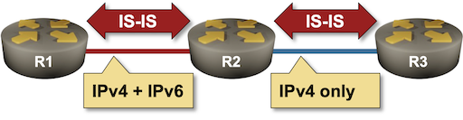

# Dual-Stack (IPv4+IPv6) IS-IS Routing

Adding IPv6 support to IS-IS seems like a no-brainer. The data structures describing the network topology are extensible, and we already have TLVs for links and IPv4 prefixes. Let's add IPv6 prefixes and call it a day. That's the approach taken by [RFC 5308](https://datatracker.ietf.org/doc/html/rfc5308). Unfortunately, the devil usually hides in the seemingly irrelevant details, and we'll explore those in this lab exercise.

We'll use a very simple topology with three routers. The only quirk is the addressing on the R2-R3 link; while all three routers have an IPv6 address configured on their loopback interface, the R2-R3 link does not run IPv6.



## Device Requirements

Use any device [supported by the _netlab_ IS-IS configuration module](https://netlab.tools/platforms/#platform-routing-support).

## Starting the Lab

You can start the lab [on your own lab infrastructure](../1-setup.md) or in [GitHub Codespaces](https://github.com/codespaces/new/bgplab/isis) ([more details](https://bgplabs.net/4-codespaces/)):

* Change directory to `basic/5-ipv6`
* Execute **netlab up**
* Log into lab devices with **netlab connect**

You'll get a lab with:

* IPv4 and IPv6 addresses on loopback interfaces
* IS-IS configured for IPv4 routing
* IPv6 LLA configured on the R1-R2 link but not on the R2-R3 link.

## Initial Routing Tables

Check the routing tables on R1 and verify that it can reach the loopback interfaces of R2 and R3. You should get these printouts on FRRouting and Arista EOS:

The IPv4 routing table on R1 running FRRouting
{.code-caption}
```
r1# show ip route
Codes: K - kernel route, C - connected, L - local, S - static,
       R - RIP, O - OSPF, I - IS-IS, B - BGP, E - EIGRP, N - NHRP,
       T - Table, v - VNC, V - VNC-Direct, A - Babel, F - PBR,
       f - OpenFabric, t - Table-Direct,
       > - selected route, * - FIB route, q - queued, r - rejected, b - backup
       t - trapped, o - offload failure

L * 10.0.0.1/32 is directly connected, lo, 00:00:21
C>* 10.0.0.1/32 is directly connected, lo, 00:00:21
I>* 10.0.0.2/32 [115/20] via 10.1.0.2, eth1, weight 1, 00:00:17
I>* 10.0.0.3/32 [115/30] via 10.1.0.2, eth1, weight 1, 00:00:17
I   10.1.0.0/30 [115/20] via 10.1.0.2, eth1 inactive, weight 1, 00:00:17
C>* 10.1.0.0/30 is directly connected, eth1, 00:00:21
L>* 10.1.0.1/32 is directly connected, eth1, 00:00:21
I>* 10.1.0.4/30 [115/20] via 10.1.0.2, eth1, weight 1, 00:00:17
```

The IPv4 routing table on R1 running Arista EOS
{.code-caption}
```
r1>show ip route | begin Gateway
Gateway of last resort is not set

 C        10.0.0.1/32
           directly connected, Loopback0
 I L2     10.0.0.2/32 [115/20]
           via 10.1.0.2, Ethernet1
 I L2     10.0.0.3/32 [115/30]
           via 10.1.0.2, Ethernet1
 C        10.1.0.0/30
           directly connected, Ethernet1
 I L2     10.1.0.4/30 [115/20]
           via 10.1.0.2, Ethernet1
```

Check also the IPv6 routing tables. Each router should have only its loopback IPv6 prefix in the IPv6 routing table:

The IPv6 routing table on R1 running FRRouting
{.code-caption}
```
r1# show ipv6 route
Codes: K - kernel route, C - connected, L - local, S - static,
       R - RIPng, O - OSPFv3, I - IS-IS, B - BGP, N - NHRP,
       T - Table, v - VNC, V - VNC-Direct, A - Babel, F - PBR,
       f - OpenFabric, t - Table-Direct,
       > - selected route, * - FIB route, q - queued, r - rejected, b - backup
       t - trapped, o - offload failure

C>* 2001:db8:cafe:1::/64 is directly connected, lo, 00:00:31
L>* 2001:db8:cafe:1::1/128 is directly connected, lo, 00:00:31
C>* fe80::/64 is directly connected, eth1, 00:00:30
```

The IPv6 routing table on R1 running Arista EOS
{.code-caption}
```
r1>show ipv6 route

VRF: default
Displaying 1 of 5 IPv6 routing table entries
Source Codes:
       C - connected, S - static, K - kernel, O3 - OSPFv3,
       B - Other BGP Routes, A B - BGP Aggregate, R - RIP,
       I L1 - IS-IS level 1, I L2 - IS-IS level 2, DH - DHCP,
       NG - Nexthop Group Static Route, M - Martian,
       DP - Dynamic Policy Route, L - VRF Leaked,
       G  - gRIBI, RC - Route Cache Route,
       CL - CBF Leaked Route

 C        2001:db8:cafe:1::/64 [0/0]
           via Loopback0, directly connected
```

## Configure IS-IS for IPv6 Routing

Enabling IPv6 routing on an existing IS-IS instance is trivial. Some devices (for example, FRRouting) expect you to do it on individual interfaces (including the loopback interfaces) with a command similar to **ipv6 router isis**; other devices (for example, Arista EOS) require you to configure the IPv6 address family within the IS-IS routing process without changing the interface configuration (**address-family ipv6** is a typical command to use)[^CB].

[^CB]: I'm positive you have to do both on some devices ;)

Depending on which devices you use in your lab, configure IPv6 IS-IS routing on all links with IPv6 addresses or IPv6 address family in the IS-IS routing process on all routers.

## The Confusing Results

If you're using Arista EOS in your lab, you'll notice that R2 no longer wants to have R3 as its IS-IS neighbor. Arista EOS is very strict and forms IS-IS adjacencies only over interfaces with addresses from all address families configured in the IS-IS routing process.

IS-IS neighbors on R2 running Arista EOS
{.code-caption}
```
r2#show isis neighbors

Instance  VRF      System Id        Type Interface          SNPA              State Hold time   Circuit Id
Gandalf   default  r1               L2   Ethernet1          P2P               UP    25          60
```

If you find that too strict, let's see what happens on devices that use a more relaxed approach. Start the lab with FRRouting devices and enable IS-IS for IPv6 (hint: **ipv6 router isis**) on all interfaces with IPv6 addresses. After doing that, R2 should still have adjacencies with R3 and R1:

IS-IS neighbors on R2 running FRRouting
{.code-caption}
```
r2# show isis neighbor
Area Gandalf:
  System Id           Interface   L  State        Holdtime SNPA
 r1                  eth1        2  Up            28       2020.2020.2020
 r3                  eth2        2  Up            28       2020.2020.2020
```

However, even though R3 advertises its loopback IPv6 prefix in its LSP, R2 does not have the IPv6 prefix of R3's loopback in its IPv6 routing table:

The LSP advertised by R3
{.code-caption}
```
r2# show isis database detail r3.00-00
Area Gandalf:
IS-IS Level-2 link-state database:
LSP ID                  PduLen  SeqNumber   Chksum  Holdtime  ATT/P/OL
r3.00-00                  109   0x00000004  0xa092    1713    0/0/0
  Protocols Supported: IPv4, IPv6
  Area Address: 49.0001
  Hostname: r3
  TE Router ID: 10.0.0.3
  Router Capability: 10.0.0.3 , D:0, S:0
  Extended Reachability: 0000.0000.0002.00 (Metric: 10)
  IPv4 Interface Address: 10.0.0.3
  Extended IP Reachability: 10.0.0.3/32 (Metric: 10)
  Extended IP Reachability: 10.1.0.4/30 (Metric: 10)
  IPv6 Reachability: 2001:db8:cafe:3::/64 (Metric: 10)
```

The IPv6 routing table on R2 (FRRouting)
{.code-caption}
```
r2# show ipv6 route
Codes: K - kernel route, C - connected, L - local, S - static,
       R - RIPng, O - OSPFv3, I - IS-IS, B - BGP, N - NHRP,
       T - Table, v - VNC, V - VNC-Direct, A - Babel, F - PBR,
       f - OpenFabric, t - Table-Direct,
       > - selected route, * - FIB route, q - queued, r - rejected, b - backup
       t - trapped, o - offload failure

I>* 2001:db8:cafe:1::/64 [115/20] via fe80::a8c1:abff:fed7:a0ce, eth1, weight 1, 00:00:47
C>* 2001:db8:cafe:2::/64 is directly connected, lo, 00:24:45
L>* 2001:db8:cafe:2::1/128 is directly connected, lo, 00:24:45
C>* fe80::/64 is directly connected, eth1, 00:24:44
```

How does R2 know that it can use the link to R3 for IPv4 traffic but not for IPv6 traffic? The lack of an IPv6 interface address is the first hint, as are the IS-IS hello messages. Every IS-IS router advertises the address families configured on an interface in the IS-IS hello messages sent over that interface. You can use a command similar to **show isis neighbor detail** to check that:

The IS-IS neighbors visible to R2 (FRRouting)
{.code-caption}
```
r2# show isis neighbor detail
Area Gandalf:
 r1
    Interface: eth1, Level: 2, State: Up, Expires in 30s
    Adjacency flaps: 1, Last: 27m13s ago
    Circuit type: L2, Speaks: IPv4, IPv6
    SNPA: 2020.2020.2020
    Area Address(es):
      49.0001
    IPv4 Address(es):
      10.1.0.1
    IPv6 Address(es):
      fe80::a8c1:abff:fed7:a0ce

 r3
    Interface: eth2, Level: 2, State: Up, Expires in 27s
    Adjacency flaps: 1, Last: 27m13s ago
    Circuit type: L2, Speaks: IPv4
    SNPA: 2020.2020.2020
    Area Address(es):
      49.0001
    IPv4 Address(es):
      10.1.0.6
```

Unfortunately, there is no way to propagate the information from the IS-IS hello packets to other routers in the network. R1 thinks it can safely use R2 to reach the IPv6 loopback address of R3 even though the R2-R3 link carries only IPv4 traffic:

The IPv6 routing table on R1 (FRRouting)
{.code-caption}
```
r1# show ipv6 route
Codes: K - kernel route, C - connected, L - local, S - static,
       R - RIPng, O - OSPFv3, I - IS-IS, B - BGP, N - NHRP,
       T - Table, v - VNC, V - VNC-Direct, A - Babel, F - PBR,
       f - OpenFabric, t - Table-Direct,
       > - selected route, * - FIB route, q - queued, r - rejected, b - backup
       t - trapped, o - offload failure

C>* 2001:db8:cafe:1::/64 is directly connected, lo, 00:29:09
L>* 2001:db8:cafe:1::1/128 is directly connected, lo, 00:29:09
I>* 2001:db8:cafe:2::/64 [115/20] via fe80::a8c1:abff:fe04:e9f6, eth1, weight 1, 00:05:11
I>* 2001:db8:cafe:3::/64 [115/30] via fe80::a8c1:abff:fe04:e9f6, eth1, weight 1, 00:05:11
C>* fe80::/64 is directly connected, eth1, 00:29:08
```

**Takeaway:** You can get black holes in your network as soon as a single link in an IS-IS domain does not forward the traffic for all address families configured in IS-IS.

## Multi-Topology Routing

The solution to the above conundrum is to use *multiple network topologies* within a single IS-IS process (multi-topology IS-IS routing, defined in [RFC 5120](https://datatracker.ietf.org/doc/html/rfc5120)), effectively turning IS-IS into a combination of OSPFv2 and OSPFv3.

!!! tip
    Multi-topology IS-IS is still better than a combination of OSPFv2 and OSPFv3. You're using a single routing protocol with a single adjacency/flooding mechanism and a unified data structure, whereas OSPFv2 and OSPFv3 have significant differences.

Most IS-IS implementations do not use multi-topology routing by default. You have to enable it with a router configuration command similar to **multi-topology** (usually within the IPv6 address family) or with a **topology ipv6-unicast** router configuration command. Do that on all three lab devices.

## Validation

After configuring multi-topology IS-IS routing on all routers in your lab, you should have:

* IS-IS adjacencies between R2 and R1/R3
* Routes for all three IPv4 loopback addresses in the IPv4 routing tables of all routes
* Routes for IPv6 loopback prefixes on R1 and R2, but not on R3. R3 cannot participate in the IPv6 topology as it has no IPv6-enabled links with other routers.

IS-IS neighbors on R2
{.code-caption}
```
r2# show isis neighbor
Area Gandalf:
  System Id           Interface   L  State        Holdtime SNPA
 r1                  eth1        2  Up            28       2020.2020.2020
 r3                  eth2        2  Up            27       2020.2020.2020
```

The routes for IPv4 loopbacks on R2
{.code-caption}
```
r2# show ip route 10.0.0.0/24 longer-prefixes
Codes: K - kernel route, C - connected, L - local, S - static,
       R - RIP, O - OSPF, I - IS-IS, B - BGP, E - EIGRP, N - NHRP,
       T - Table, v - VNC, V - VNC-Direct, A - Babel, F - PBR,
       f - OpenFabric, t - Table-Direct,
       > - selected route, * - FIB route, q - queued, r - rejected, b - backup
       t - trapped, o - offload failure

I>* 10.0.0.1/32 [115/20] via 10.1.0.1, eth1, weight 1, 00:43:00
L * 10.0.0.2/32 is directly connected, lo, 00:43:04
C>* 10.0.0.2/32 is directly connected, lo, 00:43:04
I>* 10.0.0.3/32 [115/20] via 10.1.0.6, eth2, weight 1, 00:43:00
```

The IPv6 routing table on R2
{.code-caption}
```
r2# show ipv6 route
Codes: K - kernel route, C - connected, L - local, S - static,
       R - RIPng, O - OSPFv3, I - IS-IS, B - BGP, N - NHRP,
       T - Table, v - VNC, V - VNC-Direct, A - Babel, F - PBR,
       f - OpenFabric, t - Table-Direct,
       > - selected route, * - FIB route, q - queued, r - rejected, b - backup
       t - trapped, o - offload failure

I>* 2001:db8:cafe:1::/64 [115/20] via fe80::a8c1:abff:fed7:a0ce, eth1, weight 1, 00:02:11
C>* 2001:db8:cafe:2::/64 is directly connected, lo, 00:43:33
L>* 2001:db8:cafe:2::1/128 is directly connected, lo, 00:43:33
C>* fe80::/64 is directly connected, eth1, 00:43:32
```

**Next:** [Optimize Simple IS-IS Deployments](6-level-2.md)

## Behind the Scenes

Multi-topology IS-IS routing modifies two aspects of IS-IS. The IS-IS hello packets carry additional TLVs describing the topologies enabled on the sending router. You can see them if you inspect the IS-IS neighbor details:

Multi-topology IS-IS neighbors (FRRouting)
{.code-caption}
```
r2# show isis neighbor detail
Area Gandalf:
 r1
    Interface: eth1, Level: 2, State: Up, Expires in 27s
    Adjacency flaps: 1, Last: 45m9s ago
    Circuit type: L2, Speaks: IPv4, IPv6
    Topologies:
      standard
      ipv6-unicast
    SNPA: 2020.2020.2020
    Area Address(es):
      49.0001
    IPv4 Address(es):
      10.1.0.1
    IPv6 Address(es):
      fe80::a8c1:abff:fed7:a0ce

 r3
    Interface: eth2, Level: 2, State: Up, Expires in 29s
    Adjacency flaps: 1, Last: 45m9s ago
    Circuit type: L2, Speaks: IPv4
    SNPA: 2020.2020.2020
    Area Address(es):
      49.0001
    IPv4 Address(es):
      10.1.0.6
```

!!! tip
    Even though we configured the IPv6 topology on R3, it does not advertise that topology over an IPv4-only interface.

Multi-topology IS-IS neighbors (Arista EOS)
{.code-caption}
```
r2#show isis nei detail

Instance  VRF      System Id        Type Interface          SNPA              State Hold time   Circuit Id
Gandalf   default  r1               L2   Ethernet1          P2P               UP    27          60
  Area addresses: 49.0001
  SNPA: P2P
  Router ID: 0.0.0.0
  Advertised Hold Time: 30
  State Changed: 00:00:31 ago at 2024-08-19 13:30:06
  IPv4 Interface Address: 10.1.0.1
  IPv6 Interface Address: fe80::50dc:caff:fefe:101
  Interface name: Ethernet1
  Graceful Restart: Supported
  Supported Address Families: IPv4, IPv6
  Neighbor Supported Address Families: IPv4, IPv6
Gandalf   default  r3               L2   Ethernet2          P2P               UP    22          62
  Area addresses: 49.0001
  SNPA: P2P
  Router ID: 0.0.0.0
  Advertised Hold Time: 30
  State Changed: 00:00:08 ago at 2024-08-19 13:30:29
  IPv4 Interface Address: 10.1.0.6
  IPv6 Interface Address: none
  Interface name: Ethernet2
  Graceful Restart: Supported
  Supported Address Families: IPv4
  Neighbor Supported Address Families: IPv4
```

!!! warning
    Arista EOS is very strict in its checking of IS-IS hellos. The adjacency between R2 and R3 is not established until you configure multi-topology IS-IS on R3, even though the link between R2 and R3 supports only IPv4.

The change to the LSPs is even more important. Every router is advertising the topologies it has in its LSP, as well as *per-topology* links using *Extended Reachability* (wide metrics) for IPv4-enabled links and *Multi-Topology Reachability* for IPv6-enabled links.

The LSP advertised by R2 using IPv6 topology (FRRouting)
{.code-caption}
```
r2# show isis database detail r2.00-00
Area Gandalf:
IS-IS Level-2 link-state database:
LSP ID                  PduLen  SeqNumber   Chksum  Holdtime  ATT/P/OL
r2.00-00             *    152   0x00000008  0xed0b    1415    0/0/0
  Protocols Supported: IPv4, IPv6
  Area Address: 49.0001
  MT Router Info: ipv4-unicast
  MT Router Info: ipv6-unicast
  Hostname: r2
  TE Router ID: 10.0.0.2
  Router Capability: 10.0.0.2 , D:0, S:0
  Extended Reachability: 0000.0000.0001.00 (Metric: 10)
  Extended Reachability: 0000.0000.0003.00 (Metric: 10)
  MT Reachability: 0000.0000.0001.00 (Metric: 10) ipv6-unicast
  IPv4 Interface Address: 10.0.0.2
  Extended IP Reachability: 10.0.0.2/32 (Metric: 10)
  Extended IP Reachability: 10.1.0.0/30 (Metric: 10)
  Extended IP Reachability: 10.1.0.4/30 (Metric: 10)
  MT IPv6 Reachability: 2001:db8:cafe:2::/64 (Metric: 10) ipv6-unicast
```

The per-protocol neighbor reachability information allows routers to run the SPF algorithm for individual address families. The algorithm can then discard useless links (for an address family) while building the shortest path tree.

**Takeaway:** Use multi-topology IS-IS routing in multiprotocol networks unless you can guarantee that all links use the same address families (or love late-night troubleshooting sessions).

**Next:** [Optimize Simple IS-IS Deployments](6-level-2.md)

## Reference Information

### Lab Wiring

| Origin Device | Origin Port | Destination Device | Destination Port |
|---------------|-------------|--------------------|------------------|
| r1 | eth1 | r2 | eth1 |
| r2 | eth2 | r3 | eth1 |

### Lab Addressing

| Node/Interface | IPv4 Address | IPv6 Address | Description |
|----------------|-------------:|-------------:|-------------|
| **r1** |  10.0.0.1/32 | 2001:db8:cafe:1::1/64 | Loopback |
| eth1 | 10.1.0.1/30 | LLA | r1 -> r2 |
| **r2** |  10.0.0.2/32 | 2001:db8:cafe:2::1/64 | Loopback |
| eth1 | 10.1.0.2/30 | LLA | r2 -> r1 |
| eth2 | 10.1.0.5/30 |  | r2 -> r3 |
| **r3** |  10.0.0.3/32 | 2001:db8:cafe:3::1/64 | Loopback |
| eth1 | 10.1.0.6/30 |  | r3 -> r2 |

