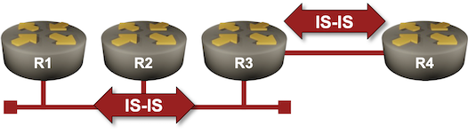

# Running IS-IS Over Unnumbered Interfaces

IS-IS does not use IPv4 or IPv6 to exchange routing information. It uses a [dedicated layer-3 protocol](https://blog.ipspace.net/2009/06/is-is-is-not-running-over-clnp/) (it has its own 802.1 Service Access Point -- SAP) and transports IPv4/IPv6 information only in various TLVs inside the LSPs.

Running IS-IS over point-to-point or multi-access unnumbered interfaces should be a no-brainer, but do all IS-IS implementations support that? You can test that in this lab exercise, which contains a point-to-point link between two routers and a LAN segment.



## Device Requirements

Use any device [supported by the _netlab_ IS-IS configuration module](https://netlab.tools/platforms/#platform-routing-support). It's best if the device supports unnumbered IPv4 interfaces.

## Starting the Lab

You can start the lab [on your own lab infrastructure](../1-setup.md) or in [GitHub Codespaces](https://github.com/codespaces/new/bgplab/isis) ([more details](../4-codespaces.md)):

* Change directory to `basic/7-unnumbered`
* Execute **netlab up**. You'll get a lab with IPv4, IPv6, and IS-IS routing configured on all lab devices.
* Log into your device (RTR) with **netlab connect rtr**

## Explore the IS-IS Data Structures

Before changing anything, explore the IS-IS data structures routers generate using regular IPv4/IPv6 interface addresses. Their LSPs contain the LAN/P2P prefix and the interface IPv4/IPv6 addresses:

R3 LSP displayed by R1 running Arista EOS
{: .code-caption }
```
r1#show isis database level-2 r3.00-00 detail
Legend:
H - hostname conflict
U - node unreachable

IS-IS Instance: Gandalf VRF: default
  IS-IS Level 2 Link State Database
    LSPID                   Seq Num  Cksum  Life Length IS  Received LSPID        Flags
    r3.00-00                      3  35505  1192    246 L2  0000.0000.0003.00-00  <>
      Remaining lifetime received: 1199 s Modified to: 1200 s
      NLPID: 0xCC(IPv4) 0x8E(IPv6)
      Hostname: r3
      Area addresses: 49.0001
      Topology: 2 (IPv6)
      Topology: 0 (IPv4)
      Interface address: 10.1.0.1
      Interface address: 172.16.0.3
      Interface address: 10.0.0.3
      Interface address: 2001:db8:20::1
      Interface address: 2001:db8:21::3
      Interface address: 2001:db8:cafe:3::1
      IS Neighbor          : r3.7e               Metric: 10
      IS Neighbor          : 0000.0000.0004.00   Metric: 10
      IS Neighbor (MT-IPv6): r3.7e               Metric: 10
      IS Neighbor (MT-IPv6): 0000.0000.0004.00   Metric: 10
      Reachability         : 10.1.0.0/30 Metric: 10 Type: 1 Up
      Reachability         : 172.16.0.0/24 Metric: 10 Type: 1 Up
      Reachability         : 10.0.0.3/32 Metric: 10 Type: 1 Up
      Reachability (MT-IPv6): 2001:db8:20::/64 Metric: 10 Type: 1 Up
      Reachability (MT-IPv6): 2001:db8:21::/64 Metric: 10 Type: 1 Up
      Reachability (MT-IPv6): 2001:db8:cafe:3::/64 Metric: 10 Type: 1 Up
      Router Capabilities: Router Id: 10.0.0.3 Flags: []
        Area leader priority: 250 algorithm: 0
```

The IPv4 and IPv6 interface addresses are also advertised in IS-IS hello messages:

Details of R3 IS-IS neighbor displayed by R1 running Arista EOS
{: .code-caption }
```
r1#show isis neighbors level-2 detail
Instance  VRF      System Id        Type Interface          SNPA              State Hold time   Circuit Id
...
Gandalf   default  r3               L2   Ethernet1          52:dc:ca:fe:3:1   UP    7           r3.7e
  Area addresses: 49.0001
  SNPA: 52:dc:ca:fe:3:1
  Router ID: 0.0.0.0
  Advertised Hold Time: 9
  State Changed: 00:02:10 ago at 2025-03-12 13:54:02
  LAN Priority: 64
  IPv4 Interface Address: 172.16.0.3
  IPv6 Interface Address: fe80::50dc:caff:fefe:301
  Interface name: Ethernet1
  Graceful Restart: Supported
  Supported Address Families: IPv4, IPv6
  Neighbor Supported Address Families: IPv4, IPv6
```

## Building the IP Routing Table

Calculating the prefixes that go into the IP routing tables and the next-hop routers is the primary job of the IS-IS SPF algorithm (we covered a few details in the [Explore IS-IS Data Structures](2-explore.md) lab exercise). In this lab exercise, we'll focus on the next hops of those prefixes.

For example, R1 finds three prefixes that go through R3 (the loopback addresses of R3 and R4 and their point-to-point link). Combining that with the IPv4/IPv6 interface address advertised by R3 in the IS-IS hello messages (see above), it installs the following routes in the IPv4 and IPv6 routing tables:

IPv4 routes using R3 as the next hop (displayed by R1 running Arista EOS)
{: .code-caption }
```
r1#show ip route isis next-hop 172.16.0.3
...

 I L2     10.0.0.3/32 [115/20]
           via 172.16.0.3, Ethernet1
 I L2     10.0.0.4/32 [115/30]
           via 172.16.0.3, Ethernet1
 I L2     10.1.0.0/30 [115/20]
           via 172.16.0.3, Ethernet1
```

IPv6 routes using R3 as the next hop (displayed by R1 running Arista EOS)
{: .code-caption }
```
r1#show ipv6 route isis
...
 I L2     2001:db8:20::/64 [115/20]
           via fe80::50dc:caff:fefe:301, Ethernet1
 I L2     2001:db8:cafe:3::/64 [115/20]
           via fe80::50dc:caff:fefe:301, Ethernet1
 I L2     2001:db8:cafe:4::/64 [115/30]
           via fe80::50dc:caff:fefe:301, Ethernet1
```

!!! Tip
    The IS-IS IPv6 routes use IPv6 LLA as the next-hop IPv6 address.

## Migrating to Unnumbered Interfaces

Replace IPv4/IPv6 addresses on all Ethernet interfaces of all routers in your lab with unnumbered IPv4 addresses and link-local-only IPv6.

The commands you have to use might be similar to **no ip address** followed by **ip address unnumbered loopback 0** and **no ipv6 address** followed by **ipv6 enable**.

!!! tip
    FRRouting allows you to configure the same IP address on multiple interfaces. After removing the original Ethernet IPv4 address, use the regular **ip address** command with the loopback IPv4 address. It also needs no **ipv6 enable** command; IPv6 is enabled with the **sysctl** commands, and removing an IPv6 address from an interface does not disable it.

## Does It Still Work?

Connect to R3 and explore its IS-IS neighbors. R3 should still have working adjacencies with all other routers in your lab.

IS-IS neighbors observed on R3 running Arista EOS
{: .code-caption }
```
r3#show isis neighbors

Instance  VRF      System Id        Type Interface          SNPA              State Hold time   Circuit Id
Gandalf   default  r1               L2   Ethernet1          52:dc:ca:fe:1:1   UP    24          r3.7e
Gandalf   default  r2               L2   Ethernet1          52:dc:ca:fe:2:1   UP    26          r3.7e
Gandalf   default  r4               L2   Ethernet2          P2P               UP    24          80
```

!!! Warning
    Some devices can run IS-IS over unnumbered point-to-point IPv4 links but not over unnumbered multi-access IPv4 links. Such a device might refuse to form adjacencies over the LAN or might not install some IPv4 routes in the IP routing table.

Next, connect to R1 and explore its IPv4 and IPv6 routing tables. Do they contain the same routes for the loopback interfaces as before? What are the next hops?

The IPv4 results might surprise you a bit. For example, Arista EOS claims that the loopback addresses of R2 and R3 are directly connected:

The IPv4 routing table on R1 running Arista EOS
{: .code-caption }
```
r1#show ip route isis
...
 I L2     10.0.0.2/32
           directly connected, Ethernet1
 I L2     10.0.0.3/32
           directly connected, Ethernet1
 I L2     10.0.0.4/32 [115/30]
           via 10.0.0.3, Ethernet1
```

Technically, that's not incorrect, as R2 and R3 reuse their loopback IPv4 addresses for the Ethernet interfaces.

The IPv6 routing table should contain no such surprises and should be mostly identical to the one you've seen before (apart from no longer having the transit subnets):

The IPv6 routing table on R1 running Arista EOS
{: .code-caption }
```
r1#show ipv6 route isis
...

 I L2     2001:db8:cafe:2::/64 [115/20]
           via fe80::50dc:caff:fefe:201, Ethernet1
 I L2     2001:db8:cafe:3::/64 [115/20]
           via fe80::50dc:caff:fefe:301, Ethernet1
 I L2     2001:db8:cafe:4::/64 [115/30]
           via fe80::50dc:caff:fefe:301, Ethernet1
```

## How Does This Work?

The IPv6 results shouldn't be surprising. The IS-IS hello messages contain the neighbor's IPv6 LLA, which is used as the next-hop address in the IPv6 routing table.

A similar process is going on in the IPv4 world. The IS-IS hello messages sent by R3 advertise its loopback address (10.0.0.3) as its IPv4 address on the LAN:

The IPv4 address of R3 observed by R1 running Arista EOS
{: .code-caption }
```
r1#show isis neighbors level-2 detail
Instance  VRF      System Id        Type Interface          SNPA              State Hold time   Circuit Id
...
Gandalf   default  r3               L2   Ethernet1          52:dc:ca:fe:3:1   UP    9           r3.7e
  Area addresses: 49.0001
  SNPA: 52:dc:ca:fe:3:1
  Router ID: 0.0.0.0
  Advertised Hold Time: 9
  State Changed: 00:10:24 ago at 2025-03-12 14:06:32
  LAN Priority: 64
  IPv4 Interface Address: 10.0.0.3
  IPv6 Interface Address: fe80::50dc:caff:fefe:301
  Interface name: Ethernet1
  Graceful Restart: Supported
  Supported Address Families: IPv4, IPv6
  Neighbor Supported Address Families: IPv4, IPv6
```

The loopback IPv4 address (10.0.0.3) is thus used as the next hop for all routes going through R3. Most routers also add the *outgoing interface* to the routes in their routing tables. R1 thus knows that it has to (A) send packets to 10.0.0.3 and (B) use the Ethernet1 interface to reach 10.0.0.3 if it wants to send packets to 10.0.0.4:

The details of the IPv4 route for 10.0.0.4/32 on R1 running Arista EOS
{: .code-caption }
```
r1#show ip route 10.0.0.4/32 detail
...

 I L2     10.0.0.4/32 [115/30] PM
           via 10.0.0.3, Ethernet1 r1 -> [r2,r3]
```

But how does R1 know what MAC address to use to reach R3? It uses ARP, sending an ARP request on Ethernet1 asking who has the IP address 10.0.0.3. Not surprisingly, we can see the results in its ARP table:

The ARP table on R1 contains the MAC addresses of all connected routers
{: .code-caption }
```
r1#show arp
Address         Age (sec)  Hardware Addr   Interface
10.0.0.2          0:13:44  52dc.cafe.0201  Ethernet1
10.0.0.3          0:13:44  52dc.cafe.0301  Ethernet1
```

Want to have even more details? Read the blog posts in the [Unnumbered IPv4 Interfaces](https://blog.ipspace.net/series/unnumbered-interfaces/) series.

## Reference Information

### Lab Wiring

**Point-to-Point Links**

| Origin Device | Origin Port | Destination Device | Destination Port |
|---------------|-------------|--------------------|------------------|
| r3 | Ethernet2 | r4 | Ethernet1 |

**LAN Links**

| Origin Device | Origin Port | Link Name (NET) | Description          |
|---------------|-------------|-----------------|----------------------|
| r1 | Ethernet1 | LAN | r1 -> [r2,r3] |
| r2 | Ethernet1 | LAN | r2 -> [r1,r3] |
| r3 | Ethernet1 | LAN  | r3 -> [r1,r2] |

**Note:** The interface names depend on the devices you use in the lab. The printout was generated with Arista EOS running on RTR and FRRouting running on X1 and X2.

### Lab Addressing

| Node/Interface | IPv4 Address | IPv6 Address | Description |
|----------------|-------------:|-------------:|-------------|
| **r1** |  10.0.0.1/32 | 2001:db8:cafe:1::1/64 | Loopback |
| Ethernet1 | 172.16.0.1/24 | 2001:db8:21::1/64 | r1 -> [r2,r3] |
| **r2** |  10.0.0.2/32 | 2001:db8:cafe:2::1/64 | Loopback |
| Ethernet1 | 172.16.0.2/24 | 2001:db8:21::2/64 | r2 -> [r1,r3] |
| **r3** |  10.0.0.3/32 | 2001:db8:cafe:3::1/64 | Loopback |
| Ethernet1 | 172.16.0.3/24 | 2001:db8:21::3/64 | r3 -> [r1,r2] |
| Ethernet2 | 10.1.0.1/30 | 2001:db8:20::1/64 | r3 -> r4 |
| **r4** |  10.0.0.4/32 | 2001:db8:cafe:4::1/64 | Loopback |
| Ethernet1 | 10.1.0.2/30 | 2001:db8:20::2/64 | r4 -> r3 |
