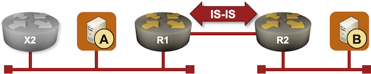
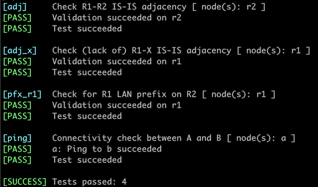

# Passive IS-IS Interfaces

Running an IGP on an untrusted network edge[^WET] is a bad idea. Unless you take extra security measures like MD5 passwords[^CTP], an intruder can establish an IGP adjacency with your router and insert any prefix they wish into your network[^POP3].

However, you still have to advertise those edge subnets into your IGP, or the hosts attached to your network won't be able to communicate. There are two ways to get that done: redistribute connected subnets into your IGP or make the customer-facing interfaces on the edge routers *passive* ([more details](#bg)). That's what we'll do in this lab exercise.



[^WET]: And when was the network edge ever trustworthy?

[^CTP]: Because it's trivial to figure out cleartext passwords in the days of downloadable Wireshark.

[^POP3]: I know an ISP that managed to get their POP3 server hijacked, exposing all their customers to a password-stealing man-in-the-middle attack.

## Device Requirements

* Use any device [supported by the _netlab_ IS-IS configuration module](https://netlab.tools/platforms/#platform-routing-support) for the routers in your lab (default: FRRouting virtual machines or containers).
* You can do automated lab validation if you use FRRouting on R1 and R2.

## Starting the Lab

You can start the lab [on your own lab infrastructure](../1-setup.md) or in [GitHub Codespaces](https://github.com/codespaces/new/bgplab/isis) ([more details](https://bgplabs.net/4-codespaces/)):

* Change directory to `feature/1-passive`
* Execute **netlab up**. You'll get a lab with IPv4 addresses configured on all interfaces and IS-IS routing configured on R1, R2, and X.
* Log into lab routers with **netlab connect** and verify their configuration.

## The Problem

R1 is running IS-IS on all its interfaces and establishes adjacency with the intruder (X):

IS-IS neighbors on R1 running FRRouting
{ .code-caption }
```
r1# show isis neighbor
Area Gandalf:
  System Id           Interface   L  State        Holdtime SNPA
 x                   eth1        2  Up            30       aac1.abd6.15da
 r2                  eth2        2  Up            27       2020.2020.2020
```

The intruder is advertising its loopback IP address (10.0.0.3/32) but could advertise any IP prefix it wishes[^LBIP].

The IP routing table on R1 running FRRouting
{ .code-caption }
```
r1# show ip route
Codes: K - kernel route, C - connected, L - local, S - static,
       R - RIP, O - OSPF, I - IS-IS, B - BGP, E - EIGRP, N - NHRP,
       T - Table, v - VNC, V - VNC-Direct, A - Babel, F - PBR,
       f - OpenFabric, t - Table-Direct,
       > - selected route, * - FIB route, q - queued, r - rejected, b - backup
       t - trapped, o - offload failure

L * 10.0.0.1/32 is directly connected, lo, 00:17:00
C>* 10.0.0.1/32 is directly connected, lo, 00:17:00
I>* 10.0.0.2/32 [115/20] via 10.1.0.2, eth2, weight 1, 00:16:57
I>* 10.0.0.3/32 [115/20] via 172.16.0.3, eth1, weight 1, 00:16:50
I   10.1.0.0/30 [115/20] via 10.1.0.2, eth2 inactive, weight 1, 00:16:57
C>* 10.1.0.0/30 is directly connected, eth2, 00:17:00
L>* 10.1.0.1/32 is directly connected, eth2, 00:17:00
I   172.16.0.0/24 [115/20] via 172.16.0.3, eth1 inactive, weight 1, 00:16:50
C>* 172.16.0.0/24 is directly connected, eth1, 00:17:00
L>* 172.16.0.1/32 is directly connected, eth1, 00:17:00
I>* 172.16.1.0/24 [115/20] via 10.1.0.2, eth2, weight 1, 00:16:57
```

[^LBIP]: We could make the intruder running FRRouting advertise the IP address of host A (172.16.0.10/32), but the same setup wouldn't work on most other network devices due to overlapping IP subnets.

## Configuration Tasks

Using an interface command similar to **isis passive**, configure the LAN interface on R1 as a passive IS-IS interface. For consistency reasons, you should do the same on R2.

!!! Tip
    Some devices configure the interface IGP state within the interface configuration; others do it within the IGP configuration.

## Validation

You can use the **netlab validate** command if you're using *netlab* release 1.8.4 or later and run FRRouting on the external routers. This is the printout you should get after completing the lab exercise:



You could also do manual validation on R1 and R2:

* Inspect IS-IS adjacencies on R1 with a command similar to **show isis neighbors** or **show isis adjacency**. Your router should have an adjacency with R2 but not with X.

IS-IS neighbors (FRRouting)
{.code-caption}
```
r1# show isis neighbor
Area Gandalf:
  System Id           Interface   L  State        Holdtime SNPA
 r2                  eth2        2  Up            27       2020.2020.2020
```

* On some devices, you can inspect the details of the IS-IS interface state with a command similar to **show isis interface detail**. When executed on R1 running FRRouting, that command shows the R1-R2 interface as *Active* and the LAN and the loopback interfaces as *Passive*.

IS-IS interface details (FRRouting)
{ .code-caption }
```
r1# show isis interface detail
Area Gandalf:
  Interface: eth2, State: Up, Active, Circuit Id: 0x0
    Type: p2p, Level: L2
    Level-2 Information:
      Metric: 10, Active neighbors: 1
      Hello interval: 3, Holddown count: 10, Padding: yes
      CNSP interval: 10, PSNP interval: 2
    IP Prefix(es):
      10.1.0.1/30

  Interface: lo, State: Up, Passive, Circuit Id: 0x0
    Type: loopback, Level: L2
    Level-2 Information:
      Metric: 10
    IP Prefix(es):
      10.0.0.1/32

  Interface: eth1, State: Up, Passive, Circuit Id: 0x0
    Type: lan, Level: L2, SNPA: 0000.0000.0000
    Level-2 Information:
      Metric: 10
    IP Prefix(es):
      172.16.0.1/24
```

* After verifying adjacencies on R1, inspect the IS-IS entries in the routing table on R2. R2 should have an IS-IS route for 172.16.0.0/24 (the R1 LAN prefix) but not for 10.0.0.3/32 (the intruder's loopback prefix)

The IS-IS routes on R2 running FRRouting
{.code-caption}
```
r2# show ip route isis
Codes: K - kernel route, C - connected, L - local, S - static,
       R - RIP, O - OSPF, I - IS-IS, B - BGP, E - EIGRP, N - NHRP,
       T - Table, v - VNC, V - VNC-Direct, A - Babel, F - PBR,
       f - OpenFabric, t - Table-Direct,
       > - selected route, * - FIB route, q - queued, r - rejected, b - backup
       t - trapped, o - offload failure

I>* 10.0.0.1/32 [115/20] via 10.1.0.1, eth2, weight 1, 00:31:18
I   10.1.0.0/30 [115/20] via 10.1.0.1, eth2 inactive, weight 1, 00:31:18
I>* 172.16.0.0/24 [115/20] via 10.1.0.1, eth2, weight 1, 00:31:18
```

## Passive Interfaces or Redistribution {#bg}

An IS-IS *passive interface* is an interface that IS-IS knows about (it includes the interface subnets in its LSP) but on which it does not send or accept hello messages. IS-IS routers cannot establish an adjacency and exchange LSPs without the hello messages, making a passive interface resilient[^PNS] against simple IS-IS spoofing attacks[^MAL].

[^PNS]: While the passive interfaces *should* provide security against all IS-IS-based attacks, some routers might decide to inspect the messages they should not care about anyway. For example, [Juniper routers love to open BGP TCP sessions with total strangers](https://blog.ipspace.net/2023/10/reject-unknown-bgp-session/#ugly) and exchange BGP OPEN messages with them, resulting in [thousands of routers being open to BGP-based attacks](https://blog.ipspace.net/2023/11/open-bgp-daemons/).

[^MAL]: Configure an Ethernetype access list [blocking IS-IS Ethernetype](https://blog.ipspace.net/2009/06/is-is-is-not-running-over-clnp/) if you want to be absolutely sure IS-IS processing is blocked on an interface that is part of an IS-IS process.

Considering the potential caveats described in the previous paragraph, a security-focused engineer might prefer *route redistribution* of connected subnets into IS-IS. Unfortunately, route redistribution brings its own set of caveats:

* Route redistribution is performed at a single point and has to be controlled by a combination of a route map and prefix lists. IS-IS passive interfaces are granular -- you can decide whether to advertise a subnet into IS-IS on a per-interface basis.
* Using passive interfaces makes it easier to figure out what subnets are announced into IS-IS.
* You can set metrics on passive interfaces, for example, when you want to use redundant routers in a primary/backup scenario. While it's possible to set metrics with redistribution route maps, that requires a more complex route map and several prefix lists[^PLER].
* With the IS-IS circuit type, you can easily control whether a subnet on a passive interface is advertised as an L1 or an L2 route (or both). Implementing a similar functionality with a route map is significantly more complex.

[^PLER]: The proof is left as an exercise for the reader.

Finally, IS-IS advertises subnets configured on passive interfaces as *internal* IS-IS routes and redistributed subnets as *external* IS-IS routes. While the difference between the two route types is not as extreme as in OSPF (IS-IS routers advertise both route types in the same LSP), there are subtle differences in route preference[^DRP] that could result in amusing[^TTA] troubleshooting scenarios worthy of a CCIE lab.

[^DRP]: See [Section 3.2 of RFC 5302](https://datatracker.ietf.org/doc/html/rfc5302#section-3.2) for more details

[^TTA]: To the uninvolved audience

**Takeaway:** Prefer passive interfaces over the redistribution of connected subnets.

**Next:** [Influence the Designated IS Election](2-dis.md)

## Reference Information

### Lab Wiring

**Point-to-point links:**

| Origin Device | Origin Port | Destination Device | Destination Port |
|---------------|-------------|--------------------|------------------|
| r2 | eth1 | b | eth1 |
| r1 | eth2 | r2 | eth2 |

**LAN links:**

| Origin Device | Origin Port | Link Name (NET) | Description          |
|---------------|-------------|-----------------|----------------------|
| a | eth1 | passive_1 | a -> [r1,x] |
| r1 | eth1 | passive_1 | r1 -> [x,a] |
| x | eth1 | passive_1 | x -> [r1,a] |

**Note:** The interface names depend on the devices you use in the lab. The printout was generated with lab devices running FRRouting.

### Lab Addressing

| Node/Interface | IPv4 Address | IPv6 Address | Description |
|----------------|-------------:|-------------:|-------------|
| **a** |
| eth1 | 172.16.0.10/24 |  | a -> [r1,x] |
| **b** |
| eth1 | 172.16.1.11/24 |  | b -> r2 |
| **r1** |  10.0.0.1/32 |  | Loopback |
| eth1 | 172.16.0.1/24 |  | r1 -> [x,a] |
| eth2 | 10.1.0.1/30 |  | r1 -> r2 |
| **r2** |  10.0.0.2/32 |  | Loopback |
| eth1 | 172.16.1.2/24 |  | r2 -> b |
| eth2 | 10.1.0.2/30 |  | r2 -> r1 |
| **x** |  10.0.0.3/32 |  | Loopback |
| eth1 | 172.16.0.3/24 |  | x -> [r1,a] |
