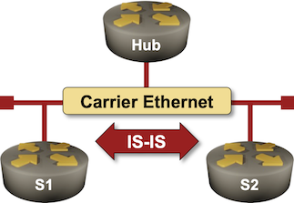

# Influence the Designated IS Election

In the [IS-IS on Point-to-Point Links](../basic/3-p2p.md) lab exercise, we discussed why it's better to configure Ethernet inter-router links as point-to-point links instead of leaving them configured as multi-access links. However, even though a large majority of core Ethernet links connect two routers, you might encounter situations where you have to connect routers to a multi-access network, for example, when building a private WAN network on top of Carrier Ethernet E-LAN service.



Like OSPF, IS-IS routers[^IS] connected to a shared segment elect a Designated Intermediate System (DIS). Unlike OSPF, the DIS is not as crucial to the proper operation of the routing protocol as the OSPF Designated Router is. IS-IS, therefore, does not have a concept of a Backup DIS.

[^IS]: Called Intermediate Systems in IS-IS standards

DIS failure can still temporarily slow down network convergence ([more details](#bg)); it makes sense to ensure that the most stable router (for example, the hub router of a Carrier Ethernet network) becomes DIS. That's almost impossible to achieve without additional device configuration; when all routers connected to a segment have the same priority, the one with the highest MAC address becomes DIS, and that's often the last router you bought[^IMAC], not the hub router.

[^IMAC]: One would expect MAC addresses to increase over time within the same vendor ID (OUI, the top 24 bits of the MAC address)

Therefore, you should always increase the DIS election priority on hub routers and decrease it on routers you don't want to use as DIS (spoke routers). You'll practice both in this lab exercise.

## Device Requirements

Use any device [supported by the _netlab_ IS-IS configuration module](https://netlab.tools/platforms/#platform-routing-support) for the routers in your lab (default: FRRouting virtual machines or containers).

## Starting the Lab

You can start the lab [on your own lab infrastructure](../1-setup.md) or in [GitHub Codespaces](https://github.com/codespaces/new/bgplab/isis) ([more details](https://bgplabs.net/4-codespaces/)):

* Change directory to `feature/2-dis`
* Execute **netlab up**. You'll get a lab with IPv4 addresses and IS-IS routing configured on all lab routers.
* Log into lab routers with **netlab connect** and verify their configuration.

## The Problem

Docker or libvirt/KVM assigns random MAC addresses to containers or virtual machines. Predicting which router on your Carrier Ethernet will become DIS is a Mission Impossible.

You can usually check the DIS status of your router with a command similar to **show isis interface _name_**. This is what you'd get on a router running FRRouting when it's not a DIS:

The IS-IS interface details displayed on the Hub router running FRRouting
{ .code-caption }
```
hub# show isis interface eth1
Area Gandalf:
  Interface: eth1, State: Up, Active, Circuit Id: 0xbb
    Type: lan, Level: L2, SNPA: aac1.ab23.d6e0
    Level-2 Information:
      Metric: 10, Active neighbors: 2
      Hello interval: 3, Holddown count: 10, Padding: yes
      CNSP interval: 10, PSNP interval: 2
      LAN Priority: 64, is not DIS
    IP Prefix(es):
      172.16.0.1/24
```

You can often display the DIS status of IS-IS neighbors with a command similar to **show isis neighbor detail**. This is what it displays on FRRouting when the first spoke router becomes DIS [^RTR]:

[^RTR]: If you don't like the results, restart the lab with **netlab restart** and hope for a better set of random MAC addresses.

The details of IS-IS neighbors displayed on the Hub router running FRRouting
{ .code-caption }
```
hub# show isis nei detail
Area Gandalf:
 s1
    Interface: eth1, Level: 2, State: Up, Expires in 27s
    Adjacency flaps: 1, Last: 11s ago
    Circuit type: L2, Speaks: IPv4
    SNPA: aac1.abed.313f, LAN id: s1.b7
    LAN Priority: 64, is DIS, DIS flaps: 1, Last: 3s ago
    Area Address(es):
      49.0001
    IPv4 Address(es):
      172.16.0.2

 s2
    Interface: eth1, Level: 2, State: Up, Expires in 30s
    Adjacency flaps: 1, Last: 11s ago
    Circuit type: L2, Speaks: IPv4
    SNPA: aac1.ab7d.6c12, LAN id: s1.b7
    LAN Priority: 64, is not DIS, DIS flaps: 1, Last: 3s ago
    Area Address(es):
      49.0001
    IPv4 Address(es):
      172.16.0.3
```

## Configuration Tasks

Using an interface command similar to **isis priority**, increase the hub router's DIS election priority to 127 (the highest value; the default value is 64) and lower the value on the spoke routers to zero (the lowest possible value).

!!! Tip
    Some devices configure the interface IGP parameters within the interface configuration; others do it within the IGP configuration.

## Validation

Log into your devices and check the state of their IS-IS interfaces and IS-IS neighbors. The hub router should consistently become the DIS; these are the printouts you should get on the Hub router:

The IS-IS interface details (Hub router running FRRouting)
{ .code-caption }
```
hub# show isis interface eth1
Area Gandalf:
  Interface: eth1, State: Up, Active, Circuit Id: 0xbb
    Type: lan, Level: L2, SNPA: aac1.ab23.d6e0
    Level-2 Information:
      Metric: 10, Active neighbors: 2
      Hello interval: 3, Holddown count: 10, Padding: yes
      CNSP interval: 10, PSNP interval: 2
      LAN Priority: 127, is DIS
    IP Prefix(es):
      172.16.0.1/24
```

The IS-IS neighbor details (Hub router running FRRouting)
{ .code-caption }
```
hub# show isis neighbor detail
Area Gandalf:
 s1
    Interface: eth1, Level: 2, State: Up, Expires in 28s
    Adjacency flaps: 1, Last: 1h26m3s ago
    Circuit type: L2, Speaks: IPv4
    SNPA: aac1.abed.313f, LAN id: 0000.0000.0001.bb
    LAN Priority: 0, is not DIS, DIS flaps: 4, Last: 1m33s ago
    Area Address(es):
      49.0001
    IPv4 Address(es):
      172.16.0.2

 s2
    Interface: eth1, Level: 2, State: Up, Expires in 30s
    Adjacency flaps: 1, Last: 1h26m3s ago
    Circuit type: L2, Speaks: IPv4
    SNPA: aac1.ab7d.6c12, LAN id: 0000.0000.0001.bb
    LAN Priority: 0, is not DIS, DIS flaps: 1, Last: 1h25m55s ago
    Area Address(es):
      49.0001
    IPv4 Address(es):
      172.16.0.3
```

## The Role of a Designated Intermediate System {#bg}

The Designated Intermediate System on a LAN segment has two roles:

* It advertises the [LAN pseudonode](../basic/3-p2p.md#db). The LAN pseudonode has [zero-cost links to all other nodes attached to the LAN](../basic/3-p2p.md#ma), and all LAN nodes advertise a link to the LAN pseudonode
* It helps other routers detect transmission errors. DIS sends periodic Complete Sequence Number PDU (CSNP) packets. These packets contain the table-of-contents of the DIS LSPDB, and other routers attached to the LAN can use them to discover LSPDB discrepancies. A router that discovers it has an extra bit of information floods it, and a router that's missing some information requests it with the Partial Sequence Number PDU (PSNP) packet.

If a DIS fails, its pseudonode LSP remains in the LSPDB, and the connectivity through the pseudonode is intact until another DIS is elected. At that point, the new DIS advertises a new LAN pseudonode, and all remaining routers change their LSPs to link to it. A change in DIS thus causes no connectivity loss[^DLER], but it does cause a flurry of LSP changes.

[^DLER]: The details are left as an exercise for the reader.

Error recovery is more critical. In a perfect world with no transmission errors, a DIS failure doesn't matter. However, if the LAN segment experiences packet drops, and there's no DIS to send periodic CSNP packets, the dropped packets won't be retransmitted until the new DIS is elected and sends the first CSNP packet. DIS failure thus has the potential to impact network convergence.

**Takeaway:** Making DIS stable is not a bad idea, especially on large-scale segments with many routers and a higher probability of packet loss (for example, large Carrier Ethernet deployments).

## Reference Information

### Lab Wiring

| Origin Device | Origin Port | Link Name (NET) | Description          |
|---------------|-------------|-----------------|----------------------|
| hub | eth1 | dis_1 | hub -> [s1,s2] |
| s1 | eth1 | dis_1 | s1 -> [s2,hub] |
| s2 | eth1 | dis_1 | s2 -> [s1,hub] |

**Note:** The interface names depend on the devices you use in the lab. The printout was generated with lab devices running FRRouting.

### Lab Addressing

| Node/Interface | IPv4 Address | IPv6 Address | Description |
|----------------|-------------:|-------------:|-------------|
| **hub** |  10.0.0.1/32 |  | Loopback |
| eth1 | 172.16.0.1/24 |  | hub -> [s1,s2] |
| **s1** |  10.0.0.2/32 |  | Loopback |
| eth1 | 172.16.0.2/24 |  | s1 -> [s2,hub] |
| **s2** |  10.0.0.3/32 |  | Loopback |
| eth1 | 172.16.0.3/24 |  | s2 -> [s1,hub] |
