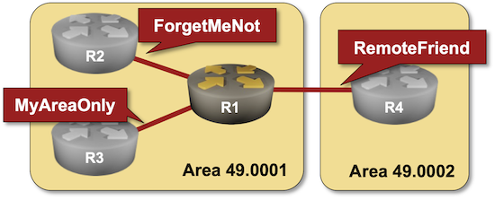
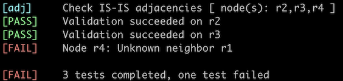

# Protect IS-IS Routing Data with MD5 Authentication

Like OSPF and BGP, IS-IS contains a simple mechanism to authenticate routing traffic -- IS-IS packets can include a cleartext password or an [MD5](https://datatracker.ietf.org/doc/html/rfc5304)- or [SHA hash](https://datatracker.ietf.org/doc/html/rfc5310)[^HO]. Unlike OSPF, IS-IS can authenticate:

* The packets exchanged between routers (hello packets)
* The contents of Link State PDUs that are flooded across an area or a domain.

[^HO]: Please note that the IS-IS packets are not encrypted. Anyone can see their contents, but the Hashed Message Authentication Code (HMAC) makes it hard for an intruder to impersonate an IS-IS router using MD5 or SHA authentication (but not impossible; we know MD5 is insecure).

!!! tip
    Authenticating IS-IS traffic is not as critical as authenticating EBGP traffic. It's almost impossible to inject IS-IS packets into a LAN segment the intruder is not connected to, and you're not supposed to run an IGP on an untrusted network anyway. However, as IS-IS packets have no checksum, you could use MD5 authentication to detect malformed packets or inadvertent data corruption.

Most IS-IS implementations have *interface* passwords (authenticating the IS-IS hello packets), *area* passwords (authenticating level-1 LSPs), and *domain* passwords (authenticating level-2 LSPs). You'll practice configuring all three in this lab exercise. 



## Device Requirements

* Use any device [supported by the _netlab_ IS-IS configuration module](https://netlab.tools/platforms/#platform-routing-support) for R1 (default: FRRouting virtual machines or containers).
* If you want preconfigured passwords for the other three routers (R2, R3, and R4), use FRRouting or Arista EOS. You can use any other device for these routers, but you'll have to configure the passwords yourself.
* Automated lab validation requires FRRouting on R2, R3, and R4.

## Starting the Lab

You can start the lab [on your own lab infrastructure](../1-setup.md) or in [GitHub Codespaces](https://github.com/codespaces/new/bgplab/isis) ([more details](https://bgplabs.net/4-codespaces/)):

* Change directory to `feature/3-md5`
* Execute **netlab up**. You'll get a lab with IPv4 addresses configured on all interfaces and IS-IS routing configured on all routers.
* Log into lab routers with **netlab connect** and verify their configuration.

## Initial Configuration

* R1, R2, and R3 are in IS-IS area 49.0001.
* R4 is in IS-IS area 49.0002.
* R1 (your router) and R2 are level-1-2 routers. R3 is a level-1 router, and R4 is a level-2 router.
* The link between R1 and R2 is a LAN (multi-access) link, the links R1-R3 and R1-R4 are point-to-point links.

The initial configuration should result in these IS-IS adjacencies:

| Link | Adjacency |
|------|-----------|
| R1-R2 | level-1 + level-2 |
| R1-R3 | level-1 |
| R1-R4 | level-2 |

However, R2, R3, and R4 use IS-IS MD5 authentication with these keys:

| Password type | Password |
|---------------|----------|
| Interface        | ForgetMeNot |
| Area (level-1)   | MyAreaOnly |
| Domain (level-2) | CloseFriends |
 
## The Problem

Some IS-IS implementations exhibit bizarre behavior when adjacent devices have an authentication mismatch. The device that does not use IS-IS authentication can claim full adjacency with its neighbors. In contrast, the adjacent device claims the adjacency is in the INIT state or shows no IS-IS neighbors on the interface.

For example, R1 running FRRouting claims it has three IS-IS neighbors and full adjacency with two of them.

IS-IS neighbors on R1 running FRRouting
{ .code-caption }
```
$ netlab connect r1 --show isis neighbor
Connecting to container clab-md5-r1, executing vtysh -c "show isis neighbor"
Area Gandalf:
  System Id           Interface   L  State        Holdtime SNPA
 r2                  eth1        1  Initializing  28       aac1.ab76.78a5
 r2                  eth1        2  Initializing  28       aac1.ab76.78a5
 r3                  eth2        1  Up            28       2020.2020.2020
 r4                  eth3        2  Up            28       2020.2020.2020
```

At the same time, R2 through R4 claim they have no IS-IS neighbors.

Arista EOS is a bit more consistent. R1 running Arista EOS claims to have three IS-IS neighbors, but the adjacency is stuck in the *INIT* phase.

IS-IS neighbors on R1 running Arista EOS
{ .code-caption }
```
r1# show isis neighbor
Instance  VRF      System Id        Type Interface          SNPA              State Hold time   Circuit Id
Gandalf   default  0000.0000.0002   L1   Ethernet1          52:dc:ca:fe:2:1   INIT  25          r1.97
Gandalf   default  0000.0000.0002   L2   Ethernet1          52:dc:ca:fe:2:1   INIT  25          r1.97
Gandalf   default  0000.0000.0003   L1   Ethernet2          P2P               INIT  26          95
Gandalf   default  0000.0000.0004   L2   Ethernet3          P2P               INIT  23          98
```

Anyway, we know what's wrong: R2, R3, and R4 use MD5 authentication and ignore unauthenticated packets sent by R1[^SHC]. Let's fix it.

[^SHC]: Figuring that out from the **show** printouts, particularly when you don't have access to the remote router, is an interesting hair-pulling exercise.

## Configuration Tasks

Configure the following IS-IS passwords using **authentication** or **password** interface- or router configuration commands[^ADP]: 

| Password type | Password |
|---------------|----------|
| Interface     | ForgetMeNot |
| Area          | MyAreaOnly |
| Domain        | RemoteFriend |

[^ADP]: Some implementations (for example, Arista EOS) call the area password *level-1* and the domain password *level-2*.

## Validation

You can use the **netlab validate** command if you run FRRouting on R2, R3, and R4. The validation process checks the IS-IS adjacency using IS-IS hostnames. The validation will succeed on R2 and R3 if you configured the interface password (otherwise, the IS-IS adjacency is not established) and the area password (otherwise, R2 and R3 see adjacent system ID 0000.0000.0001 but do not know it is R1). You must configure the domain password for the validation to succeed on R4.

For example, this is the printout you would get after configuring the interface- and area passwords:



You could also do manual validation:

* After configuring the interface passwords, all IS-IS adjacencies should be in UP state on all routers.

IS-IS neighbors on R1 running Arista EOS
{.code-caption}
```
r1#show isis neighbors

Instance  VRF      System Id        Type Interface          SNPA              State Hold time   Circuit Id
Gandalf   default  r2               L1   Ethernet1          52:dc:ca:fe:2:1   UP    8           r2.a4
Gandalf   default  r2               L2   Ethernet1          52:dc:ca:fe:2:1   UP    6           r2.a4
Gandalf   default  r3               L1   Ethernet2          P2P               UP    22          A6
Gandalf   default  r4               L2   Ethernet3          P2P               UP    28          A8
```

* You will not see R1 level-1 LSPs on other routers until you configure the area (level-1) password on R1. For example, this is the level-1 database on R2 when R1 has no area password. The R1 LSP is missing, and R3 is unreachable.

IS-IS level-1 database on R2 running Arista EOS
{ .code-caption }
```
r2#show isis database level-1
Legend:
H - hostname conflict
U - node unreachable

IS-IS Instance: Gandalf VRF: default
  IS-IS Level 1 Link State Database
    LSPID                   Seq Num  Cksum  Life Length IS  Received LSPID        Flags
    r2.00-00                      3  61902   905    113 L2  0000.0000.0002.00-00  <>
 U  r2.a4-00                      1  13264   905     70 L2  0000.0000.0002.a4-00  <>
 U  r3.00-00                      3  58414   907    113 L1  0000.0000.0003.00-00  <>
```

* After configuring the area (level-1) password on R1, R2 and R3 should display R1's LSPs in their level-1 database:

The IS-IS level-1 database on R2 running Arista EOS contains an authenticated R1 LSP
{.code-caption}
```
r2#show isis database level-1
Legend:
H - hostname conflict
U - node unreachable

IS-IS Instance: Gandalf VRF: default
  IS-IS Level 1 Link State Database
    LSPID                   Seq Num  Cksum  Life Length IS  Received LSPID        Flags
    r1.00-00                      9  61720  1195    150 L2  0000.0000.0001.00-00  <DefaultAtt>
    r2.00-00                      3  61902   842    113 L2  0000.0000.0002.00-00  <>
    r2.a4-00                      1  13264   842     70 L2  0000.0000.0002.a4-00  <>
    r3.00-00                      3  58414   844    113 L1  0000.0000.0003.00-00  <>
```

* Similarly, R2 and R4 won't display R1 level-2 LSP until you configure the domain (level-2) password:

The IS-IS level-2 database on R4 (running Arista EOS) does not contain the R1 LSP
{ .code-caption }
```
r4#show isis database
Legend:
H - hostname conflict
U - node unreachable

IS-IS Instance: Gandalf VRF: default
  IS-IS Level 2 Link State Database
    LSPID                   Seq Num  Cksum  Life Length IS  Received LSPID        Flags
 U  r2.00-00                      4  53488  1052    151 L2  0000.0000.0002.00-00  <>
 U  r2.a4-00                      1  20572   711     70 L2  0000.0000.0002.a4-00  <>
    r4.00-00                      3  36459   711    113 L2  0000.0000.0004.00-00  <>
```

* After configuring the domain (level-2) password on R1, R2 and R4 should display R1's LSPs in their level-2 database:

IS-IS level-2 database on R4 running Arista EOS contains authenticated R1 LSP
{.code-caption}
```
r4#show isis database
Legend:
H - hostname conflict
U - node unreachable

IS-IS Instance: Gandalf VRF: default
  IS-IS Level 2 Link State Database
    LSPID                   Seq Num  Cksum  Life Length IS  Received LSPID        Flags
    r1.00-00                     10  16371  1196    170 L2  0000.0000.0001.00-00  <>
    r2.00-00                      4  53488   983    151 L2  0000.0000.0002.00-00  <>
    r2.a4-00                      1  20572   642     70 L2  0000.0000.0002.a4-00  <>
    r4.00-00                      3  36459   642    113 L2  0000.0000.0004.00-00  <>
```

**Next**: [Hide Transit Subnets in IS-IS Networks](4-hide-transit.md)

## Reference Information

### Lab Wiring

| Origin Device | Origin Port | Destination Device | Destination Port |
|---------------|-------------|--------------------|------------------|
| r1 | eth1 | r2 | eth1 |
| r1 | eth2 | r3 | eth1 |
| r1 | eth3 | r4 | eth1 |

**Note:** The interface names depend on the devices you use in the lab. The printout was generated with lab devices running FRRouting.

### Lab Addressing

| Node/Interface | IPv4 Address | IPv6 Address | Description |
|----------------|-------------:|-------------:|-------------|
| **r1** |  10.0.0.1/32 |  | Loopback |
| eth1 | 10.1.0.1/30 |  | r1 -> r2 |
| eth2 | 10.1.0.5/30 |  | r1 -> r3 |
| eth3 | 10.1.0.9/30 |  | r1 -> r4 |
| **r2** |  10.0.0.2/32 |  | Loopback |
| eth1 | 10.1.0.2/30 |  | r2 -> r1 |
| **r3** |  10.0.0.3/32 |  | Loopback |
| eth1 | 10.1.0.6/30 |  | r3 -> r1 |
| **r4** |  10.0.0.4/32 |  | Loopback |
| eth1 | 10.1.0.10/30 |  | r4 -> r1 |
