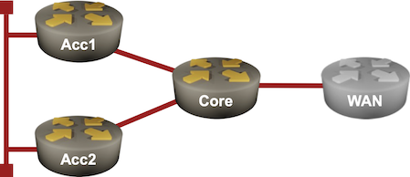
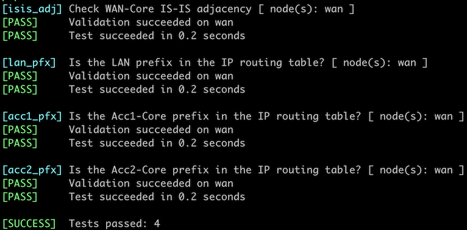

# Hide Transit Subnets in IS-IS Networks

Transit subnets (the prefixes configured on inter-router or inter-switch links) could represent a large percentage of the IP routing table in highly meshed networks. Those subnets are usually not used[^LB] and thus represent pure overhead. Removing them from the IS-IS LSPs would reduce the LSP size and improve the forwarding table convergence time[^FPI]. That's what you'll do in this lab exercise.

[^LB]: If the IGP is running, you can access a device through its loopback interfaces, and if the IGP is broken, you won't get any reachability information anyway.

[^FPI]: The forwarding table convergence time on modern devices is usually limited by the bandwidth between the CPU and the switching ASICs. Reducing the size of the IP routing table directly impacts the time it takes to update the forwarding table.



## Device Requirements

* Use any device [supported by the _netlab_ IS-IS configuration module](https://netlab.tools/platforms/#platform-routing-support) for the routers in your lab.
* You can do automated lab validation when using Arista EOS on your routers.

!!! Warning
    The `advertise-passive-only` functionality did not work correctly on any FRRouting release I tested[^FRI]. After configuring that IS-IS router configuration command, all IS-IS routes disappeared from the IP routing table.

[^FRI]: The [issue reporting this bug](https://github.com/FRRouting/frr/issues/16325) was closed after nobody touched it for over 6 months.

## Starting the Lab

You can start the lab [on your own lab infrastructure](../1-setup.md) or in [GitHub Codespaces](https://github.com/codespaces/new/bgplab/isis) ([more details](https://bgplabs.net/4-codespaces/)):

* Change directory to `feature/4-hide-transit`
* Execute **netlab up**. You'll get a lab with IPv4 addresses configured on all interfaces and level-2 IS-IS routing configured on all routers.
* Log into lab routers with **netlab connect** and verify their configuration.

## The Problem

Most routers in your network are advertising the /30 prefixes configured on inter-router links. The IP routing table on the WAN router contains three IS-IS loopback prefixes (one for each router), one LAN prefix, and two transit prefixes (the third transit prefix is a connected route).

The IP routing table on the WAN router running Arista EOS
{ .code-caption }
```
$ netlab connect wan --show ip route isis
Connecting to clab-adv_passive-wan using SSH port 22, executing show ip route isis
...
 I L2     10.0.0.1/32 [115/20]
           via 10.1.0.9, Ethernet1
 I L2     10.0.0.2/32 [115/30]
           via 10.1.0.9, Ethernet1
 I L2     10.0.0.3/32 [115/30]
           via 10.1.0.9, Ethernet1
 I L2     10.1.0.0/30 [115/20]
           via 10.1.0.9, Ethernet1
 I L2     10.1.0.4/30 [115/20]
           via 10.1.0.9, Ethernet1
 I L2     172.16.0.0/24 [115/30]
           via 10.1.0.9, Ethernet1
```

You can see the same information in the IS-IS LSPs. For example, the ACC1 router advertises its loopback, LAN, and transit prefixes:

The IS-IS LSP advertised by ACC1
{ .code-caption }
```
$ netlab connect -q wan --show isis database acc1.00-00 detail
Legend:
H - hostname conflict
U - node unreachable

IS-IS Instance: Gandalf VRF: default
  IS-IS Level 2 Link State Database
    LSPID                   Seq Num  Cksum  Life Length IS  Received LSPID        Flags
    acc1.00-00                    3  13191  1073    119 L2  0000.0000.0002.00-00  <>
      Remaining lifetime received: 1199 s Modified to: 1200 s
      NLPID: 0xCC(IPv4)
      Hostname: acc1
      Area addresses: 49.0001
      Interface address: 10.1.0.1
      Interface address: 172.16.0.1
      Interface address: 10.0.0.2
      IS Neighbor          : acc2.00             Metric: 10
      IS Neighbor          : core.00             Metric: 10
      Reachability         : 10.1.0.0/30 Metric: 10 Type: 1 Up
      Reachability         : 172.16.0.0/24 Metric: 10 Type: 1 Up
      Reachability         : 10.0.0.2/32 Metric: 10 Type: 1 Up
      Router Capabilities: Router Id: 10.0.0.2 Flags: []
        Area leader priority: 250 algorithm: 0
```

## Configuration Tasks

Many IS-IS implementations contain one or two nerd knobs that can be used to suppress the advertising of transit prefixes. For example, you can control which IP prefixes and which interface addresses the Arista EOS devices advertise.

* Disable the advertising of transit prefixes on all routers in your lab.
* If available, turn off the advertising of transit interface addresses.

Some devices also have the opposite nerd knob that can explicitly suppress the subnet used on the interface.

## Problem Solved? Not Yet

Connect to the WAN router and inspect the IS-IS routes in its IP routing table. You're done if you see the three loopback prefixes *and the LAN prefix*. However, if you mindlessly followed the above instructions, you'll get only the three loopback prefixes:

The reduced IP routing table on WAN
{ .code-caption }
```
$ netlab connect -q wan --show ip route isis
...
 I L2     10.0.0.1/32 [115/20]
           via 10.1.0.9, Ethernet1
 I L2     10.0.0.2/32 [115/30]
           via 10.1.0.9, Ethernet1
 I L2     10.0.0.3/32 [115/30]
           via 10.1.0.9, Ethernet1
```

Arista EOS allows you to *advertise only the prefixes of the passive interfaces*, but the LAN segment connected to ACC1 and ACC2 is not (yet) configured as a passive interface.

* Configure the LAN segment as a passive interface on ACC1 and ACC2. The details are in the [Passive IS-IS Interfaces](1-passive.md) lab exercise.

## Validation

You can use the **netlab validate** command if you're using *netlab* release 1.8.4 or later and run Arista EOS on the WAN router. This is the printout you should get after completing the lab exercise:



You could also manually validate your work. Inspect IS-IS routes in the WAN router's IP routing table; it should contain three loopback (/32) prefixes and a single LAN (/24) prefix but no transit (/30) prefixes.

**Next:** [Drain Traffic Before Node Maintenance](5-drain.md)

## Reference Information

### Lab Wiring

| Origin Device | Origin Port | Destination Device | Destination Port |
|---------------|-------------|--------------------|------------------|
| core | Ethernet1 | acc1 | Ethernet1 |
| core | Ethernet2 | acc2 | Ethernet1 |
| core | Ethernet3 | wan | Ethernet1 |
| acc1 | Ethernet2 | acc2 | Ethernet2 |

**Note:** The interface names depend on the devices you use in the lab. The printout was generated with lab devices running Arista EOS.

### Lab Addressing

| Node/Interface | IPv4 Address | IPv6 Address | Description |
|----------------|-------------:|-------------:|-------------|
| **acc1** |  10.0.0.2/32 |  | Loopback |
| Ethernet1 | 10.1.0.1/30 |  | acc1 -> core |
| Ethernet2 | 172.16.0.1/24 |  | acc1 -> acc2 |
| **acc2** |  10.0.0.3/32 |  | Loopback |
| Ethernet1 | 10.1.0.5/30 |  | acc2 -> core |
| Ethernet2 | 172.16.0.2/24 |  | acc2 -> acc1 |
| **core** |  10.0.0.1/32 |  | Loopback |
| Ethernet1 | 10.1.0.2/30 |  | core -> acc1 |
| Ethernet2 | 10.1.0.6/30 |  | core -> acc2 |
| Ethernet3 | 10.1.0.9/30 |  | core -> wan |
| **wan** |  10.0.0.4/32 |  | Loopback |
| Ethernet1 | 10.1.0.10/30 |  | wan -> core |
