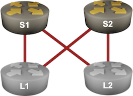
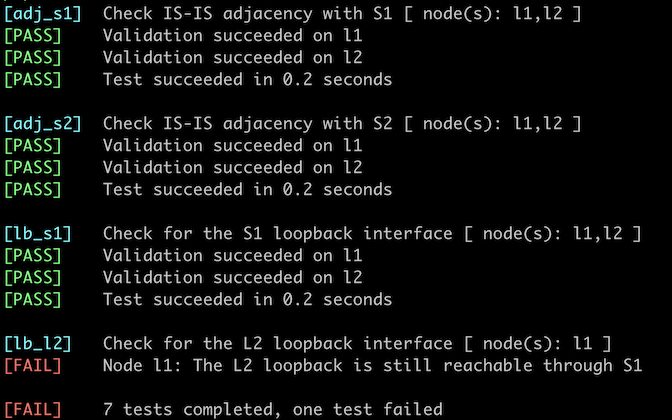

# Drain Traffic Before Node Maintenance

Imagine you have a leaf-and-spine fabric with two spines. Each leaf has two equal-cost paths to every other leaf, resulting in a pretty optimal traffic distribution across all core links. 



Next, assume you must do some maintenance on S1. Turning it off would disrupt the traffic between L1 and L2 until they realize S1 is gone and the convergence process does its job ([more details](https://blog.ipspace.net/2020/11/fast-failover-implementation/)).

Is there a way to drain the traffic from the spine switch before turning it off? You'll explore that in this lab exercise.

## Device Requirements

* Use any device [supported by the _netlab_ IS-IS configuration module](https://netlab.tools/platforms/#platform-routing-support) for the routers in your lab (default: FRRouting virtual machines or containers).
* You can do automated lab validation with FRRouting running on L1 and L2.

## Starting the Lab

You can start the lab [on your own lab infrastructure](../1-setup.md) or in [GitHub Codespaces](https://github.com/codespaces/new/bgplab/isis) ([more details](https://bgplabs.net/4-codespaces/)):

* Change directory to `feature/5-drain`
* Execute **netlab up**. You'll get a lab with IPv4 addresses configured on all interfaces and level-2 IS-IS routing configured on all routers.
* Log into lab routers with **netlab connect** and verify their configuration.

## The Problem

Every leaf switch has two equal-cost paths to every other leaf switch. For example L1 uses S1 and S2 to reach the loopback interface of L2:

Routes toward the loopback interface of L2 on L1 running FRRouting
{ .code-caption }
```
$ netlab connect -q l1 --show ip route 10.0.0.4
Routing entry for 10.0.0.4/32
  Known via "isis", distance 115, metric 30, best
  Last update 00:01:17 ago
  * 10.1.0.2, via eth1, weight 1
  * 10.1.0.6, via eth2, weight 1
```

If you shut down S1, the routes using S1 (next hop 10.1.0.2) remain in the routing (and forwarding) table of L1 until L1 discovers it lost the link toward S1. That might be pretty fast if you can rely on the physical link-loss signal or take seconds if your only failure detection mechanism is the IS-IS hello protocol. Regardless of the failure detection time, there will be some traffic disruption.

## Draining Traffic from an IS-IS Router

We're using the *maximum metric* functionality in OSPF networks to solve a similar problem; if an OSPF router advertises all its links with a high metric, all other routers eventually find a better path, and the router is no longer used for transit traffic.

While some IS-IS implementations have a similar configuration command (for example, `advertise-high-metrics` on FRRouting), the IS-IS designers decided to take an even better approach years before OSPF got the *maximum metric* functionality: the IS-IS LSPs contain an **overload** bit that a router can use to tell everyone else to avoid it for transit traffic.

Setting the **overload** bit on S1 enables a clean shutdown. As the other routers receive and flood S1 LSP across the network, they recompute their best paths and remove routes using S1 (or replace them with alternate paths).

!!! Tip
    Abruptly increasing interface metrics or setting the **overload** bit could cause transient micro-loops in complex networks due to the asynchronous nature of IS-IS path computation. Fortunately, we won't experience micro-loops in our fabric, as we always have multiple equal-cost paths between the leaf switches.
    
    At least one academic team published a paper describing an algorithm for computing a series of gradual metric increases that avoids micro-loops. However, I don't know anyone using that approach in a production network.

## Configuration Tasks

Configure the **overload** bit in the IS-IS process of S1.

!!! Tip
    You're running a dual-stack network; some devices (for example, FRRouting) can set the **overload** bit for individual address families. Check what your devices are doing, or you might drain IPv4 traffic but leave IPv6 intact.

Check also the *IS-IS high metric* functionality on devices that support it as an alternative to the **overload** bit and in combination with it, and explore the resulting changes in the S1's IS-IS LSP, IS-IS topology, and IP routing table.

## Validation

You can use the **netlab validate** command if you're using *netlab* release 1.8.4 or later and run FRRouting on L1 and L2. This is the printout you'd get if you failed to configure the **overload** bit:



You could also do manual validation of the routing tables on L1 and L2:

* There should be a single path (through S2) for the other leaf router's IPv4 and IPv6 loopback prefixes.
* The IPv4 and IPv6 loopback prefixes of S1 should still be reachable (because it's not a transit route through S1).

The final IPv4 loopback IS-IS routes on L1 (FRRouting)
{.code-caption}
```
l1# show ip route 10.0.0.0/24 longer-prefixes isis
Codes: K - kernel route, C - connected, L - local, S - static,
       R - RIP, O - OSPF, I - IS-IS, B - BGP, E - EIGRP, N - NHRP,
       T - Table, v - VNC, V - VNC-Direct, A - Babel, F - PBR,
       f - OpenFabric, t - Table-Direct,
       > - selected route, * - FIB route, q - queued, r - rejected, b - backup
       t - trapped, o - offload failure

I>* 10.0.0.1/32 [115/20] via 10.1.0.2, eth1, weight 1, 00:22:00
I>* 10.0.0.2/32 [115/20] via 10.1.0.6, eth2, weight 1, 00:22:00
I>* 10.0.0.4/32 [115/30] via 10.1.0.6, eth2, weight 1, 00:00:59
```

You can also inspect the S1 LSP to verify it has the **overload** bit set:

The S1 LSP on L1 (FRRouting). The overload bit is the summary line's **/OL** part.
{.code-caption}
```
l1# show isis database detail s1.00-00
Area Gandalf:
IS-IS Level-2 link-state database:
LSP ID                  PduLen  SeqNumber   Chksum  Holdtime  ATT/P/OL
s1.00-00                  112   0x00000004  0x0266    1618    0/0/1
  Protocols Supported: IPv4
  Area Address: 49.0001
  Hostname: s1
  TE Router ID: 10.0.0.1
  Router Capability: 10.0.0.1 , D:0, S:0
  Extended Reachability: 0000.0000.0003.00 (Metric: 10)
  Extended Reachability: 0000.0000.0004.00 (Metric: 10)
  IPv4 Interface Address: 10.0.0.1
  Extended IP Reachability: 10.1.0.0/30 (Metric: 10)
  Extended IP Reachability: 10.1.0.8/30 (Metric: 10)
  Extended IP Reachability: 10.0.0.1/32 (Metric: 10)
```

## Other Uses of the Overload Bit

Most IS-IS implementations can set the **overload** bit during the device startup process to prevent other routers from using a device for transit routing until it completes collecting routing information or initializing other control-plane protocols (for example, LDP).

Some implementations allow you to set the overload bit for a fixed amount of time; others are more flexible and can wait for the initial BGP convergence to complete before clearing the **overload** bit.

Finally, some implementors returned to the fundamentals and started using the **overload** bit for what it was initially designed to do: signal to the rest of the network that the router has performance problems (for example, running out of RAM due to a memory leak) and should be avoided.

**Next:** [Adjust IS-IS Timers](6-timers.md)

## Reference Information

### Lab Wiring

| Origin Device | Origin Port | Destination Device | Destination Port |
|---------------|-------------|--------------------|------------------|
| l1 | eth1 | s1 | eth1 |
| l1 | eth2 | s2 | eth1 |
| l2 | eth1 | s1 | eth2 |
| l2 | eth2 | s2 | eth2 |

**Note:** The interface names depend on the devices you use in the lab. The printout was generated with lab devices running FRRouting.

### Lab Addressing

| Node/Interface | IPv4 Address | IPv6 Address | Description |
|----------------|-------------:|-------------:|-------------|
| **l1** |  10.0.0.3/32 | 2001:db8:cafe:3::1/64 | Loopback |
| eth1 | 10.1.0.1/30 | LLA | l1 -> s1 |
| eth2 | 10.1.0.5/30 | LLA | l1 -> s2 |
| **l2** |  10.0.0.4/32 | 2001:db8:cafe:4::1/64 | Loopback |
| eth1 | 10.1.0.9/30 | LLA | l2 -> s1 |
| eth2 | 10.1.0.13/30 | LLA | l2 -> s2 |
| **s1** |  10.0.0.1/32 | 2001:db8:cafe:1::1/64 | Loopback |
| Ethernet1 | 10.1.0.2/30 | LLA | s1 -> l1 |
| Ethernet2 | 10.1.0.10/30 | LLA | s1 -> l2 |
| **s2** |  10.0.0.2/32 | 2001:db8:cafe:2::1/64 | Loopback |
| Ethernet1 | 10.1.0.6/30 | LLA | s2 -> l1 |
| Ethernet2 | 10.1.0.14/30 | LLA | s2 -> l2 |

