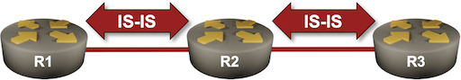
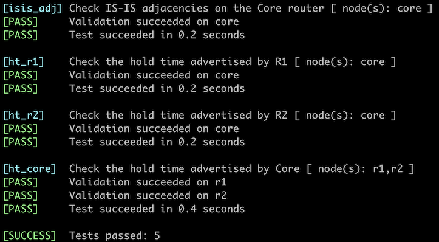

# Adjust IS-IS Timers

Like any other (interior) routing protocol, IS-IS uses hello packets to discover adjacent routers (intermediate systems) and to detect the loss of communication with them.

Unlike OSPF, where the hello timers must match between neighbors, IS-IS allows each router to define its own hold time (the time after which it is considered unreachable). The *advertised hold time* is the only parameter relevant in the neighbor loss detection; it's up to the IS-IS implementation what the hello interval is and how many hello packets are sent within the hold time.

In this lab exercise, you will reduce the IS-IS timers on the remote routers (R1, R2) to speed up neighbor loss detection on the Core router. You will also explore other configurable timers.



!!! warning
    Changing IS-IS hello timers should be a last resort. If you want to improve the failure detection speed, use BFD.

## Device Requirements

* Use any device [supported by the _netlab_ IS-IS configuration module](https://netlab.tools/platforms/#platform-routing-support) for the routers in your lab.
* You can do automated lab validation when using Arista EOS on your routers[^FRSAT].

[^FRSAT]: FRRouting does not display the advertised hold time in the **show isis neighbors** command and thus cannot provide the information needed for the automated validation.

## Starting the Lab

You can start the lab [on your own lab infrastructure](../1-setup.md) or in [GitHub Codespaces](https://github.com/codespaces/new/bgplab/isis) ([more details](https://bgplabs.net/4-codespaces/)):

* Change directory to `feature/6-timers`
* Execute **netlab up**. You'll get a lab with IPv4 addresses configured on all interfaces and level-2 IS-IS routing configured on all routers.
* Log into lab routers with **netlab connect** and verify their configuration.

## Initial State

Most IS-IS implementations advertise a 30-second *hold interval*  but differ significantly in their hello intervals. For example, by default, FRRouting sends IIH (IS-IS Hello) packets every three seconds, while Arista EOS sends them every ten seconds.

Some platforms show the configured IIH timers in the **show isis interface** commands:

The **show isis interface** command on FRRouting displays the hello timers
{: .code-caption}
```
r1# show isis interface detail
Area Gandalf:
  Interface: eth1, State: Up, Active, Circuit Id: 0x0
    Type: p2p, Level: L2
    Level-2 Information:
      Metric: 10, Active neighbors: 1
      Hello interval: 3, Holddown count: 10, Padding: yes
      CNSP interval: 10, PSNP interval: 2
    IP Prefix(es):
      10.1.0.1/30
```

To get the advertised *hold time* value, use the **show isis neighbor** command; some implementations include it in the printout.

The **show isis neighbor detail** command on Arista EOS displays the advertised hold time
{: .code-caption}
```
r1#show isis neighbors detail

Instance  VRF      System Id        Type Interface          SNPA              State Hold time   Circuit Id
Gandalf   default  r2               L2   Ethernet1          P2P               UP    25          DB
  Area addresses: 49.0001
  SNPA: P2P
  Router ID: 0.0.0.0
  Advertised Hold Time: 30
  State Changed: 00:04:38 ago at 2025-03-12 16:36:58
  IPv4 Interface Address: 10.1.0.2
  IPv6 Interface Address: none
  Interface name: Ethernet1
  Graceful Restart: Supported
  Supported Address Families: IPv4
  Neighbor Supported Address Families: IPv4
```

## Configuration Tasks

In our network, every remote router has a single uplink to the core router. Detecting neighbor loss on the remote routers is thus not as relevant as detecting remote site failure on the core router:

* Reduce the advertised hold time on the Core router to 15 seconds.
* Reduce the advertised hold time on R1 and R2 to 3 seconds.
* Most IS-IS implementations ask you to configure the interface parameters **hello-interval** and **hello-multiplier** (the advertised hold time is a product of these two parameters). Use whatever parameter values work for you.

## Validation

You can use the **netlab validate** command if you're using *netlab* release 1.8.4 or later and run Arista EOS on the WAN router. This is the printout you should get after completing the lab exercise:



You could also manually validate your work. Inspect the details of IS-IS neighbors on all three routers and check the *advertised hold time*.

## Beyond Neighbor Hold Times

Most IS-IS implementations have several SPF-, LSP-, and CSNP-related timers you can tweak to improve your network's convergence. While setting these timers to low values is tempting, you always have to find the right balance between convergence speed, routing protocol overhead (excessive flooding and CPU utilization), and network instability due to overly quick reactions to partially updated information ([example](https://blog.ipspace.net/2019/06/know-thy-environment-before-redesigning/)).

These are the usual timers you can tweak:

**SPF interval**

This parameter changes the maximum interval between SPF runs. It directly impacts the convergence speed and is set to conservative values in implementations with enough history, as they had to work on very slow CPUs. Most modern IS-IS implementations use reasonable values for SPF interval.
{: style='margin-left: 2rem'}

**LSP generation**

The interval between the generation of changed LSPs. This parameter should not be set too low, as it prevents your router from flooding the network with too many changes generated by a flapping interface. However, it might also impact the speed with which changes in network topology or redistributed routes are advertised in IS-IS.
{: style='margin-left: 2rem'}

**CSNP generation**

IS-IS uses periodic CSNP packets (table-of-contents of the LSP database) to detect missing information. Sending them more often will improve recovery from lost LSP updates. However, if the LSP packet loss significantly impacts your network convergence, you have much bigger problems to fix than the CSNP interval.
{: style='margin-left: 2rem'}

You can find further network-convergence-related information in the [Fast Failover](https://blog.ipspace.net/series/fast-failover/) series of blog posts.

**Next**: [Route Redistribution into IS-IS](7-redistribute.md)

## Reference Information

### Lab Wiring

| Origin Device | Origin Port | Destination Device | Destination Port |
|---------------|-------------|--------------------|------------------|
| r1 | Ethernet1 | core | Ethernet1 |
| r2 | Ethernet1 | core | Ethernet2 |

**Note:** The interface names depend on the devices you use in the lab. The printout was generated with lab devices running Arista EOS.

### Lab Addressing

| Node/Interface | IPv4 Address | IPv6 Address | Description |
|----------------|-------------:|-------------:|-------------|
| **core** |  10.0.0.2/32 |  | Loopback |
| Ethernet1 | 10.1.0.1/30 |  | core -> r1 |
| Ethernet2 | 10.1.0.5/30 |  | core -> r2 |
| **r1** |  10.0.0.1/32 |  | Loopback |
| Ethernet1 | 10.1.0.2/30 |  | r1 -> core |
| **r2** |  10.0.0.3/32 |  | Loopback |
| Ethernet1 | 10.1.0.6/30 |  | r2 -> core |
