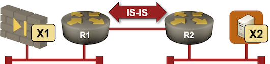
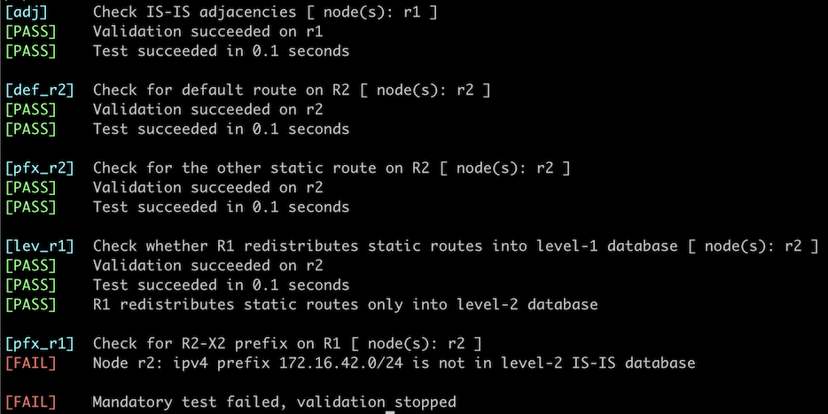

# Route Redistribution into IS-IS

In the ideal world, you'd run a single routing protocol on all routers in your network, and use routing protocol features like *[passive interfaces](1-passive.md)* on the network edges.

In real life, you often have to use static routes to external destinations[^DRI] or combine multiple routing protocols[^RP]. In this lab exercise, you'll figure out how to configure simple redistribution of external routing information (connected interfaces and static routes) into IS-IS.

[^DRI]: Usually a default route pointing to an Internet-facing firewall.

[^RP]: For example, you might have to use OSPF or RIP at the network edges while running IS-IS as the core routing protocol.



!!! Warning
    Route redistribution has probably caused more network meltdowns than any other networking feature (apart from STP). Unless you have a very good reason, use [passive interfaces](1-passive.md) instead of redistributing connected subnets. Some IS-IS implementations also allow you to advertise a default route into IS-IS with a command like **default-information originate**.

## Device Requirements

* Use any device [supported by the _netlab_ IS-IS configuration module](https://netlab.tools/platforms/#platform-routing-support) for the routers in your lab.
* The external devices (X1 and X2) are Linux virtual machines or containers[^VP]
* You can do automated lab validation with FRRouting running on R1 and R2.

[^VP]: Depending on the virtualization provider you're using for your lab

## Starting the Lab

You can start the lab [on your own lab infrastructure](../1-setup.md) or in [GitHub Codespaces](https://github.com/codespaces/new/bgplab/isis) ([more details](https://bgplabs.net/4-codespaces/)):

* Change directory to `feature/7-redistribute`
* Execute **netlab up**. You'll get a lab with IPv4 addresses configured on all interfaces and level-2 IS-IS routing configured between R1 and R2.
* Log into lab routers with **netlab connect** and verify their configuration.

You'll get a lab with IPv4 addresses and basic IS-IS configurations on R1 and R2. R1 and R2 will be configured as level-1-2 routers[^ABP].

You'll also get static routes on R1 if we've implemented static routing configuration on the device you're using for R1; otherwise, you'll get a warning message and will have to configure static routes for 0.0.0.0/0 and 172.16.0.0/16 pointing to 10.0.42.42.

[^ABP]: That's against the recommendations from the [Configure IS-IS Routing for IPv4](../basic/1-simple-ipv4.md) lab exercise for reasons that will become obvious in a few minutes.

## The Problem

The two routers running IS-IS do not propagate external routing information. R2 does not have the default route, and R1 does not know how to reach X2 (the prefix 172.16.42.0/24 assigned to the R2-X2 link is not in its routing table). X1 thus cannot reach X2.

Routes on R1 running FRRouting
{ .code-caption }
```
$ netlab connect r1 -q --show ip route
Codes: K - kernel route, C - connected, L - local, S - static,
       R - RIP, O - OSPF, I - IS-IS, B - BGP, E - EIGRP, N - NHRP,
       T - Table, v - VNC, V - VNC-Direct, A - Babel, F - PBR,
       f - OpenFabric, t - Table-Direct,
       > - selected route, * - FIB route, q - queued, r - rejected, b - backup
       t - trapped, o - offload failure

IPv4 unicast VRF default:
S>* 0.0.0.0/0 [1/0] via 10.0.42.42, eth2, weight 1, 00:00:13
L * 10.0.0.1/32 is directly connected, lo, weight 1, 00:00:15
C>* 10.0.0.1/32 is directly connected, lo, weight 1, 00:00:15
I>* 10.0.0.2/32 [115/20] via 10.1.0.2, eth1, weight 1, 00:00:10
C>* 10.0.42.0/24 is directly connected, eth2, weight 1, 00:00:15
L>* 10.0.42.1/32 is directly connected, eth2, weight 1, 00:00:15
I   10.1.0.0/30 [115/20] via 10.1.0.2, eth1 inactive, weight 1, 00:00:10
C>* 10.1.0.0/30 is directly connected, eth1, weight 1, 00:00:15
L>* 10.1.0.1/32 is directly connected, eth1, weight 1, 00:00:15
S>* 172.16.0.0/16 [1/0] via 10.0.42.42, eth2, weight 1, 00:00:13
```

Routes on R2 running FRRouting
{ .code-caption }
```
$ netlab connect r2 -q --show ip route
Codes: K - kernel route, C - connected, L - local, S - static,
       R - RIP, O - OSPF, I - IS-IS, B - BGP, E - EIGRP, N - NHRP,
       T - Table, v - VNC, V - VNC-Direct, A - Babel, F - PBR,
       f - OpenFabric, t - Table-Direct,
       > - selected route, * - FIB route, q - queued, r - rejected, b - backup
       t - trapped, o - offload failure

IPv4 unicast VRF default:
I>* 10.0.0.1/32 [115/20] via 10.1.0.1, eth1, weight 1, 00:00:02
L * 10.0.0.2/32 is directly connected, lo, weight 1, 00:00:08
C>* 10.0.0.2/32 is directly connected, lo, weight 1, 00:00:08
I   10.1.0.0/30 [115/20] via 10.1.0.1, eth1 inactive, weight 1, 00:00:02
C>* 10.1.0.0/30 is directly connected, eth1, weight 1, 00:00:08
L>* 10.1.0.2/32 is directly connected, eth1, weight 1, 00:00:08
C>* 172.16.42.0/24 is directly connected, eth2, weight 1, 00:00:08
L>* 172.16.42.2/32 is directly connected, eth2, weight 1, 00:00:08
```

## Configuration Tasks

* Configure redistribution of static routes into IS-IS on R1.
* Configure redistribution of connected subnets into IS-IS on R2.

!!! Warning
    Some IS-IS implementations (for example, FRR) refuse to redistribute the default route into IS-IS. The only way to originate a default route is with the **default-information originate** command.

While configuring the route redistribution, try to:

* Redistribute routes only into the level-2 LSP database
* Set a high metric (for example, 3000) on the redistributed routes.

!!! Tip
    Some IS-IS implementations (for example, Arista EOS) can redistribute external routes only into the level-2 database.

## Validation

You can use the **netlab validate** command when using FRRouting on R1 and R2. This is the printout you'd get after configuring default route redistribution on R1 while forgetting the redistribution of connected interfaces on R2.



You could also do manual validation of the routing tables on R1 and R2:

* The prefix 172.16.42.0/24 should be in the R1 routing table
* The prefixes 0.0.0.0/0 and 172.16.0.0/16 should be in the R2 routing table.
* X1 should be able to ping X2. Use the **netlab connect x2 ping x1** command if you don't want to be bothered with Linux details.
* You could inspect the details of individual LSPs in the LSP database and verify that the redistributed routes are not in the level-1 LSPs.

## Behind the Scenes

Inspect the LSP database after configuring the route redistribution. The number of LSPs has not changed; each router still advertises a single LSP. Contrary to OSPF (which uses LSA type-5 for external routes), IS-IS includes redistributed routes into the router LSP, and there's no difference between an external route and an internal one[^XF].

[^XF]: Devices implementing [RFC 7794](https://www.rfc-editor.org/rfc/rfc7794.html) can set the X bit in the Prefix Attribute Flags (sub-TLV 4).

Level-2 LSP on R1 running FRRouting. There's no difference between IS-IS subnets and external routes.
{ .code-caption }
```
IS-IS Level-2 link-state database:
LSP ID                  PduLen  SeqNumber   Chksum  Holdtime  ATT/P/OL
r1.00-00             *    104   0x00000005  0x0b5f    1679    0/0/0
  Protocols Supported: IPv4
  Area Address: 49.0001
  Hostname: r1
  TE Router ID: 10.0.0.1
  Router Capability: 10.0.0.1 , D:0, S:0
    SR Algorithm:
      0: SPF
  Extended Reachability: 0000.0000.0002.00 (Metric: 10)
  IPv4 Interface Address: 10.0.0.1
  Extended IP Reachability: 10.0.0.1/32 (Metric: 10)
  Extended IP Reachability: 10.1.0.0/30 (Metric: 10)
  Extended IP Reachability: 0.0.0.0/0 (Metric: 3000)
  Extended IP Reachability: 172.16.0.0/16 (Metric: 3000)
```  

!!! Tip
    Including external routes in router LSP increases LSP churn (the router has to change its LSP every time an external route changes). On the other hand, there's a hard limit on how many routes a single router can redistribute into IS-IS. The [nightmare BGP-to-OSPF FUBARs](https://blog.ipspace.net/2020/10/redistributing-bgp-into-ospf/) are way less damaging in IS-IS.

Some IS-IS implementations can set additional attributes on external IS-IS routes. For example, Arista EOS allows you to set route tags on external routes (it uses the [32-bit Administrative Tag TLV](https://www.rfc-editor.org/rfc/rfc5130.html#section-3.1) defined in [RFC 5130](https://www.rfc-editor.org/rfc/rfc5130.html) to carry tags)

R1 LSP generated by Arista EOS can include route tags
{ .code-caption }
```
r1#show isis data detail level-2 r1.00-00
Legend:
H - hostname conflict
U - node unreachable

IS-IS Instance: Gandalf VRF: default
  IS-IS Level 2 Link State Database
    LSPID                   Seq Num  Cksum  Life Length IS  Received LSPID        Flags
    r1.00-00                     11  43343   928    133 L2  0000.0000.0001.00-00  <>
      LSP generation remaining wait time: 0 ms
      Time remaining until refresh: 628 s
      NLPID: 0xCC(IPv4)
      Hostname: r1
      Area addresses: 49.0001
      Interface address: 10.1.0.1
      Interface address: 10.0.0.1
      IS Neighbor          : r2.00               Metric: 10
      Reachability         : 10.0.0.2/32 Metric: 20 Type: 1 Up
      Reachability         : 172.16.0.0/16 Metric: 3000 Type: 1 Up
        Route Tag: 2020
      Reachability         : 0.0.0.0/0 Metric: 3000 Type: 1 Up
        Route Tag: 2020
      Reachability         : 10.1.0.0/30 Metric: 10 Type: 1 Up
      Reachability         : 10.0.0.1/32 Metric: 10 Type: 1 Up
      Router Capabilities: Router Id: 10.0.0.1 Flags: []
        Area leader priority: 250 algorithm: 0
```

## Reference Information

### Lab Wiring

| Origin Device | Origin Port | Destination Device | Destination Port |
|---------------|-------------|--------------------|------------------|
| r1 | eth1 | r2 | eth1 |
| r1 | eth2 | x1 | eth1 |
| r2 | eth2 | x2 | eth1 |

!!! Note
    The interface names depend on the lab devices you use. The printout was generated with lab devices running FRRouting.

### Lab Addressing

| Node/Interface | IPv4 Address | IPv6 Address | Description |
|----------------|-------------:|-------------:|-------------|
| **r1** |  10.0.0.1/32 |  | Loopback |
| eth1 | 10.1.0.1/30 |  | r1 -> r2 |
| eth2 | 10.0.42.1/24 |  | r1 -> x1 |
| **r2** |  10.0.0.2/32 |  | Loopback |
| eth1 | 10.1.0.2/30 |  | r2 -> r1 |
| eth2 | 172.16.42.2/24 |  | r2 -> x2 |
| **x1** |
| eth1 | 10.0.42.42/24 |  | x1 -> r1 |
| **x2** |
| eth1 | 172.16.42.3/24 |  | x2 -> r2 |
