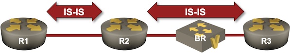

# Use BFD to Speed Up IS-IS Failure Detection

In the [Adjust IS-IS Timers](6-timers.md) lab exercise, you've learned how to reduce the IS-IS hello interval to improve the failure detection speed (TL&DR: don't), and how to tweak the SPF timers to minimize the overall convergence time. 

The minimum IS-IS hello interval is usually a second, resulting in a 3-second failure detection time, but that works best in PowerPoint[^ISI]. You MUST [use BFD](https://blog.ipspace.net/2017/10/to-bfd-or-not-to-bfd/) if you want reliable failure detection faster than the one provided by the default IS-IS hello interval.

In this lab exercise, you'll combine BFD with IS-IS to reduce the failure detection time to less than one second[^BFDF]. The lab topology is almost identical to the one we used in the [Adjust IS-IS Timers](6-timers.md) exercise; the only new element is a bridge[^L2S] we'll use to create a link failure *on the path* between two routers.

[^ISI]: The reliability of hello-based failure detection depends heavily on IS-IS [implementation details](https://blog.ipspace.net/2021/11/multi-threaded-routing-daemons/) and operating system scheduling capabilities ([even more details](https://blog.ipspace.net/2021/12/highlights-multi-threaded-routing-daemons/)). While it's easy to get a sub-three-second failure detection in a small lab, things might not work so well over congested links, on routers with many IS-IS adjacencies, or during network instabilities. An overloaded IS-IS process might lose adjacencies due to missed hello packets, resulting in even further instabilities and potentially a network-wide meltdown.

[^BFDF]: The minimum sane BFD timers depend on the implementation details. Do not use aggressive timers over long-distance links, [over Carrier Ethernet service](https://blog.ipspace.net/2019/06/know-thy-environment-before-redesigning/), or when your device [runs BFD in a process on the main CPU](https://blog.ipspace.net/2020/11/detecting-network-failure/); you can use shorter timers with linecard- or hardware-implemented BFD.
 
[^L2S]: Sometimes lovingly called *layer-2 switch* by vendor marketing departments



## Device Requirements

* Use any device supported by the _netlab_ [IS-IS](https://netlab.tools/module/isis/#platform-support) and [BFD](https://netlab.tools/module/bfd/) configuration modules for the routers in your lab.
* The bridge between R2 and R3 is implemented with a Linux VM or container (depending on the virtualization provider you're using) running FRRouting.

## Starting the Lab

You can start the lab [on your own lab infrastructure](../1-setup.md) or in [GitHub Codespaces](https://github.com/codespaces/new/bgplab/isis) ([more details](https://bgplabs.net/4-codespaces/)):

* Change directory to `feature/8-bfd`
* Execute **netlab up**.

You'll get a lab with IPv4+IPv6 addresses and basic IS-IS configurations on R1, R2, and R3. BFD will be enabled but not configured.

* Log into lab routers with **netlab connect** and verify their configuration.

## Measure the Failure Detection Time

* Log into R1 and R2
* Enable IP routing debugging on R1[^ZR] and IS-IS adjacency logging on R2
* Shut down an interface on BR with the `bash down.sh` command[^DOWN]

[^ZR]: Use **debug zebra rib** on FRRouting

[^DOWN]: The command starts the `down.sh` script in the current directory. The script uses the **netlab config** command to deploy a configuration template that shuts down the first interface on BR. It also prints the current date and time, which you can compare to the debugging printouts.

This is what you might get when using FRRouting on R1 and R2:

The bridge interface is shut down (notice the timestamp)
{: .code-caption}
```
$ bash down.sh
.........

# STATS ****************************************************************************************************************
br    : ok=9	changed=2	failed=0	unreachable=0	rescued=0	ignored=0

Interface shut down @ 14:45:50.724834949
```

IS-IS adjacency logging message on R2
{: .code-caption}
```
2025-07-31 14:46:17.168 [INFO] isisd: [Q7SVW-YVKRH] %ADJCHANGE: Adjacency to r3 (eth2) for level-2 changed from Up to Down, holding time expired
```

The routing table is updated on R1 (select messages only)
{: .code-caption}
```
2025-07-31 14:46:17.225 [DEBG] zebra: [S59C1-4C5PP] default(0:254):10.0.0.3/32: Deleting route rn 0x7fb7c59f5b90, re 0x7fb7c59d73d0 (isis)
2025-07-31 14:46:17.225 [DEBG] zebra: [S59C1-4C5PP] default(0:254):2001:db8:cafe:3::/64: Deleting route rn 0x7fb7c59de760, re 0x7fb7c59d7490 (isis)
```

Based on the debugging printouts:

* It took R2 ~27 seconds to detect the link failure
* LSP flooding and SPF run were almost immediate. Less than 100 milliseconds passed between failure detection and routing table update on R1.

Finally, use `bash up.sh` command to restore the R2-R3 link.

Now that you have a pretty decent[^FIC] measurement tool, tweak the IS-IS interface- and SPF timers to reduce the overall convergence time (see [Adjust IS-IS Timers](6-timers.md) for more details).

[^FIC]: Compared to its cost

## Configuration Tasks

* Enable BFD on R2 and R3 (not needed on some devices)
* Enable BFD for IS-IS (usually with an interface command like **isis bfd**). On some platforms, you might have to enable BFD for IPv4 and IPv6 separately[^AAI]. Other platforms (for example, FRRouting) have a single command, but run BFD in a single address family.

!!! tip
    While running BFD for IPv4 and IPv6 is recommended[^WH], it might not be strictly necessary. Some platforms bring down IS-IS adjacency after a single BFD session failure; others will just note that one of the address families is unavailable in their IS-IS hellos and LSPs.

* If possible, tweak the BFD timers. The configuration differs widely between platforms. While many implementations have an interface configuration command similar to **bfd interval**, you must configure a BFD profile on FRRouting and apply it to IS-IS on each interface.

[^AAI]: On Arista EOS, use **isis bfd** interface command to enable BFD for IPv4, and **bfd all-interfaces** router address family configuration command to enable BFD for IPv6.

[^WH]: I have seen weird hardware that treated IPv4 packets differently from IPv6 ones 🤦‍♂️. You'd better run BFD in both address families if you have such hardware in the forwarding path.

## Validation

Use a command similar to **show bfd peers** to verify that R2 runs BFD with R3 over IPv4 and IPv6.

BFD peers on R2 running FRRouting (it runs BFD only over IPv6)
{: .code-caption}
```
BFD Peers:
	peer fe80::a8c1:abff:fe94:12c7 local-address fe80::a8c1:abff:fefa:38b3 vrf default interface eth2
		ID: 3558723326
		Remote ID: 1517743069
		Active mode
		Log session changes
		Status: up
		Uptime: 4 minute(s), 45 second(s)
		Diagnostics: ok
		Remote diagnostics: ok
		Peer Type: dynamic
		RTT min/avg/max: 0/0/0 usec
		Local timers:
			Detect-multiplier: 3
			Receive interval: 300ms
			Transmission interval: 50ms
			Echo receive interval: 50ms
			Echo transmission interval: disabled
		Remote timers:
			Detect-multiplier: 3
			Receive interval: 300ms
			Transmission interval: 50ms
			Echo receive interval: 50ms
```

BFD peers on R2 running Arista EOS (it also tries to establish a session with R1)
```
r2#show bfd peers
VRF name: default
-----------------
DstAddr            MyDisc      YourDisc    Interface/Transport       Type             LastUp     LastDown          LastDiag   State
------------- ------------- ------------- ---------------------- ---------- ------------------ ------------ ----------------- -----
172.16.0.3     1905829730    1290893693       Ethernet2(14579)     normal     07/31/25 15:25           NA     No Diagnostic      Up

DstAddr                       MyDisc     YourDisc   Interface/Transport     Type           LastUp   LastDown        LastDiag  State
------------------------- ----------- ------------ --------------------- -------- ---------------- ---------- --------------- -----
fe80::50dc:caff:fefe:101   142389730            0      Ethernet1(14583)   normal               NA         NA   No Diagnostic   Down
fe80::50dc:caff:fefe:301  4084028665   1014221528      Ethernet2(14579)   normal   07/31/25 15:26         NA   No Diagnostic     Up
```

Repeat the failure detection measurement. You might get results similar to these on FRRouting:

The bridge interface is shut down
{: .code-caption}
```
$ bash down.sh
.........

# STATS ****************************************************************************************************************
br    : ok=9	changed=2	failed=0	unreachable=0	rescued=0	ignored=0

Interface shut down @ 15:13:23.078914210
```

FRRouting IS-IS and BFD logging messages on R2
{: .code-caption}
```
2025-07-31 15:13:23.645 [NTFY] bfdd: [STTY2-28ZPH] Session-Change: [mhop:no peer:fe80::a8c1:abff:fe94:12c7 local:fe80::a8c1:abff:fefa:38b3 vrf:default ifname:eth2] up -> down reason:control-expired
2025-07-31 15:13:23.646 [INFO] isisd: [Q7SVW-YVKRH] %ADJCHANGE: Adjacency to r3 (eth2) for level-2 changed from Up to Down, bfd session went down
2025-07-31 15:13:23.646 [DEBG] isisd: [M611R-YQPBQ] ISIS-SPF (Gandalf) L2 SPF scheduled immediately due to BFD 'down' message
```

According to the debugging messages, it took R2 approximately 600 milliseconds to detect the link failure, declare the IS-IS adjacency failure, and schedule the SPF run. Further reducing the BFD **transmit** and **receive** timers can bring the failure detection time down to ~100 milliseconds, at which point the routers detect failure before the Ansible playbook finishes[^BA] (the script timestamp is higher than the debugging timestamp).

[^BA]: Since we haven't seen tachions yet, I blame Ansible.

## Reference Information

### Lab Wiring

| Origin Device | Origin Port | Destination Device | Destination Port |
|---------------|-------------|--------------------|------------------|
| r1 | Ethernet1 | r2 | Ethernet1 |
| br | eth1 | r2 | Ethernet2 |
| br | eth2 | r3 | Ethernet1 |

**Note:** The interface names depend on the devices you use in the lab. The printout was generated with lab devices running Arista EOS.

### Lab Addressing

| Node/Interface | IPv4 Address | IPv6 Address | Description |
|----------------|-------------:|-------------:|-------------|
| **r1** |  10.0.0.1/32 | 2001:db8:cafe:1::1/64 | Loopback |
| Ethernet1 | 10.1.0.1/30 | LLA | r1 -> r2 |
| **r2** |  10.0.0.2/32 | 2001:db8:cafe:2::1/64 | Loopback |
| Ethernet1 | 10.1.0.2/30 | LLA | r2 -> r1 |
| Ethernet2 | 172.16.0.2/24 | 2001:db8:21::2/64 | r2 -> [br,r3] |
| **r3** |  10.0.0.3/32 | 2001:db8:cafe:3::1/64 | Loopback |
| Ethernet1 | 172.16.0.3/24 | 2001:db8:21::3/64 | r3 -> [r2,br] |
| **br** |  10.0.0.4/32 | 2001:db8:cafe:4::1/64 | Loopback |
| eth1 |  |  | [Access VLAN ethernet] br -> r2 |
| eth2 |  |  | [Access VLAN ethernet] br -> r3 |
| vlan1000 |  |  | VLAN ethernet (1000) -> [r2,r3] |
